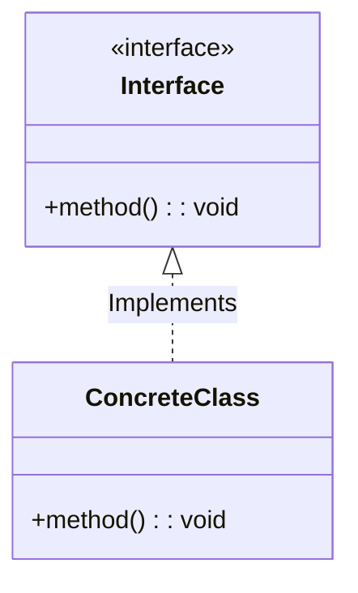
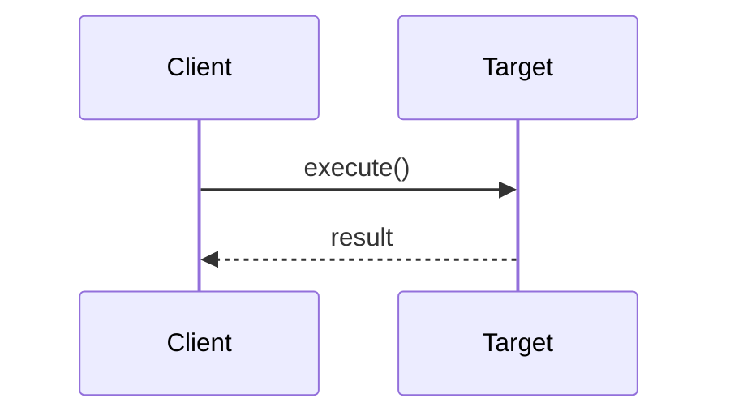

# (Icon) Pattern Name: (Subtitle)

## 📝 Overview
(Brief, 2-sentence elevator pitch of what the pattern does, why it exists, and its GoF category: Creational, Structural, or Behavioral.)

!!! abstract "Core Concepts"
    - **Concept 1:** (Detail)
    - **Concept 2:** (Detail)
    ...

---

## 🏭 The Engineering Story & Problem
*(Use this section to bridge the technical requirements with human intuition.)*

### 😡 The Villain (The Problem)
(Describe the messy code, tight coupling, or "if-else" nightmare that exists without this pattern. What is the business or technical pain point?)

### 🦸 The Hero (The Solution)
(How this pattern saves the day conceptually. e.g., "Introducing Waiters as an intermediary so the Chef just cooks.")

### 📜 Requirements & Constraints
1.  **(Functional):** (e.g., Must support adding new types without changing core logic.)
2.  **(Technical):** (e.g., Thread safety, memory constraints.)
...

---

## 🏗️ Structure & Blueprint

### Class Diagram
*(The static structure: Who owns who? Who implements what?)*


### Runtime Context (Sequence)
*(The dynamic flow: How do objects talk to each other at runtime? Optional for simpler patterns.)*


---

## 💻 Implementation & Code

### 🧠 SOLID Principles Applied
- **Single Responsibility:** (How it's applied here)
- **Open/Closed:** (How it's applied here)

### 🐍 The Code

??? failure "The Villain's Code (Without Pattern)"
    ```python
    # Show a quick snippet of the bad, tightly coupled code here.
    # Using the ??? creates a collapsible block in MkDocs so it doesn't clutter the page!
    ```

???+ success "The Hero's Code (With Pattern)"
    ```python
    --8<-- "(Link to your implementation file)"
    ```

---

## ⚖️ Trade-offs & Testing

| Pros (Why it works) | Cons (The Twist / Pitfalls) |
| :--- | :--- |
| (Pro 1) | (Con 1 - e.g., Increased complexity) |
| (Pro 2) | (Con 2) |
...

### 🧪 Testing Strategy
(Briefly explain how this pattern makes testing easier or harder. e.g., "Because we depend on interfaces, we can easily inject Mock implementations during unit testing.")

---

## 🎤 Interview Toolkit

- **Interview Signal:** (What demonstrating this pattern tells the interviewer about your skills.)
- **When to Use:** (Quick bullet points on trigger scenarios/keywords in an interview prompt).
- **Scalability Probe:** (How does this handle high throughput or concurrency?)
- **Design Alternatives:** (Could we have used Pattern X instead?)

## 🔗 Related Patterns
- [Related Pattern 1](#) — (How is it similar/different?)
- [Related Pattern 2](#) — (Can they be used together?)
...
