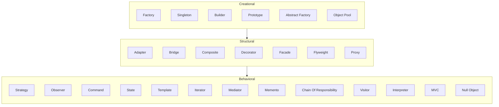

# 🗺️ Design Patterns Roadmap

A high-level guide to mastering GoF design patterns and architectural best practices.

## 📊 Topic Progress

1.  **Creational Patterns**
    *   [Abstract Factory](./creational/abstract_factory/ui_toolkit/PROBLEM.md)
    *   [Builder](./creational/builder/custom_pc_builder/PROBLEM.md)
    *   [Factory](./creational/factory/coupon_factory/PROBLEM.md)
    *   [Prototype](./creational/prototype/PROBLEM.md)
    *   [Singleton](./creational/singleton/singleton_pattern/PROBLEM.md)
    *   [Object Pool](./creational/object_pool/db_connection_pool/PROBLEM.md)

2.  **Structural Patterns**
    *   [Adapter](./structural/adapter/format_translator/PROBLEM.md)
    *   [Bridge](./structural/bridge/remote_control/PROBLEM.md)
    *   [Composite](./structural/composite/organisation_chart/PROBLEM.md)
    *   [Decorator](./structural/decorator/pizza_builder_decorator/PROBLEM.md)
    *   [Facade](./structural/facade/smart_home_facade/PROBLEM.md)
    *   [Flyweight](./structural/flyweight/forest_simulator/PROBLEM.md)
    *   [Proxy](./structural/proxy/lazy_loading_proxy/PROBLEM.md)

3.  **Behavioral Patterns**
    *   [Strategy](./behavioral/strategy/sprinkler_system/PROBLEM.md)
    *   [Observer](./behavioral/observer/basic_observer/PROBLEM.md)
    *   [Command](./behavioral/command/smart_home_hub/PROBLEM.md)
    *   [State](./behavioral/state/document_workflow/PROBLEM.md)
    *   [Template](./behavioral/template/data_exporter/PROBLEM.md)
    *   [Iterator](./behavioral/iterator/menu_iterator/PROBLEM.md)
    *   [Mediator](./behavioral/mediator/PROBLEM.md)
    *   [Memento](./behavioral/memento/text_editor_history/PROBLEM.md)
    *   [Chain of Responsibility](./behavioral/chain_of_responsibility/PROBLEM.md)
    *   [Visitor](./behavioral/visitor/PROBLEM.md)
    *   [Interpreter](./behavioral/interpreter/rule_engine/PROBLEM.md)
    *   [MVC](./behavioral/mvc/PROBLEM.md)
    *   [Null Object](./behavioral/null_object/discount_system/PROBLEM.md)

Refer to [repo_index.md](../repo_index.md) for a complete list of all implementations.
