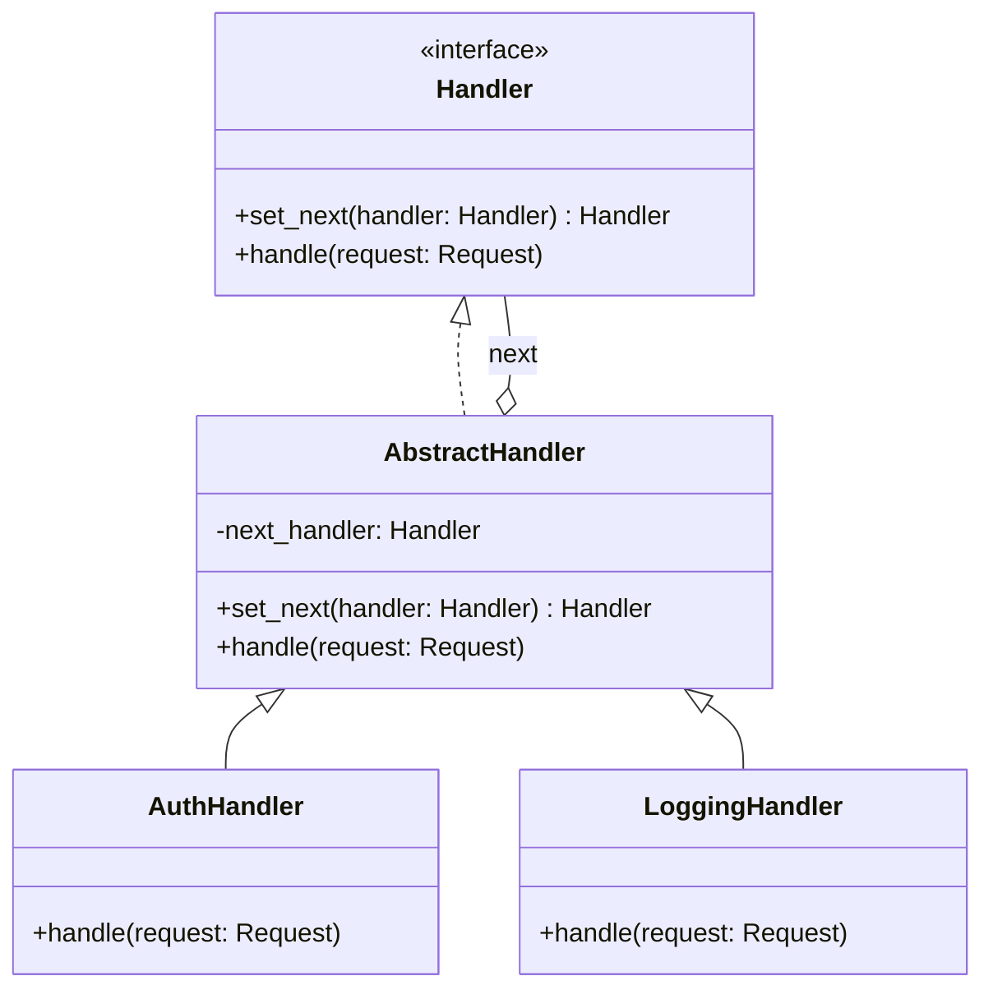
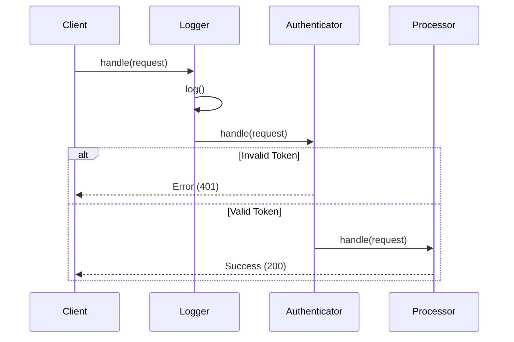

# ⛓️ Chain of Responsibility: Middleware Pipeline

## 📝 Overview
The **Chain of Responsibility** pattern allows you to pass requests along a dynamic chain of handlers. Each handler decides either to process the request or to pass it to the next handler in the chain, enabling flexible and decoupled processing pipelines.

!!! abstract "Core Concepts"
    - **Handler Chaining:** Linking objects sequentially so they can pass requests down the line.
    - **Decoupled Senders & Receivers:** The client doesn't need to know which specific object will handle the request.
    - **Dynamic Composition:** The ability to add, remove, or reorder handlers at runtime without breaking the client code.

---

## 🏭 The Engineering Story & Problem

### 😡 The Villain (The Problem)
Imagine a "Monolithic Middleware" function for a web server. It handles everything: logging, authentication, rate limiting, data validation, and caching. This single function is 1,000 lines long, filled with nested `if-else` statements.    
Every time you need to add a new check (like CORS or CSRF protection), you have to modify this giant, fragile function. Testing is a nightmare because all the logic is tightly coupled; you can't test authentication without also triggering logging and rate limiting.

### 🦸 The Hero (The Solution)
The **Chain of Responsibility** introduces a "Linked Pipeline." Instead of one giant function, each responsibility (Logging, Auth, Throttling) is encapsulated in its own small, focused class. These classes are linked together like a chain. 
When a request comes in, it's passed to the first handler. That handler does its job and then calls the `next` handler. If a handler decides the request is invalid (e.g., Auth fails), it stops the chain immediately. The client just sends the request to the first link and doesn't care about the rest.

### 📜 Requirements & Constraints
1.  **(Functional):** The pipeline must process requests sequentially (Log -> Auth -> Throttle).
2.  **(Functional):** If a handler fails (e.g., Authentication fails), the request processing must stop immediately.
3.  **(Technical):** Handlers should be easily reorderable (e.g., move Logging after Auth) without changing the handler code.

---

## 🏗️ Structure & Blueprint

### Class Diagram


### Runtime Context (Sequence)


---

## 💻 Implementation & Code

### 🧠 SOLID Principles Applied
- **Single Responsibility:** Each handler (Auth, Log) focuses on one specific task.
- **Open/Closed:** You can add new handlers (e.g., `ValidationHandler`) without modifying existing code.

### 🐍 The Code

??? failure "The Villain's Code (Without Pattern)"
    ```python
    def process_request(request):
        # 😡 The God Function
        print("Logging request...")
        
        if request.token != "secret":
            return "401 Unauthorized"
            
        if request.rate_limit_exceeded:
            return "429 Too Many Requests"
            
        if not request.body:
             return "400 Bad Request"
             
        # Finally, business logic...
        return "200 OK"
    ```

???+ success "The Hero's Code (With Pattern)"
    ```python
    # TODO: Add solution file for Chain of Responsibility
    # --8<-- "design_patterns/behavioral/chain_of_responsibility/middleware_pipeline.py"
    ```

---

## ⚖️ Trade-offs & Testing

| Pros (Why it works) | Cons (The Twist / Pitfalls) |
| :--- | :--- |
| **Decoupling:** Senders and receivers are decoupled. | **Uncertainty:** A request might fall off the end of the chain unhandled. |
| **Flexibility:** You can reorder handlers dynamically. | **Performance:** Long chains can introduce latency and stack depth issues. |
| **SRP:** Logic is split into small, focused classes. | **Debugging:** Tracing the flow through many handlers can be tedious. |

### 🧪 Testing Strategy
Testing is simplified because you can test each handler in isolation.
1.  **Unit Test Handlers:** Test `AuthHandler` by passing it valid and invalid requests directly, mocking the `next` handler.
2.  **Pipeline Test:** Chain a few mock handlers together to verify the flow and "short-circuiting" behavior.

---

## 🎤 Interview Toolkit

- **Interview Signal:** Demonstrates understanding of **middleware architectures**, **interceptor patterns**, and **decoupling logic**.
- **When to Use:**
    - "Process a request through a series of checks..."
    - "Build a flexible middleware system..."
    - "Avoid coupling the sender to a specific receiver..."
- **Scalability Probe:** "How does this impact latency?" (Answer: Each link adds a small overhead; deep chains can be slow. Use async iterators or flattened lists for high-perf pipelines.)
- **Design Alternatives:**
    - **Decorator:** Similar structure, but Decorators usually add behavior around an object, whereas Chain passes the request *down* a line.
    - **Observer:** Observers all get notified at once; Chain handles them one by one.

## 🔗 Related Patterns
- [Decorator](../../structural/decorator/pizza_builder_decorator/PROBLEM.md) — Often used together; Decorators can be part of a chain.
- [Command](../command/smart_home_hub/PROBLEM.md) — A chain can execute Command objects.
- [Composite](../../structural/composite/organisation_chart/PROBLEM.md) — A Composite can be used to represent the chain structure.
