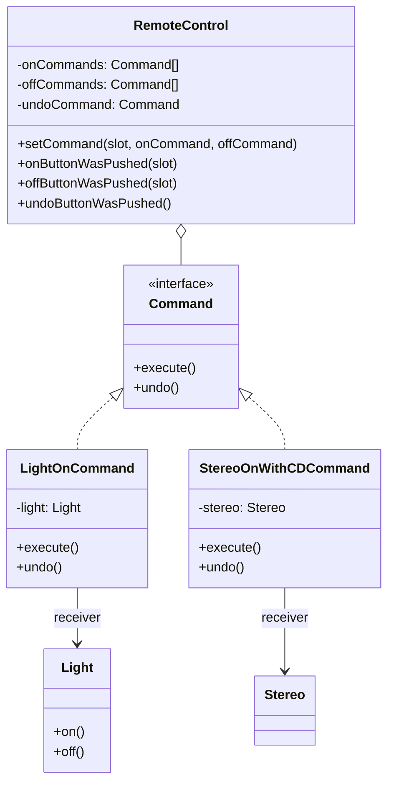
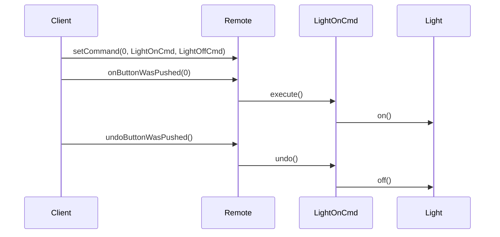

# 🕹️ Command Pattern: Programmable Smart Home Hub

## 📝 Overview
The **Command Pattern** encapsulates a request as a standalone object, allowing you to parameterize clients with different requests, queue or log requests, and support undoable operations. It decouples the object that invokes the operation from the one that knows how to perform it.

!!! abstract "Core Concepts"
    - **Encapsulation of Request:** Turning a method call into an object.
    - **Decoupling:** The Invoker (remote) knows nothing about the Receiver (light bulb).
    - **Undo/Redo:** Commands can store state to reverse their effects.
    - **Macro Commands:** Composing multiple commands into a single "macro" for batch execution.

---

## 🏭 The Engineering Story & Problem

### 😡 The Villain (The Problem)
Imagine a "Hardwired Remote Control" where every button is soldered directly to a specific device's circuit. Button 1 is hardwired to the Living Room Light. Button 2 to the Stereo.
If you want to change Button 1 to turn on the Kitchen Light instead, you have to physically rewire the remote (change the `Remote` class code). The remote acts like a God Object that needs to know the specific API of every device (`light.turnOn()`, `stereo.setVolume()`, `door.lock()`). This tight coupling makes the system rigid and hard to extend.

### 🦸 The Hero (The Solution)
The **Command Pattern** introduces a "Universal Connector." We create a standard `Command` interface with an `execute()` method. We wrap every specific device action (like "Turn on Light") into its own little class (e.g., `LightOnCommand`).
The remote just holds a list of these Command objects. When you press a button, it just says `command.execute()`. It doesn't care if it's turning on a light or launching a missile. You can swap commands in and out dynamically without touching the remote's code.

### 📜 Requirements & Constraints
1.  **(Functional):** The Remote Control must have programmable slots that can be assigned any command.
2.  **(Functional):** Support an "Undo" button that reverses the last action.
3.  **(Technical):** The Remote must be decoupled from specific device implementations (Light, Stereo, TV).

---

## 🏗️ Structure & Blueprint

### Class Diagram


### Runtime Context (Sequence)


---

## 💻 Implementation & Code

### 🧠 SOLID Principles Applied
- **Single Responsibility:** The `Remote` only knows how to trigger commands; `Commands` only know how to map trigger to action; `Devices` only know how to perform actions.
- **Open/Closed:** You can add new commands (e.g., `GarageDoorOpenCommand`) without changing the `Remote` code.

### 🐍 The Code

??? failure "The Villain's Code (Without Pattern)"
    ```python
    class RemoteControl:
        def on_button_pressed(self, slot):
            # 😡 Tight coupling and rigid logic
            if slot == 0:
                self.living_room_light.on()
            elif slot == 1:
                self.kitchen_light.on()
            elif slot == 2:
                self.stereo.on()
                self.stereo.set_cd()
                self.stereo.set_volume(11)
            # If we want to change slot 0, we must edit this class!
    ```

???+ success "The Hero's Code (With Pattern)"
    ```python
    --8<-- "design_patterns/behavioral/command/smart_home_hub/smart_home_hub.py"
    ```

---

## ⚖️ Trade-offs & Testing

| Pros (Why it works) | Cons (The Twist / Pitfalls) |
| :--- | :--- |
| **Decoupling:** Invoker and Receiver are independent. | **Class Explosion:** Every action requires a new concrete Command class. |
| **Extensibility:** Easy to add new commands or Macro commands. | **Complexity:** Can feel like overkill for simple callback logic. |
| **Undo/Redo:** State can be saved in the command to reverse it. | **Memory:** Keeping a history of commands for unlimited undo consumes RAM. |

### 🧪 Testing Strategy
1.  **Unit Test Commands:** verify that `LightOnCommand.execute()` calls `light.on()`.
2.  **Test Remote (Invoker):** Verify that the remote calls `execute()` on the injected mock command.
3.  **Test Undo:** Execute a command, then call undo, and verify the state is rolled back.

---

## 🎤 Interview Toolkit

- **Interview Signal:** mastery of **encapsulation**, **callbacks vs objects**, and **transactional behavior** (undo).
- **When to Use:**
    - "Implement a menu system where actions are configurable..."
    - "Build a task queue or job scheduler..."
    - "Support Undo/Redo functionality..."
- **Scalability Probe:** "How to handle thousands of commands?" (Answer: Use a command queue/worker pool pattern. Serializing commands to DB allows persistent queues.)
- **Design Alternatives:**
    - **Strategy:** Similar (encapsulating behavior), but Strategy is about *how* to do something, Command is about *what* to do.
    - **Memento:** Often used *with* Command to save state for undo.

## 🔗 Related Patterns
- [Memento](../../memento/text_editor_history/PROBLEM.md) — Used to store state for Command's undo.
- [Chain of Responsibility](../../chain_of_responsibility/PROBLEM.md) — A command can be passed along a chain.
- [Composite](../../../structural/composite/organisation_chart/PROBLEM.md) — MacroCommands are Composites of Commands.
