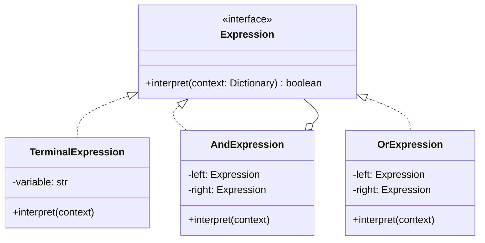
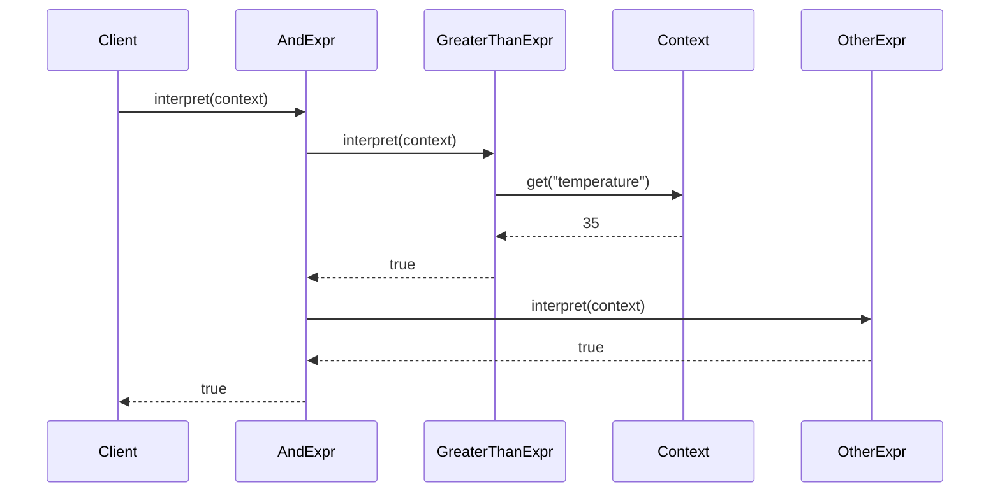

# 🔠 Interpreter Pattern: Smart Home Rule Engine

## 📝 Overview
The **Interpreter Pattern** defines a representation for a grammar and provides an evaluator that interprets sentences in that language. It is best used for building **rule engines**, **query languages**, or **domain-specific languages (DSLs)** where logic needs to be defined dynamically at runtime.

!!! abstract "Core Concepts"
    - **Abstract Syntax Tree (AST):** Sentences are parsed into a tree where nodes represent grammar rules.
    - **Recursive Evaluation:** Each node in the tree knows how to interpret itself by calling `interpret()` on its children.
    - **Context:** A global state object passed around during interpretation to look up variable values.

---

## 🏭 The Engineering Story & Problem

### 😡 The Villain (The Problem)
Imagine a "Hardcoded Rule System" for a smart home. Users want to define automation rules like "IF temp > 30 AND motion = detected THEN turn_on_ac".
In the bad version, you write a parser that spits out a massive nested `if-else` block or, worse, uses Python's dangerous `eval()` function on raw strings. Adding a new operator like "XOR" or "NOT" requires hacking the core parsing logic. The business logic is buried in the parser, making it rigid and unsafe.

### 🦸 The Hero (The Solution)
The **Interpreter Pattern** treats the rule as a "Sentence" in a language. We break the sentence down into small grammatical parts (Tokens).    
-   **Terminal Expressions:** The leaves of the tree (e.g., `30`, `temp`).  
-   **Non-Terminal Expressions:** The branches (e.g., `AndExpression`, `GreaterThanExpression`).    
We build a tree: `And(GreaterThan(temp, 30), Equals(motion, detected))`. To run it, we just call `root.interpret(context)`. The `And` node calls `interpret` on its two children and combines the result.

### 📜 Requirements & Constraints
1.  **(Functional):** Support boolean logic (`AND`, `OR`) and comparison operators (`>`, `<`).
2.  **(Technical):** The system must parse string rules into an executable object tree.
3.  **(Technical):** Context (sensor data) is provided at runtime, separate from the rule definition.

---

## 🏗️ Structure & Blueprint

### Class Diagram


### Runtime Context (Sequence)


---

## 💻 Implementation & Code

### 🧠 SOLID Principles Applied
- **Open/Closed:** You can add a `XorExpression` class without modifying the existing `AndExpression` or parsing logic.
- **Single Responsibility:** Each class handles the logic for exactly one grammar rule.

### 🐍 The Code

??? failure "The Villain's Code (Without Pattern)"
    ```python
    def check_rules(rule_string, data):
        # 😡 The Dangerous/Rigid Way
        # 1. Security risk (eval)
        # 2. Or massive hardcoded parsing logic
        if "AND" in rule_string:
            parts = rule_string.split("AND")
            # ... parsing hell ...
        
        # DANGEROUS:
        # return eval(rule_string, {}, data) 
    ```

???+ success "The Hero's Code (With Pattern)"
    ```python
    --8<-- "design_patterns/behavioral/interpreter/rule_engine/rule_engine.py"
    ```

---

## ⚖️ Trade-offs & Testing

| Pros (Why it works) | Cons (The Twist / Pitfalls) |
| :--- | :--- |
| **Extensibility:** Easy to add new grammar rules. | **Complexity:** A class for every grammar rule. |
| **Safety:** Sandboxed execution (unlike `eval`). | **Performance:** Recursive calls can be slow for huge trees. |
| **Modularity:** Logic is broken down into tiny units. | **Hard to Maintain:** If the grammar gets too big, the number of classes explodes. |

### 🧪 Testing Strategy
1.  **Unit Test Expressions:** Test `AndExpression` with hardcoded true/false children.
2.  **Integration Test:** Parse a full string `"temp > 10"` and verify `interpret({'temp': 20})` returns `True`.

---

## 🎤 Interview Toolkit

- **Interview Signal:** mastery of **recursion**, **trees**, and **language design**.
- **When to Use:**
    - "Design a rule engine..."
    - "Implement a custom query language..."
    - "Evaluate complex logical expressions..."
- **Scalability Probe:** "What if the expression tree is 10,000 nodes deep?" (Answer: Recursion depth limit. Use the Visitor pattern or an iterative stack-based approach.)
- **Design Alternatives:**
    - **Composite:** The Interpreter structure *is* a Composite.
    - **Visitor:** Used to separate the operation (interpret, pretty-print) from the structure.

## 🔗 Related Patterns
- [Composite](../../../structural/composite/organisation_chart/PROBLEM.md) — The structure of the AST is a Composite.
- [Visitor](../../visitor/PROBLEM.md) — Can be used to traverse the tree and perform operations (like validation or printing) without changing the classes.
- [Flyweight](../../../structural/flyweight/forest_simulator/PROBLEM.md) — Terminal nodes (like the string "temperature") can be shared.
