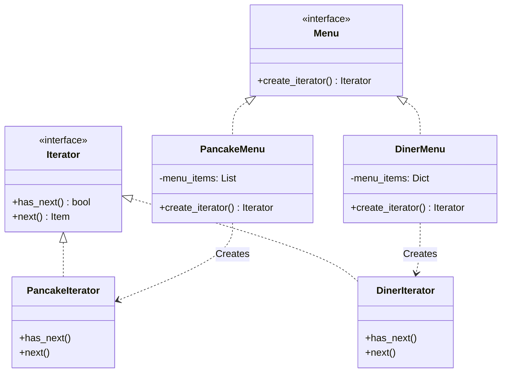
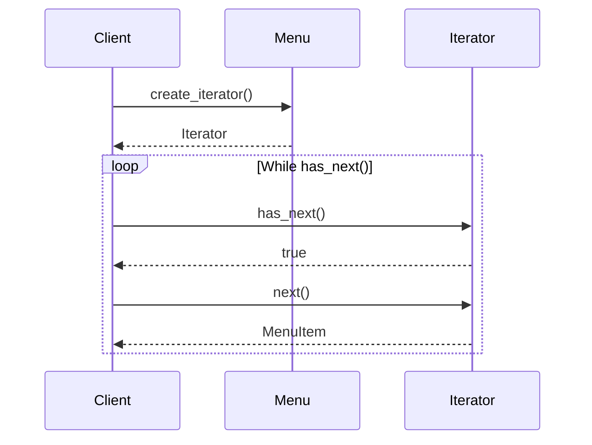

# 📋 Iterator Pattern: Unified Menu Traversal

## 📝 Overview
The **Iterator Pattern** provides a way to access the elements of an aggregate object sequentially without exposing its underlying representation (list, stack, tree, etc.). It decouples the traversal algorithms from the data structure, allowing a client to iterate over diverse collections using a uniform interface.

!!! abstract "Core Concepts"
    - **Uniform Interface:** `hasNext()` and `next()` work the same way whether you're traversing a linked list or a hash map.
    - **Single Responsibility:** The collection focuses on storage; the iterator focuses on traversal.
    - **Encapsulation:** The client doesn't know (or care) how the data is stored internally.

---

## 🏭 The Engineering Story & Problem

### 😡 The Villain (The Problem)
Meet "The Frustrated Waitress." She works for a company that just merged two restaurants: "Objectville Diner" and "Pancake House."
-   **Pancake House** stores their menu items in a Python `List` (`[]`).
-   **Objectville Diner** stores their menu items in a Python `Dictionary` (`{}`).
To print the combined menu, the Waitress has to write two completely different loops. One uses an index `for i in range(len(list))` and the other iterates over keys `for key in dict`. If a third restaurant joins (using a Tree or Set), she has to write *another* specific loop. Her code is tightly coupled to the internal data structures of every restaurant.

### 🦸 The Hero (The Solution)
The **Iterator Pattern** introduces a standard "Remote Control" for traversal. We define an `Iterator` interface with just two methods: `has_next()` and `next()`.
Each restaurant implements its own `create_iterator()` method.
-   Pancake House returns a `ListIterator`.
-   Diner returns a `DictIterator`.
The Waitress now just asks for an iterator. She runs a simple `while iterator.has_next(): print(iterator.next())`. She doesn't know if it's a list, an array, or a database cursor.

### 📜 Requirements & Constraints
1.  **(Functional):** Traverse both `List` based menus and `Dictionary` based menus using the same client code.
2.  **(Technical):** The traversal logic must be encapsulated in separate Iterator classes.
3.  **(Technical):** The Client (Waitress) must rely only on the `Iterator` interface.

---

## 🏗️ Structure & Blueprint

### Class Diagram


### Runtime Context (Sequence)


---

## 💻 Implementation & Code

### 🧠 SOLID Principles Applied
- **Single Responsibility:** The Menu classes manage data; the Iterator classes manage traversal.
- **Open/Closed:** You can add a new `CafeMenu` (using a Tree) with a new `TreeIterator` without changing the Waitress code.

### 🐍 The Code

??? failure "The Villain's Code (Without Pattern)"
    ```python
    class Waitress:
        def print_menu(self):
            # 😡 Tightly coupled to implementation details
            pancake_menu = PancakeHouseMenu()
            diner_menu = DinerMenu()
            
            # Loop 1: List
            for item in pancake_menu.get_menu_items():
                print(item)
                
            # Loop 2: Dictionary
            menu_dict = diner_menu.get_menu_items()
            for key in menu_dict:
                print(menu_dict[key])
                
            # If we add a 3rd menu, we need a 3rd loop type!
    ```

???+ success "The Hero's Code (With Pattern)"
    ```python
    --8<-- "design_patterns/behavioral/iterator/menu_iterator/menu_iterator.py"
    ```

---

## ⚖️ Trade-offs & Testing

| Pros (Why it works) | Cons (The Twist / Pitfalls) |
| :--- | :--- |
| **Uniformity:** Client code looks the same for all collections. | **Overhead:** Creating an object for simple iteration is slower than a raw `for` loop. |
| **Encapsulation:** Hides internal data structures (Arrays, Lists, Trees). | **Complexity:** Needs a new class for every type of collection. |
| **Flexibility:** Can support multiple simultaneous traversals. | **Modification:** Iterating while modifying the collection (add/remove) is dangerous. |

### 🧪 Testing Strategy
1.  **Unit Test Iterators:** Create a list, wrap it in an iterator, and verify `next()` returns items in order and `has_next()` returns false at the end.
2.  **Test Empty Collections:** Ensure the iterator handles empty lists gracefully without crashing.

---

## 🎤 Interview Toolkit

- **Interview Signal:** Mastery of **abstraction layers** and **interface-based design**.
- **When to Use:**
    - "Traverse a composite structure (like a tree)..."
    - "Hide the complexity of a data structure..."
    - "Write a generic algorithm that works on any collection..."
- **Scalability Probe:** "How to handle a database result set with 1 million rows?" (Answer: Use a "Pagination Iterator" or a "Cursor Iterator" that lazy-loads data in chunks.)
- **Design Alternatives:**
    - **Visitor:** Often used with Iterator to perform an operation on each element.
    - **Composite:** Iterator is the standard way to traverse a Composite tree.

## 🔗 Related Patterns
- [Composite](../../../structural/composite/organisation_chart/PROBLEM.md) — Iterator is used to traverse Composite trees.
- [Factory Method](../../../creational/factory/document_factory/PROBLEM.md) — `create_iterator()` is a Factory Method.
- [Memento](../../memento/text_editor_history/PROBLEM.md) — Can capture the state of an iteration.
