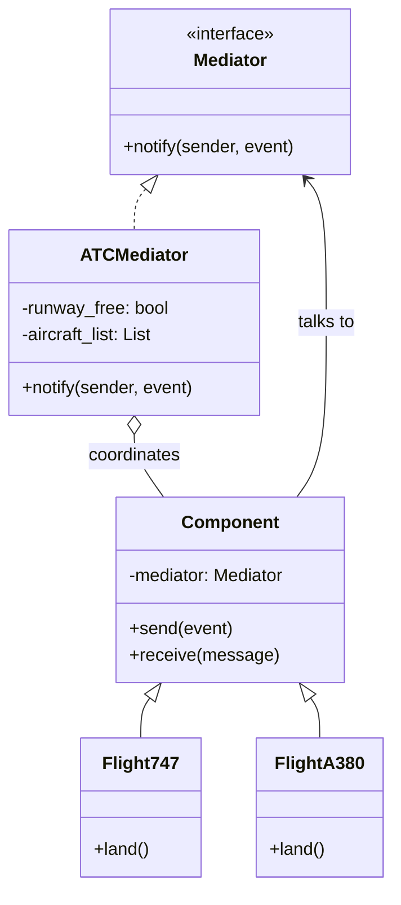
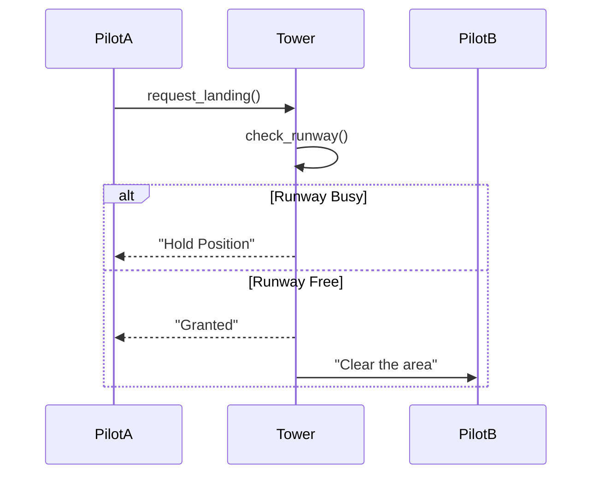

# ✈️ Mediator Pattern: ATC Flight Coordination

## 📝 Overview
The **Mediator Pattern** reduces chaotic dependencies between objects by forcing them to communicate via a central mediator object. This limits direct connections between components, allowing them to communicate indirectly and reducing coupling from a messy mesh ($N^2$) to a simple star topology ($N$).

!!! abstract "Core Concepts"
    - **Centralized Control:** A single point of truth (like an Air Traffic Controller) manages complex interactions.
    - **Loose Coupling:** Components (Colleagues) don't need to know about each other; they only talk to the Mediator.
    - **Hub-and-Spoke:** Replaces many-to-many relationships with one-to-many relationships.

---

## 🏭 The Engineering Story & Problem

### 😡 The Villain (The Problem)
Imagine an airport without an Air Traffic Control tower. Every pilot has to talk to every other pilot to coordinate landings.   
"Flight A calling Flight B: I'm landing."   
"Flight B calling Flight A: Wait, I'm taking off!"  
"Flight C calling Flight A: I'm also landing!"  
This "N-squared" communication chaos leads to a spaghetti network of dependencies. If you add one more plane, it has to connect to all existing planes. The system is fragile, hard to maintain, and dangerous.

### 🦸 The Hero (The Solution)
The **Mediator Pattern** introduces the "Tower" (ATC).  
Pilots (Colleagues) never talk to each other directly. They only talk to the Tower. 
-   Flight A: "Tower, requesting to land."  
-   Tower: "Flight A, hold position. Flight B is taking off."   
-   Tower: "Flight B, runway is yours." 
The logic for *who goes when* stays in the Tower. The planes are simple; they just follow orders. You can change the landing rules in the Tower without modifying the planes.

### 📜 Requirements & Constraints
1.  **(Functional):** Ensure only one aircraft uses the runway at a time.
2.  **(Technical):** Aircraft classes (`Boeing`, `Airbus`) must not reference each other.
3.  **(Technical):** All communication must go through the `ATCMediator`.

---

## 🏗️ Structure & Blueprint

### Class Diagram


### Runtime Context (Sequence)


---

## 💻 Implementation & Code

### 🧠 SOLID Principles Applied
- **Single Responsibility:** The Mediator handles the complex interaction logic; Components handle their own business logic.
- **Open/Closed:** You can introduce new types of Aircraft without changing the Mediator (mostly), but changing the *interaction logic* often requires changing the Mediator.

### 🐍 The Code

??? failure "The Villain's Code (Without Pattern)"
    ```python
    class Plane:
        def __init__(self, other_planes):
            self.other_planes = other_planes
            
        def request_landing(self):
            # 😡 Every plane talks to every other plane
            for p in self.other_planes:
                if p.is_landing:
                    print("Waiting for plane", p)
                    return
            print("Landing!")
    ```

???+ success "The Hero's Code (With Pattern)"
    ```python
    # TODO: Add solution file for Mediator
    # --8<-- "design_patterns/behavioral/mediator/mediator.py"
    ```

---

## ⚖️ Trade-offs & Testing

| Pros (Why it works) | Cons (The Twist / Pitfalls) |
| :--- | :--- |
| **Decoupling:** Reduces dependencies between components. | **God Object:** The Mediator can become huge and complex. |
| **Centralization:** Interaction logic is in one place. | **Performance:** Centralized bottleneck for communication. |
| **Simplicity:** Colleague classes remain small and focused. | **Hidden Logic:** Hard to see *how* components interact just by looking at them. |

### 🧪 Testing Strategy
1.  **Unit Test Mediator:** Mock the colleagues (Aircraft). Send an event to the Mediator and verify it calls the correct methods on the other mocks.
2.  **Test Colleagues:** Verify they send the correct messages to the Mediator interface.

---

## 🎤 Interview Toolkit

- **Interview Signal:** mastery of **system decoupling** and **event-driven architectures**.
- **When to Use:**
    - "Manage complex GUI forms where changing one checkbox affects 5 others..."
    - "Coordinate microservices through a message broker..."
    - "Refactor a system with cyclic dependencies..."
- **Scalability Probe:** "What if the Mediator becomes a bottleneck?" (Answer: Use multiple Mediators for different subsystems, or an Event Bus.)
- **Design Alternatives:**
    - **Observer:** Can be used to implement the Mediator (Mediator subscribes to Colleagues).
    - **Facade:** Simpler, one-way structural interface. Mediator is multidirectional and behavioral.

## 🔗 Related Patterns
- [Observer](../observer/basic_observer/PROBLEM.md) — The Mediator often uses Observer to listen to events.
- [Facade](../../structural/facade/smart_home_facade/PROBLEM.md) — Facade provides a unified interface to a system; Mediator coordinates interaction *between* components.
