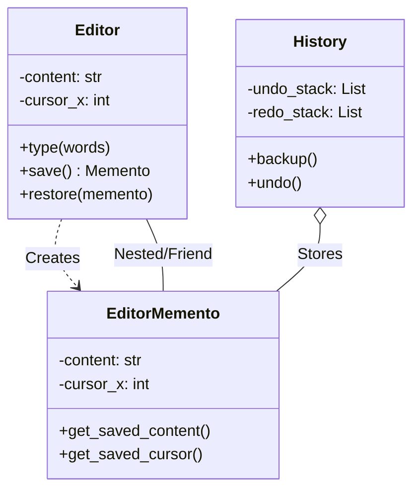
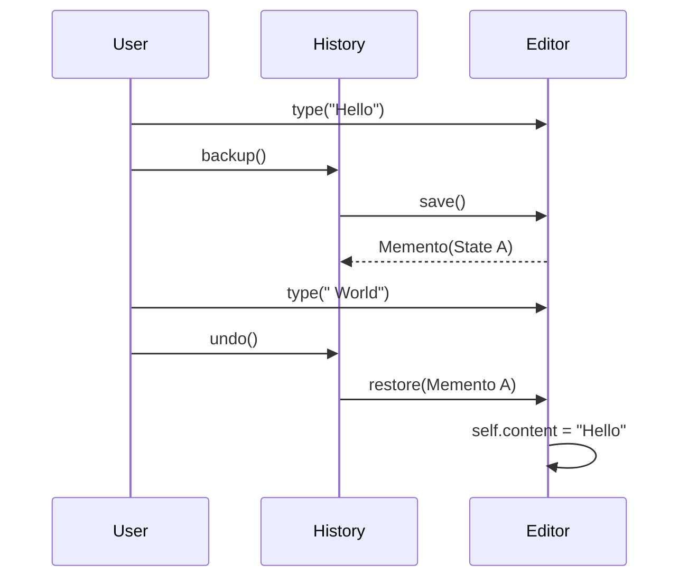

# 💾 Memento Pattern: Advanced Undo/Redo System

## 📝 Overview
The **Memento Pattern** captures and externalizes an object's internal state so that the object can be restored to this state later. It allows you to implement **Undo/Redo** functionality without violating encapsulation (i.e., without exposing private fields to the outside world).

!!! abstract "Core Concepts"
    - **Originator:** The object whose state needs to be saved (e.g., the Text Editor).
    - **Memento:** An immutable object that acts as a snapshot of the Originator's state.
    - **Caretaker:** The object that keeps track of the Mementos (e.g., a History stack) but never modifies them.

---

## 🏭 The Engineering Story & Problem

### 😡 The Villain (The Problem)
Imagine a "Complex Text Editor" with text content, cursor position, scroll position, and text selection. You want to implement `Ctrl+Z` (Undo). 
The naive approach is to have a `HistoryManager` that forcefully reads the `Editor`'s private variables (`editor._content`, `editor._cursor_x`) and saves them. 
This breaks **Encapsulation**. If you change the `Editor`'s internal implementation (e.g., renaming `_cursor_x` to `_position`), the `HistoryManager` breaks. The `HistoryManager` knows too much about the `Editor`.

### 🦸 The Hero (The Solution)
The **Memento Pattern** introduces a "Black Box" snapshot.  
The `Editor` (Originator) has a method `save()` that returns a `Memento` object containing a copy of its internal state. The `HistoryManager` (Caretaker) grabs this object and puts it in a stack. It *cannot* look inside the Memento; it just holds it.  
When the user presses Undo, the `HistoryManager` pops the Memento and passes it back to the `Editor.restore(memento)`. The `Editor` opens the box and restores its own state. The secrets remain with the Editor.

### 📜 Requirements & Constraints
1.  **(Functional):** Support unlimited Undo/Redo operations.
2.  **(Technical):** The Memento object must be immutable (state cannot be changed once saved).
3.  **(Technical):** The Caretaker must not have access to the internal data of the Memento.

---

## 🏗️ Structure & Blueprint

### Class Diagram


### Runtime Context (Sequence)


---

## 💻 Implementation & Code

### 🧠 SOLID Principles Applied
- **Single Responsibility:** The `History` class manages the stack; the `Editor` manages the state.
- **Open/Closed:** You can add new state fields to `Editor` and `Memento` without changing the `History` class.

### 🐍 The Code

??? failure "The Villain's Code (Without Pattern)"
    ```python
    class HistoryManager:
        def backup(self, editor):
            # 😡 Breaks encapsulation! accessing private fields
            self.snapshots.append({
                "content": editor._hidden_content, 
                "cursor": editor._cursor_pos
            })
            
        def undo(self, editor):
            state = self.snapshots.pop()
            # 😡 Direct injection of state
            editor._hidden_content = state["content"] 
    ```

???+ success "The Hero's Code (With Pattern)"
    ```python
    --8<-- "design_patterns/behavioral/memento/advanced_text_editor/advanced_text_editor.py"
    ```

---

## ⚖️ Trade-offs & Testing

| Pros (Why it works) | Cons (The Twist / Pitfalls) |
| :--- | :--- |
| **Encapsulation:** Internal state stays private. | **Memory Usage:** Storing full copies of state can be expensive. |
| **Simplified Originator:** Doesn't need to manage history logic. | **Complexity:** Requires creating specific Memento classes. |
| **Stability:** History class isn't coupled to Originator fields. | **Performance:** Deep copying state (if required) takes time. |

### 🧪 Testing Strategy
1.  **Unit Test Memento:** Verify that a Memento object correctly holds the data it was given.
2.  **Test Undo Logic:** Perform actions, save state, perform more actions, undo, and verify the state is identical to the saved state.
3.  **Test Immutability:** Ensure that modifying the Memento after creation doesn't affect the Editor or vice-versa.

---

## 🎤 Interview Toolkit

- **Interview Signal:** mastery of **state management**, **encapsulation**, and **undo architectures**.
- **When to Use:**
    - "Implement Undo/Redo..."
    - "Save snapshots of a game state..."
    - "Implement database transactions (rollback)..."
- **Scalability Probe:** "How to handle huge states (e.g., Photoshop)?" (Answer: Use "Deltas" or "Diffs" in the Memento instead of full copies. Or store Mementos on disk.)
- **Design Alternatives:**
    - **Command:** Command Pattern can also support undo by having an `unexecute()` method. Memento is better for "snapshotting" arbitrary state; Command is better for reversing specific operations.

## 🔗 Related Patterns
- [Command](../../command/smart_home_hub/PROBLEM.md) — Commands can use Mementos to save state before executing, to support undo.
- [Prototype](../../../creational/prototype/PROBLEM.md) — Mementos are often created by cloning the Originator's state (using Prototype).
