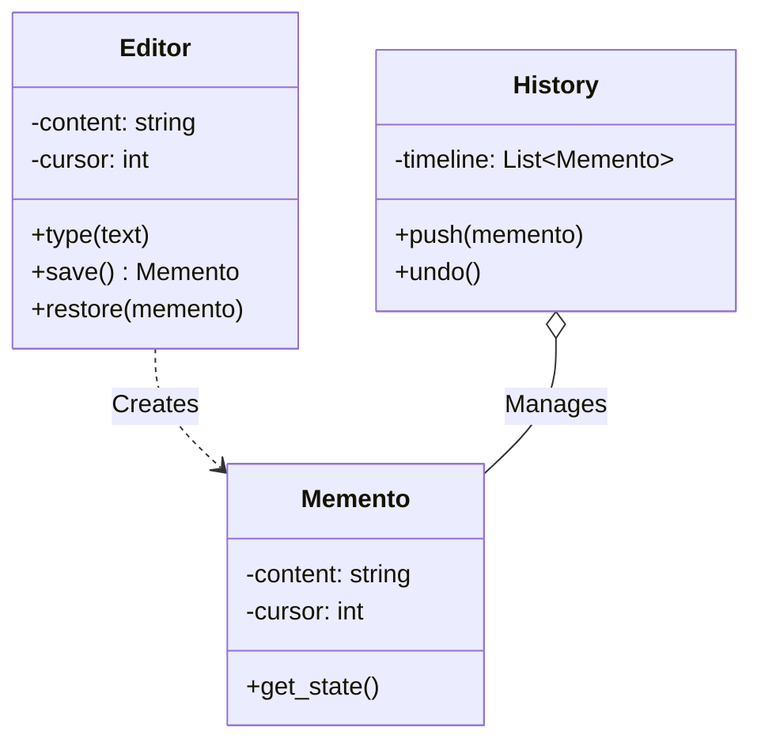
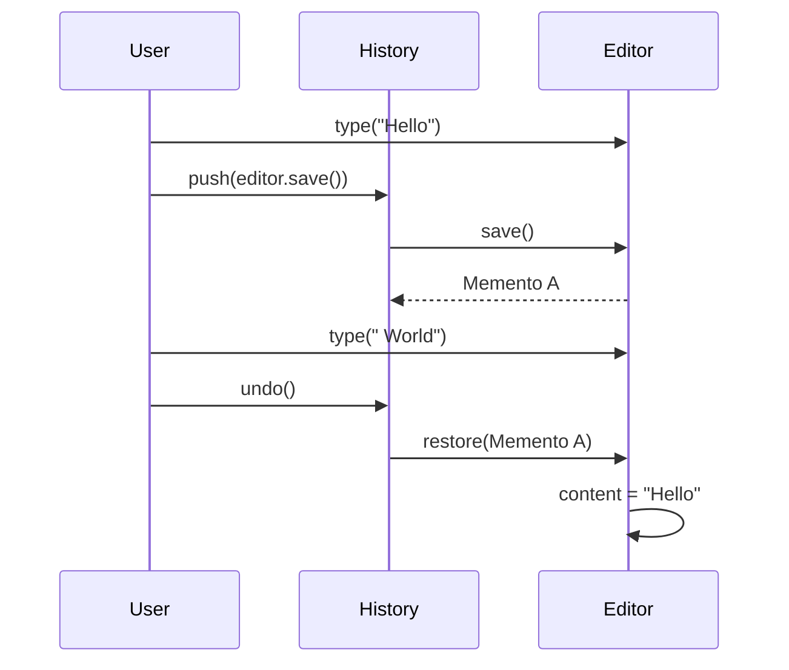

# ⏪ Memento Pattern: Pro-Pixel Undo History

## 📝 Overview
The **Memento Pattern** provides the ability to capture and externalize an object's internal state so that it can be restored later, without violating encapsulation. It is the architectural backbone of "Undo/Redo" functionality.

!!! abstract "Core Concepts"
    - **Snapshot:** Capturing the exact state of an object at a specific point in time.
    - **Encapsulation:** The object's internal details (private fields) are saved but remains hidden from the rest of the system.
    - **History Management:** A separate caretaker manages the timeline of snapshots.

---

## 🏭 The Engineering Story & Problem

### 😡 The Villain (The Problem)
You're building a professional text editor. You need an "Undo" feature. 
The "Snapshot Leaker" approach is to let the `HistoryManager` read the `Editor`'s private variables (`_text`, `_cursor`, `_scroll_y`) and copy them into a list.    
This creates **Tight Coupling**. The `HistoryManager` now depends on the internal implementation of the `Editor`. If you refactor the `Editor` to use a `GapBuffer` instead of a string, the `HistoryManager` breaks. You've leaked the internal state, violating encapsulation.

### 🦸 The Hero (The Solution)
The **Memento Pattern** solves this by creating a "Sealed Envelope" (the Memento).  
The `Editor` (Originator) packs its own state into a `Memento` object. It hands this sealed envelope to the `HistoryManager` (Caretaker). The `HistoryManager` keeps it safe but **cannot open it**.    
When the user hits Undo, the `HistoryManager` hands the envelope back to the `Editor`. The `Editor` opens it and restores its state. The `HistoryManager` never saw the data, preserving encapsulation.

### 📜 Requirements & Constraints
1.  **(Functional):** implement a text editor with Undo functionality.
2.  **(Technical):** The `History` class must treat Mementos as opaque objects (no access to fields).
3.  **(Technical):** Mementos must be immutable deep copies of the state.

---

## 🏗️ Structure & Blueprint

### Class Diagram


### Runtime Context (Sequence)


---

## 💻 Implementation & Code

### 🧠 SOLID Principles Applied
- **Single Responsibility:** `Editor` handles editing; `History` handles storage.
- **Open/Closed:** The `History` mechanism works for any object that implements the Memento pattern.

### 🐍 The Code

??? failure "The Villain's Code (Without Pattern)"
    ```python
    class History:
        def save(self, editor):
            # 😡 Direct access to private fields
            self.snapshots.append(editor._content)
            
        def undo(self, editor):
            # 😡 Direct modification of private fields
            editor._content = self.snapshots.pop()
    ```

???+ success "The Hero's Code (With Pattern)"
    ```python
    --8<-- "design_patterns/behavioral/memento/text_editor_history/text_editor_history.py"
    ```

---

## ⚖️ Trade-offs & Testing

| Pros (Why it works) | Cons (The Twist / Pitfalls) |
| :--- | :--- |
| **Encapsulation:** State remains private. | **RAM Usage:** Saving full copies is memory intensive. |
| **Separation:** Originator and Caretaker are decoupled. | **Complexity:** Needs extra Memento classes. |
| **Safety:** Caretaker cannot corrupt the state. | **Garbage Collection:** Caretakers can keep obsolete states alive. |

### 🧪 Testing Strategy
1.  **Unit Test Editor:** Verify `type()` changes state.
2.  **Unit Test Undo:** Type "A", Save, Type "B", Undo. Verify state is "A".
3.  **Test Immutability:** Verify that changing the Memento object externally (if possible) doesn't change the Editor.

---

## 🎤 Interview Toolkit

- **Interview Signal:** Demonstrates understanding of **encapsulation boundaries** and **restoration logic**.
- **When to Use:**
    - "Implement 'Ctrl+Z'..."
    - "Save game progress..."
    - "Transaction rollback..."
- **Scalability Probe:** "How to implement Undo for a 1GB file?" (Answer: Don't save the whole file. Save the *diff* or operation (Command pattern) to reverse it.)
- **Design Alternatives:**
    - **Command Pattern:** Often preferred for "lightweight" undo (reversing the operation) vs Memento's "heavyweight" undo (restoring the state).

## 🔗 Related Patterns
- [Command](../../command/smart_home_hub/PROBLEM.md) — Can implement undo by reversing operations.
- [Prototype](../../../creational/prototype/PROBLEM.md) — Used to create the state copy for the Memento.
