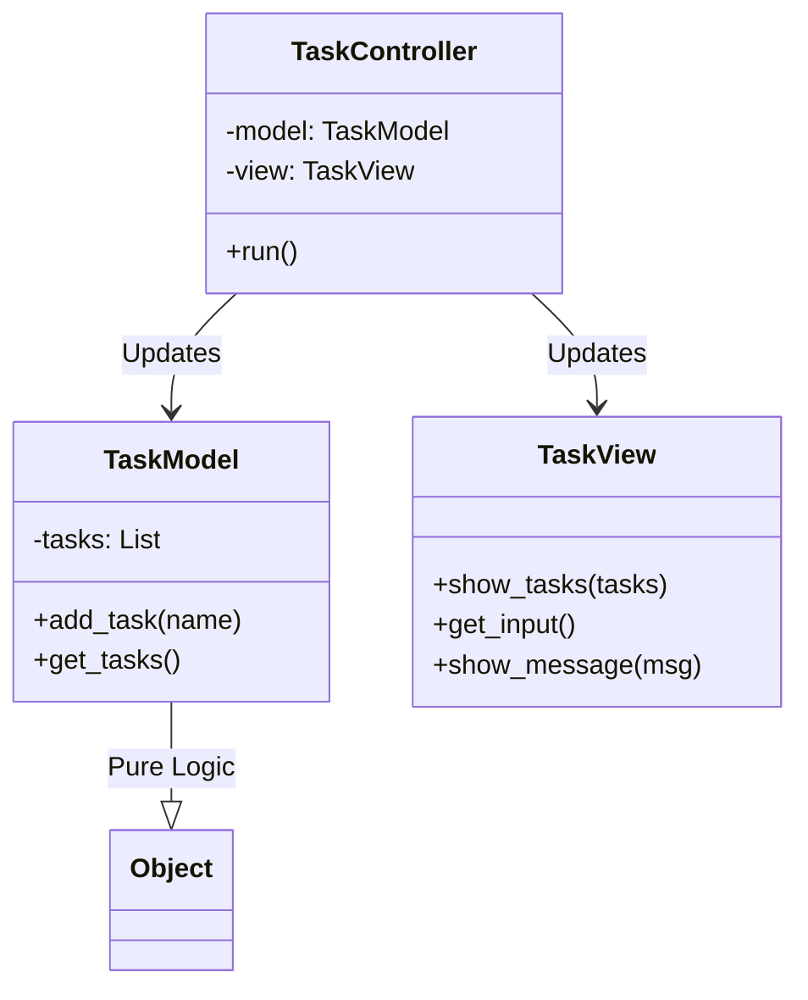
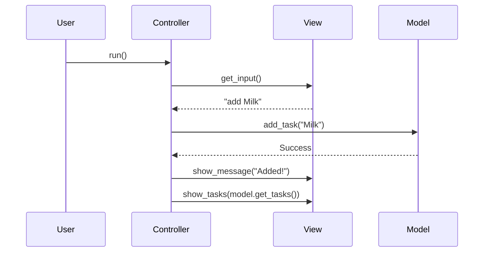

# 🏗️ MVC Pattern: CLI Task Manager

## 📝 Overview
The **Model-View-Controller (MVC)** pattern is an architectural pattern that separates an application into three main logical components: the **Model** (data and business logic), the **View** (user interface), and the **Controller** (input handling and orchestration). This separation of concerns makes the application easier to modify, test, and extend.

!!! abstract "Core Concepts"
    - **Model:** The "Brain." Manages data, logic, and rules. It has *no knowledge* of the UI.
    - **View:** The "Face." Visualizes the data (CLI, Web, GUI). It shouldn't contain business logic.
    - **Controller:** The "Coordinator." Accepts input, converts it to commands for the Model or View.

---

## 🏭 The Engineering Story & Problem

### 😡 The Villain (The Problem)
You're building a simple CLI To-Do app. You start with a single `main.py`.
You mix SQL queries with `print()` statements.
```python
if user_input == "add":
    db.execute("INSERT INTO tasks...")
    print(f"{green_color}Task Added!{reset_color}")
```
This is "Spaghetti Code."
-   **Hard to Test:** You can't test the "Add Task" logic without seeing the print output.
-   **Hard to Change:** If you want to switch from CLI to a Web API, you have to rewrite the whole application because the database logic is tangled with `print` statements.

### 🦸 The Hero (The Solution)
The **MVC Pattern** enforces strict separation.
1.  **Model:** `TaskModel`. Holds the list of tasks. Knows how to add/remove/complete tasks. Knows *nothing* about printing.
2.  **View:** `TaskView`. Knows how to print a task list prettily. Knows how to ask for input. Knows *nothing* about storage.
3.  **Controller:** `TaskController`. Connects them.
    -   "View, get me an input."
    -   "Model, add this task."
    -   "View, show the success message."
You can now swap the `TaskView` (CLI) for a `WebTaskView` (HTML) without touching the `TaskModel`.

### 📜 Requirements & Constraints
1.  **(Functional):** Users can add, view, and complete tasks via CLI.
2.  **(Technical):** The Model must not import the View or Controller.
3.  **(Technical):** The View must not process business logic (like validation).

---

## 🏗️ Structure & Blueprint

### Class Diagram


### Runtime Context (Sequence)


---

## 💻 Implementation & Code

### 🧠 SOLID Principles Applied
- **Single Responsibility:** Each component has exactly one job (Data, UI, or Coordination).
- **Dependency Inversion:** The high-level policy (Task Management) is decoupled from the low-level details (CLI Input/Output).

### 🐍 The Code

??? failure "The Villain's Code (Without Pattern)"
    ```python
    def run_app():
        # 😡 The God Function
        tasks = []
        while True:
            cmd = input("Enter command: ")
            if cmd == "add":
                name = input("Task name: ")
                # Logic mixed with UI
                if len(name) < 3:
                    print("Error: Name too short")
                    continue
                tasks.append(name)
                print("Task added!")
            elif cmd == "list":
                for t in tasks:
                    print(f"- {t}")
    ```

???+ success "The Hero's Code (With Pattern)"
    ```python
    # TODO: Add solution file for MVC
    # --8<-- "design_patterns/behavioral/mvc/task_manager_mvc.py"
    ```

---

## ⚖️ Trade-offs & Testing

| Pros (Why it works) | Cons (The Twist / Pitfalls) |
| :--- | :--- |
| **Testability:** Test the Model in isolation (fast, no UI). | **Complexity:** 3 files instead of 1. |
| **Flexibility:** Swap UI (CLI -> Web) easily. | **Boilerplate:** Passing data between layers can feel tedious. |
| **Organization:** Code is easy to navigate. | **Controller Bloat:** Business logic tends to leak into the Controller. |

### 🧪 Testing Strategy
1.  **Unit Test Model:** Verify `add_task` adds to the list and validation works.
2.  **Mock Test Controller:** Mock the View and Model. Verify that when View returns "add", Controller calls `model.add_task`.
3.  **Manual Test View:** Verify the CLI formatting looks correct.

---

## 🎤 Interview Toolkit

- **Interview Signal:** Mastery of **architectural patterns** and **separation of concerns**.
- **When to Use:**
    - "Build a web app (Django/Rails)..."
    - "Design a GUI application..."
    - "Separate backend logic from frontend display..."
- **Scalability Probe:** "How does this scale to a rich client-side app (SPA)?" (Answer: The Backend becomes the Model/Controller (API), and the Frontend has its own MVC/MVVM structure.)
- **Design Alternatives:**
    - **MVVM (Model-View-ViewModel):** Better for modern UIs with data binding (React, Vue, WPF).
    - **Clean Architecture:** A more advanced layering (Entities, Use Cases, Interfaces).

## 🔗 Related Patterns
- [Observer](../observer/basic_observer/PROBLEM.md) — The View often observes the Model for updates.
- [Command](../command/smart_home_hub/PROBLEM.md) — Controllers often use Commands to execute user actions.
