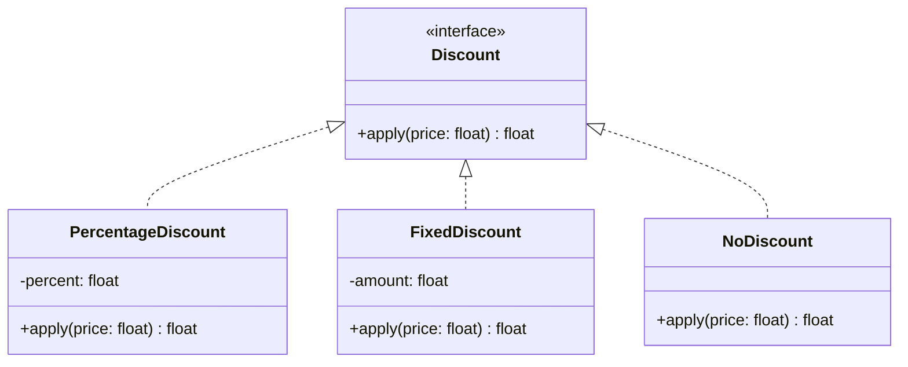
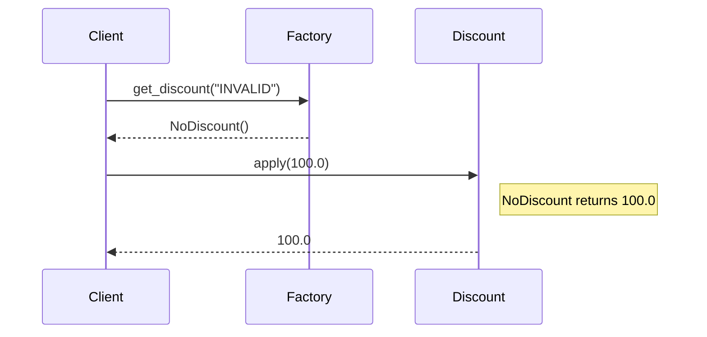

# 🧱 Null Object: Resilient Discount Engine

## 📝 Overview
The **Null Object Pattern** uses a special object to represent the absence of a value or behavior, instead of using `null` (or `None` in Python). This removes the need for repetitive null-checks in client code and provides a safe, "do-nothing" default behavior.

!!! abstract "Core Concepts"
    - **Polymorphism:** The Null Object implements the same interface as the Real Object.
    - **Safe Defaults:** Instead of crashing or doing nothing by accident, the Null Object explicitly defines "doing nothing."
    - **Cleaner Code:** Replaces cluttered `if obj is not None:` blocks with uniform method calls.

---

## 🏭 The Engineering Story & Problem

### 😡 The Villain (The Problem)
You're building an e-commerce checkout. Users *might* have a discount code, or they might not.  
The "Null-Check Minefield" code looks like this:
```python
discount = get_discount(code)
if discount is not None:
    total = discount.apply(total)
else:
    # Do nothing, keep total as is
    pass
```
This check has to be repeated *everywhere* the discount is used (UI display, invoice generation, email receipt). If a developer forgets the check in just one place, the app crashes with `AttributeError: 'NoneType' object has no attribute 'apply'`.

### 🦸 The Hero (The Solution)
The **Null Object Pattern** introduces a "Safety Net."  
We create a `NoDiscount` class that implements the `Discount` interface. Its `apply()` method simply returns the price unchanged.   
Now, the `get_discount(code)` function *never* returns `None`. If the code is invalid, it returns `NoDiscount()`.   
The client code becomes:
```python
total = get_discount(code).apply(total)
```
No checks. No crashes. The system handles the "absence" of a discount gracefully using polymorphism.

### 📜 Requirements & Constraints
1.  **(Functional):** The system must handle valid and invalid/missing discount codes.
2.  **(Technical):** The client code must not check for `None`.
3.  **(Technical):** The `NoDiscount` object must behave exactly like a real `Discount` but have no effect on the price.

---

## 🏗️ Structure & Blueprint

### Class Diagram


### Runtime Context (Sequence)


---

## 💻 Implementation & Code

### 🧠 SOLID Principles Applied
- **Liskov Substitution:** `NoDiscount` can be used anywhere a `Discount` is expected without breaking the application.
- **Open/Closed:** You can add new discount types without changing client logic.

### 🐍 The Code

??? failure "The Villain's Code (Without Pattern)"
    ```python
    def calculate_total(price, discount_code):
        discount = lookup_discount(discount_code)
        
        # 😡 Repetitive null checks everywhere
        if discount is not None:
            final_price = discount.apply(price)
        else:
            final_price = price
            
        # ... later in code ...
        if discount is not None:
            print(f"Applied: {discount.name}")
        else:
            print("No discount")
    ```

???+ success "The Hero's Code (With Pattern)"
    ```python
    --8<-- "design_patterns/behavioral/null_object/discount_system/discount_system.py"
    ```

---

## ⚖️ Trade-offs & Testing

| Pros (Why it works) | Cons (The Twist / Pitfalls) |
| :--- | :--- |
| **Robustness:** Eliminates NullPointerExceptions. | **Hidden Errors:** Can mask real bugs if a missing object *should* contain data. |
| **Simplicity:** Removes conditional logic (`if/else`) from client. | **Class Explosion:** Need a Null class for every interface. |
| **Reusability:** The Null Object can be reused (Singleton). | **Confusion:** Developers might expect `None` and be confused by an object. |

### 🧪 Testing Strategy
1.  **Unit Test NoDiscount:** Verify `apply(100)` returns `100`.
2.  **Test Factory:** Verify that providing an invalid code returns an instance of `NoDiscount`, not `None`.
3.  **Integration:** Verify the checkout flow works seamlessly with the Null Object.

---

## 🎤 Interview Toolkit

- **Interview Signal:** mastery of **defensive programming** and **polymorphism**.
- **When to Use:**
    - "Handle optional dependencies (like a Logger)..."
    - "Avoid null checks in a strategy pattern..."
    - "Provide a default behavior for missing configuration..."
- **Scalability Probe:** "How to optimize memory if `NoDiscount` is used millions of times?" (Answer: Make `NoDiscount` a Singleton. It has no state, so one instance is enough.)
- **Design Alternatives:**
    - **Optional/Maybe Type:** In languages like Java/Rust, `Optional<T>` forces the handling of missing values. Null Object is the OO version of this.

## 🔗 Related Patterns
- [Strategy](../../strategy/sprinkler_system/PROBLEM.md) — Null Object is often a "Default Strategy."
- [Singleton](../../../creational/singleton/singleton_pattern/PROBLEM.md) — Null Objects are usually Singletons.
- [Factory Method](../../../creational/factory/document_factory/PROBLEM.md) — The Factory creates the Null Object when appropriate.
