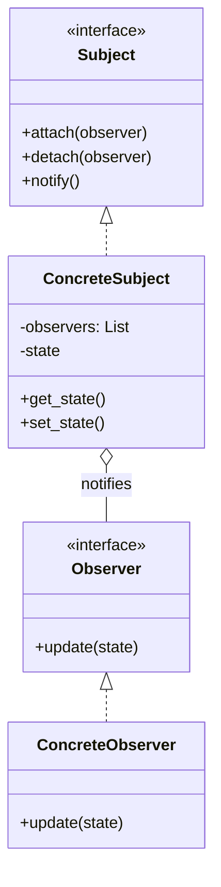
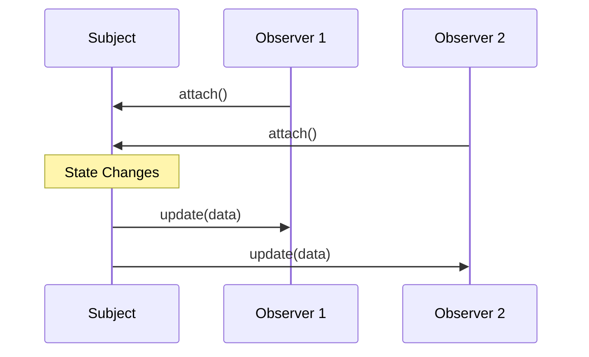

# 👀 Observer Pattern: Core Subscription Mechanics

## 📝 Overview
The **Observer Pattern** is the foundation of reactive programming. It defines a one-to-many dependency between objects so that when one object (the **Subject**) changes state, all its dependents (**Observers**) are notified and updated automatically.

!!! abstract "Core Concepts"
    - **Subject Registry:** A central list of "subscribers" that the subject manages.
    - **Loose Coupling:** The Subject doesn't need to know the specific classes of its observers, only that they implement a common interface.
    - **Broadcast Communication:** The subject pushes updates to all registered observers simultaneously.

---

## 🏭 The Engineering Story & Problem

### 😡 The Villain (The Problem)
Imagine a "Rigid Weather Station." It measures temperature and needs to update a `PhoneApp`, a `WebDashboard`, and a `PublicDisplay`.
In the bad version, the `WeatherStation` class has a hardcoded reference to all three:
```python
class WeatherStation:
    def measurements_changed(self):
        self.phone_app.update(self.temp)
        self.web_dashboard.update(self.temp)
        self.public_display.update(self.temp)
```
Every time you want to add a new device (like a Smart Watch), you have to modify the `WeatherStation` code. This is a "Rigid Broadcaster" that is tightly coupled and fragile.

### 🦸 The Hero (The Solution)
The **Observer Pattern** introduces a "Subscription Desk." The `WeatherStation` doesn't care who is listening. It just maintains a list of `Observers`.
If a new device wants updates, it "attaches" itself to the station.
When the temperature changes, the station simply loops through its list:
```python
for observer in self.observers:
    observer.update(self.temp)
```
The station is now decoupled. You can add 100 different observers without ever changing a single line of code in the `WeatherStation`.

### 📜 Requirements & Constraints
1.  **(Functional):** allow any number of observers to subscribe and unsubscribe at runtime.
2.  **(Technical):** The Subject must not depend on concrete Observer classes.
3.  **(Technical):** Observers must implement a standard `update()` method.

---

## 🏗️ Structure & Blueprint

### Class Diagram


### Runtime Context (Sequence)


---

## 💻 Implementation & Code

### 🧠 SOLID Principles Applied
- **Open/Closed:** You can add new Observer types without modifying the Subject.
- **Dependency Inversion:** The Subject depends on an abstract `Observer` interface, not concrete classes.

### 🐍 The Code

??? failure "The Villain's Code (Without Pattern)"
    ```python
    class DataStore:
        def update_data(self, data):
            self.data = data
            # 😡 Hardcoded dependencies
            self.logger.log(data)
            self.email_service.send(data)
            self.ui_panel.refresh(data)
    ```

???+ success "The Hero's Code (With Pattern)"
    ```python
    --8<-- "design_patterns/behavioral/observer/basic_observer/basic_observer.py"
    ```

---

## ⚖️ Trade-offs & Testing

| Pros (Why it works) | Cons (The Twist / Pitfalls) |
| :--- | :--- |
| **Loose Coupling:** Subject and Observers are independent. | **Notification Order:** Usually unpredictable. |
| **Flexibility:** Add/remove observers at runtime. | **Memory Leaks:** If observers don't "detach," they stay in memory forever. |
| **Broadcast:** Efficiently update many objects at once. | **Cascade Updates:** One update might trigger a chain reaction of many more. |

### 🧪 Testing Strategy
1.  **Unit Test Subject:** Verify `attach` increases the observer count and `detach` decreases it.
2.  **Test Notification:** Mock two observers, trigger a change in the subject, and verify both mocks' `update` methods were called with the correct data.

---

## 🎤 Interview Toolkit

- **Interview Signal:** mastery of **event-driven design** and **decoupling**.
- **When to Use:**
    - "A change in one object requires changing others, but you don't know how many..."
    - "Implement an event listener system..."
    - "Keep multiple views of data in sync (MVC)..."
- **Scalability Probe:** "How to handle 10,000 observers?" (Answer: Use an asynchronous message queue like RabbitMQ or a 'Fan-out' pattern to prevent the Subject from blocking.)
- **Design Alternatives:**
    - **Pub-Sub:** A variation where a "Message Broker" sits between the Subject and Observers.
    - **Mediator:** Centralizes communication; Observer distributes it.

## 🔗 Related Patterns
- [Mediator](../../mediator/PROBLEM.md) — Observer is for one-to-many; Mediator is for many-to-many.
- [MVC](../../mvc/PROBLEM.md) — The core mechanism for updating Views from a Model.
- [Singleton](../../../creational/singleton/singleton_pattern/PROBLEM.md) — The Subject is often a global Singleton (Event Bus).
