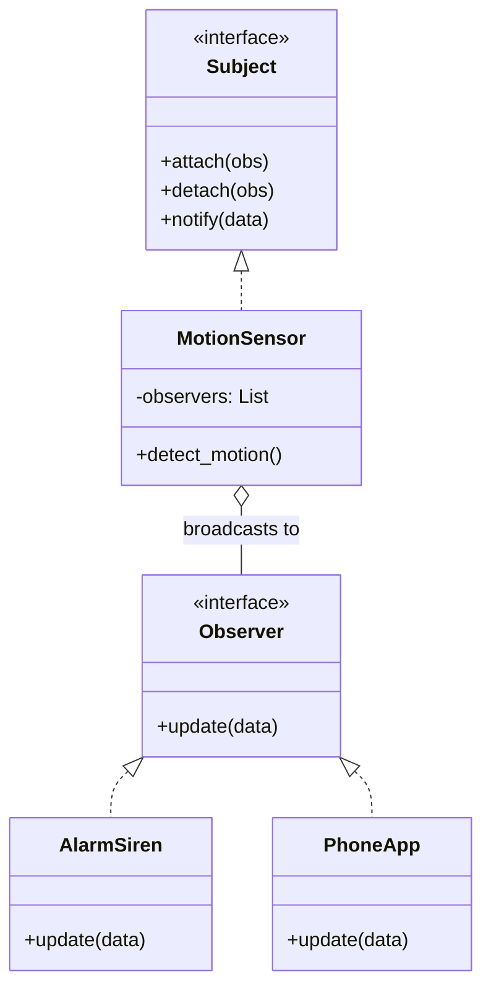
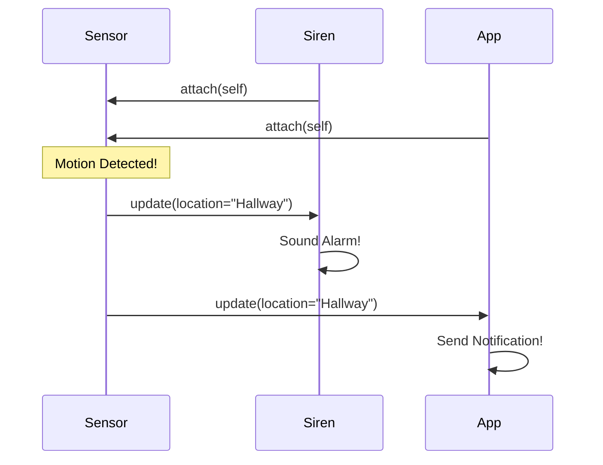

# 🔔 Observer Pattern: Smart IoT Event Bus

## 📝 Overview
The **Observer Pattern** defines a one-to-many dependency between objects. When the **Subject** (e.g., a Motion Sensor) changes state, all its registered **Observers** (e.g., Siren, Lights, Phone App) are notified and updated automatically. This is the heart of event-driven architectures.

!!! abstract "Core Concepts"
    - **Pub-Sub Decoupling:** The Publisher (Subject) doesn't know who the Subscribers (Observers) are.
    - **Dynamic Subscription:** Observers can join or leave the "broadcast" at any time.
    - **Cascade Updates:** A single trigger can result in many independent actions across the system.

---

## 🏭 The Engineering Story & Problem

### 😡 The Villain (The Problem)
You're building a smart security system. When a `MotionSensor` triggers, it needs to sound the `Siren`, send a `PushNotification`, and turn on the `SmartLights`.   
In the "Hardcoded Dependency" version, the sensor code looks like this:
```python
class MotionSensor:
    def on_detect(self):
        self.siren.alert()
        self.app.send_push()
        self.lights.turn_on()
```
Next week, the client wants to add a `SmartLock` to lock the doors when motion is detected. You have to open the `MotionSensor` class and add `self.lock.close()`. The sensor becomes a "God Object" that is tightly coupled to every device in the house.

### 🦸 The Hero (The Solution)
The **Observer Pattern** introduces an "Event Bus." 
The `MotionSensor` is now a **Subject**. It doesn't know about Sirens or Locks. It just has a list of generic `Observers`.  
When motion is detected, it shouts: "Motion detected at 10:00 PM!" to its list. 
The `Siren`, `PhoneApp`, and `SmartLock` are all **Observers**. They subscribe to the sensor. When they hear the shout, they decide how to react (Siren wails, App notifies, Lock closes). You can add a `CoffeeMaker` to start brewing when motion is detected in the morning without ever touching the sensor's code.

### 📜 Requirements & Constraints
1.  **(Functional):** multiple devices must respond to a single sensor trigger.
2.  **(Technical):** Pass event data (location, timestamp) to all observers.
3.  **(Technical):** Support dynamic registration (e.g., only notify the Phone App if the user is away).

---

## 🏗️ Structure & Blueprint

### Class Diagram


### Runtime Context (Sequence)


---

## 💻 Implementation & Code

### 🧠 SOLID Principles Applied
- **Open/Closed:** Add a `SmartCamera` observer without modifying `MotionSensor`.
- **Single Responsibility:** The sensor detects motion; the observers handle the reactions.

### 🐍 The Code

??? failure "The Villain's Code (Without Pattern)"
    ```python
    class MotionSensor:
        def trigger(self):
            # 😡 Maintenance nightmare: hardcoded list of devices
            print("Motion detected!")
            siren.wail()
            app.notify("Motion!")
            lights.on()
            # Adding a new device requires editing this class
    ```

???+ success "The Hero's Code (With Pattern)"
    ```python
    --8<-- "design_patterns/behavioral/observer/iot_notification_system/iot_notification_system.py"
    ```

---

## ⚖️ Trade-offs & Testing

| Pros (Why it works) | Cons (The Twist / Pitfalls) |
| :--- | :--- |
| **Scalability:** Easily add 1 or 100 devices. | **Complexity:** Can be hard to trace "who is listening" in a large system. |
| **Modularity:** Devices are independent of the sensor. | **Memory Leaks:** Forgetting to `detach()` a listener is a common bug. |
| **Real-time:** Updates happen immediately. | **Cyclic Dependencies:** If Observer A updates Subject B which updates Observer A... |

### 🧪 Testing Strategy
1.  **Unit Test Registration:** Verify `sensor.attach(obs)` adds to the list.
2.  **Integration Test:** Trigger motion and verify that *all* registered devices performed their expected actions.
3.  **Test Unsubscribe:** Detach the Siren, trigger motion, and verify the Siren remained silent while other devices reacted.

---

## 🎤 Interview Toolkit

- **Interview Signal:** mastery of **reactive systems** and **broadcast patterns**.
- **When to Use:**
    - "Build a real-time notification system..."
    - "Design a UI that updates when the underlying data changes..."
    - "Implement a plugin architecture where plugins react to core events..."
- **Scalability Probe:** "How to handle slow observers (e.g., an API call)?" (Answer: Use a thread pool or an async event loop so one slow observer doesn't block the others.)
- **Design Alternatives:**
    - **Chain of Responsibility:** Processes a request sequentially; Observer processes it in parallel.

## 🔗 Related Patterns
- [Mediator](../../mediator/PROBLEM.md) — Used if the communication between objects becomes too complex for simple Observation.
- [Strategy](../../strategy/sprinkler_system/PROBLEM.md) — Observers often encapsulate different strategies for reacting to an event.
