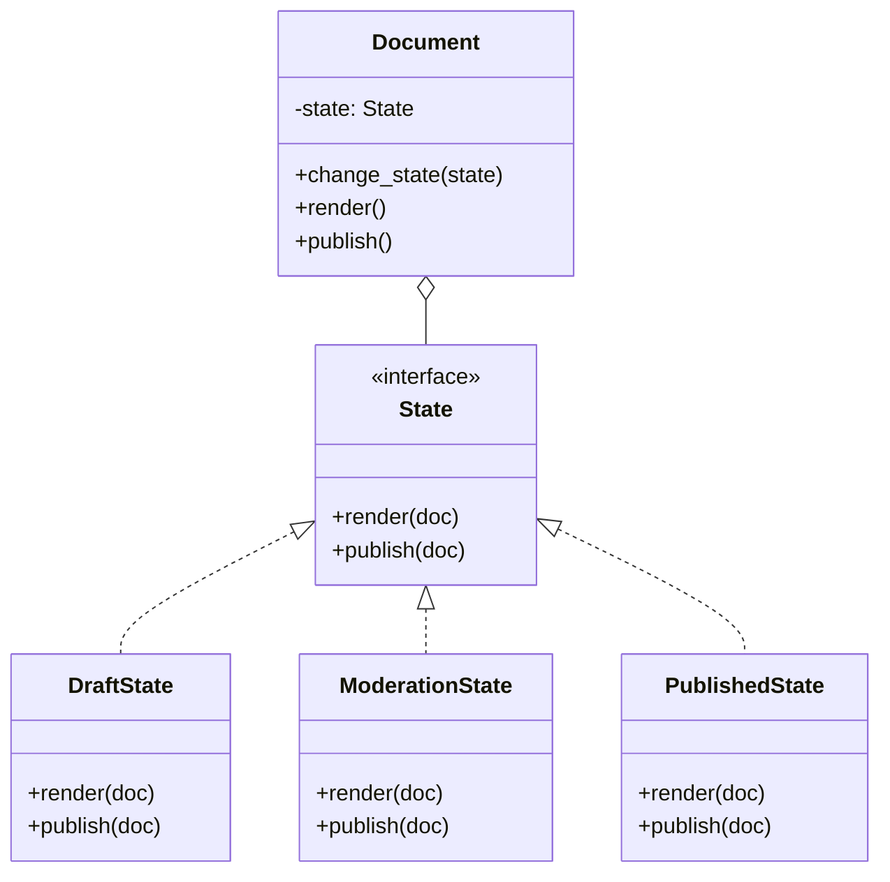
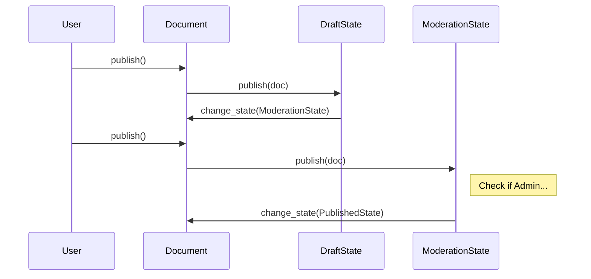

# 📑 State Pattern: Enterprise Document Workflow

## 📝 Overview
The **State Pattern** allows an object to change its behavior when its internal state changes. It is particularly useful for managing complex lifecycles (like document workflows or order processing) where the same action (e.g., `publish()`) must behave differently depending on the current stage of the object.

!!! abstract "Core Concepts"
    - **Context:** The main object (e.g., `Document`) that holds a reference to a state object.
    - **State Interface:** A common interface for all concrete states.
    - **Encapsulated Behavior:** Each state class implements behavior specific to that state and handles transitions to the next state.

---

## 🏭 The Engineering Story & Problem

### 😡 The Villain (The Problem)
You're building a Document Management System. A document has stages: `Draft`, `Moderation`, and `Published`.    
The rules are complex:  
-   In `Draft`, you can edit and publish.   
-   In `Moderation`, you can't edit, and only an admin can publish. 
-   In `Published`, you can't edit or publish.  
The "Workflow Spaghetti" code looks like this:
```python
class Document:
    def publish(self, user):
        if self.state == "DRAFT":
            self.state = "MODERATION"
        elif self.state == "MODERATION":
            if user.is_admin:
                self.state = "PUBLISHED"
        # ... and so on for every method ...
```
Every time you add a new state (like `Archived` or `Rejected`), you have to go into *every single method* and add more `if/elif` blocks. The `Document` class becomes a giant, unreadable mess.

### 🦸 The Hero (The Solution)
The **State Pattern** introduces "State Delegates." 
Instead of one giant class, we create `DraftState`, `ModerationState`, and `PublishedState` classes.    
The `Document` class is now simple. When you call `doc.publish()`, it just says: `self.state.publish(self)`.    
-   If it's in `DraftState`, the `publish()` method moves it to `Moderation`.   
-   If it's in `PublishedState`, the `publish()` method does nothing.   
Each state knows its own rules. To add an `Archived` state, you just create one new class and point the `PublishedState` to it. You don't touch the `Document` or `DraftState` at all.

### 📜 Requirements & Constraints
1.  **(Functional):** Manage a workflow: Draft -> Moderation -> Published.
2.  **(Technical):** Transitions must be handled by state objects, not the Document class.
3.  **(Technical):** Prevent illegal actions (like editing a published document) polymorphically.

---

## 🏗️ Structure & Blueprint

### Class Diagram


### Runtime Context (Sequence)


---

## 💻 Implementation & Code

### 🧠 SOLID Principles Applied
- **Single Responsibility:** Each state class handles logic for exactly one stage.
- **Open/Closed:** Add new states (e.g., `Rejected`) without changing existing state classes or the `Document`.

### 🐍 The Code

??? failure "The Villain's Code (Without Pattern)"
    ```python
    class Document:
        def __init__(self):
            self.state = "DRAFT"
            
        def publish(self):
            # 😡 Nested if-else nightmare
            if self.state == "DRAFT":
                print("Moving to moderation")
                self.state = "MODERATION"
            elif self.state == "MODERATION":
                print("Already in moderation")
            elif self.state == "PUBLISHED":
                print("Already published")
    ```

???+ success "The Hero's Code (With Pattern)"
    ```python
    --8<-- "design_patterns/behavioral/state/document_workflow/document_workflow.py"
    ```

---

## ⚖️ Trade-offs & Testing

| Pros (Why it works) | Cons (The Twist / Pitfalls) |
| :--- | :--- |
| **Clean Logic:** No giant `if/else` or `switch` blocks. | **Class Explosion:** One class for every state. |
| **Explicit Transitions:** The workflow is clearly defined in classes. | **State Awareness:** States often need to know about each other to transition. |
| **Scalability:** Easy to add complex new stages. | **Overhead:** Might be overkill for a simple "Enabled/Disabled" toggle. |

### 🧪 Testing Strategy
1.  **Unit Test States:** Test `DraftState.publish()` in isolation. Verify it calls `doc.change_state` with `ModerationState`.
2.  **Workflow Test:** Start a document in Draft, call publish twice, and verify the final state is `Published`.

---

## 🎤 Interview Toolkit

- **Interview Signal:** mastery of **Finite State Machines (FSM)** and **polymorphic behavior**.
- **When to Use:**
    - "An object's behavior changes based on its status..."
    - "Implement a multi-step checkout or wizard..."
    - "Handle complex permissions that change per stage..."
- **Scalability Probe:** "What if you have 100 states?" (Answer: Use a state-transition table/matrix or a dedicated Workflow Engine like Temporal or Airflow.)
- **Design Alternatives:**
    - **Strategy:** Very similar, but Strategy is about *how* to do something, while State is about *what phase* you are in (and phases change).

## 🔗 Related Patterns
- [Strategy](../../strategy/sprinkler_system/PROBLEM.md) — States can be seen as strategies that change over time.
- [Singleton](../../../creational/singleton/singleton_pattern/PROBLEM.md) — State objects are often Singletons if they don't hold instance data.
- [Flyweight](../../../structural/flyweight/forest_simulator/PROBLEM.md) — Shared state objects can save memory.
