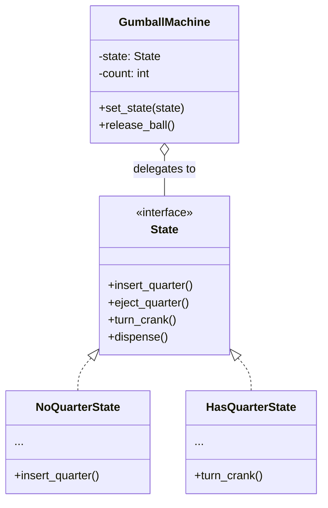
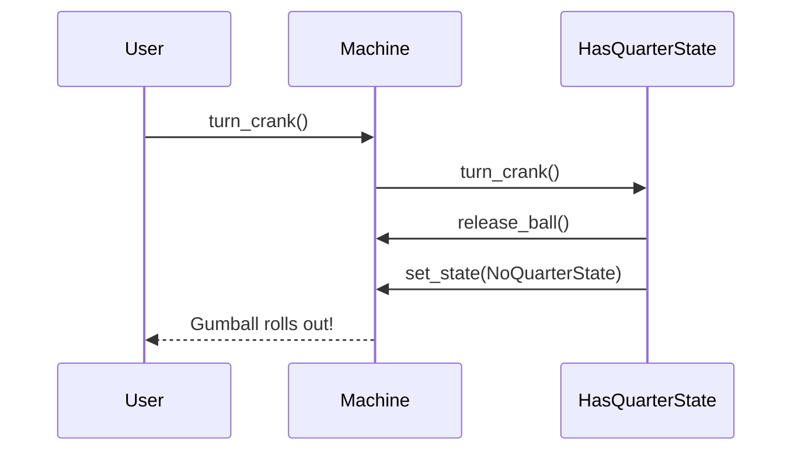

# 🍬 State Pattern: Intelligent Gumball Vendor

## 📝 Overview
The **State Pattern** allows an object to alter its behavior when its internal state changes. It encapsulates state-specific behaviors into separate classes, removing massive `if-else` or `switch` statements and allowing the object to "change its class" at runtime as it transitions through a lifecycle.

!!! abstract "Core Concepts"
    - **Finite State Machine (FSM):** The pattern provides a structured way to implement complex state-transition diagrams.
    - **Context Delegation:** The main object (e.g., Gumball Machine) delegates all actions to the current state object.
    - **Polymorphic Transitions:** Each state class handles its own logic and decides when to trigger a transition to the next state.

---

## 🏭 The Engineering Story & Problem

### 😡 The Villain (The Problem)
You're building the software for a classic Gumball Machine. It has four states: `No Quarter`, `Has Quarter`, `Gumball Sold`, and `Out of Gumballs`.
The "Nested If-Else Monster" version looks like this:
```python
class GumballMachine:
    def turn_crank(self):
        if self.state == HAS_QUARTER:
            if self.count > 0:
                self.dispense()
                self.state = SOLD
            else:
                self.state = SOLD_OUT
        elif self.state == NO_QUARTER:
            print("Please insert a quarter first!")
        # ... repeat for every action ...
```
Every time you add a new feature (like a "Winner" state where users occasionally get two gumballs for one quarter), you have to touch *every single method* and add more `if/elif` blocks. the code becomes a tangled web of conditional logic that is impossible to test or extend.

### 🦸 The Hero (The Solution)
The **State Pattern** introduces "State Objects."
Instead of the machine checking its state, we create classes like `NoQuarterState`, `HasQuarterState`, and `SoldState`.
The `GumballMachine` (Context) just holds a reference to the `current_state`. When you turn the crank, it just says: `self.current_state.turn_crank()`.
-   If it's in `HasQuarterState`, the crank works and it dispenses a gumball.
-   If it's in `NoQuarterState`, it tells you to insert money.
Each state is a small, focused class. To add a "Winner" feature, you just add one new `WinnerState` class and update the transition in `HasQuarterState`. You don't have to touch the `GumballMachine` or `SoldOutState` at all.

### 📜 Requirements & Constraints
1.  **(Functional):** implement the lifecycle of a gumball machine (Insert -> Turn -> Dispense).
2.  **(Technical):** Transitions must be handled by state objects.
3.  **(Technical):** The machine must handle the "Sold Out" state gracefully.

---

## 🏗️ Structure & Blueprint

### Class Diagram


### Runtime Context (Sequence)


---

## 💻 Implementation & Code

### 🧠 SOLID Principles Applied
- **Single Responsibility:** Each state class handles logic for exactly one machine state.
- **Open/Closed:** You can add a `WinnerState` without changing the existing `SoldOutState` or `NoQuarterState`.

### 🐍 The Code

??? failure "The Villain's Code (Without Pattern)"
    ```python
    class GumballMachine:
        def insert_quarter(self):
            # 😡 Rigid conditional logic
            if self.state == HAS_QUARTER:
                print("Already has a quarter")
            elif self.state == SOLD_OUT:
                print("Machine is empty")
            elif self.state == NO_QUARTER:
                self.state = HAS_QUARTER
                print("Quarter inserted")
    ```

???+ success "The Hero's Code (With Pattern)"
    ```python
    --8<-- "design_patterns/behavioral/state/gumball_machine_vending/gumball_machine_vending.py"
    ```

---

## ⚖️ Trade-offs & Testing

| Pros (Why it works) | Cons (The Twist / Pitfalls) |
| :--- | :--- |
| **Encapsulation:** All state logic is in one place. | **Class Explosion:** One class for every single state. |
| **Readability:** Replaces complex `if-else` with simple calls. | **Complexity:** Harder to follow the overall flow "at a glance." |
| **FSM Alignment:** Perfectly maps to Finite State Machine diagrams. | **Transitions:** States must often know about each other to trigger changes. |

### 🧪 Testing Strategy
1.  **Unit Test States:** Test `HasQuarterState.turn_crank()` in isolation by mocking the `GumballMachine`.
2.  **Workflow Test:** Insert quarter -> turn crank -> verify inventory decreased and state is now `NoQuarter`.
3.  **Boundary Test:** Empty the machine and verify it stays in `SoldOutState` regardless of input.

---

## 🎤 Interview Toolkit

- **Interview Signal:** mastery of **state-driven logic** and **polymorphism**.
- **When to Use:**
    - "Build a vending machine or ATM..."
    - "Handle complex UI navigation (Wizards)..."
    - "Implement a network protocol (TCP/IP handshake)..."
- **Scalability Probe:** "How to handle persistence?" (Answer: Store the state *name* in the DB. When loading, use a Factory to re-create the correct State object.)
- **Design Alternatives:**
    - **Strategy:** If the behavior doesn't change based on *phases* but just based on *configuration*.

## 🔗 Related Patterns
- [Strategy](../../strategy/sprinkler_system/PROBLEM.md) — States can be swapped like Strategies, but States are aware of each other.
- [Singleton](../../../creational/singleton/singleton_pattern/PROBLEM.md) — State objects are often Singletons.
- [Flyweight](../../../structural/flyweight/forest_simulator/PROBLEM.md) — Shared state objects can save memory.
