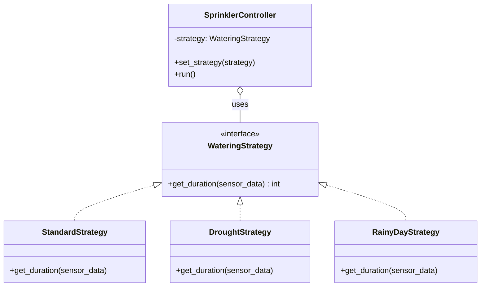
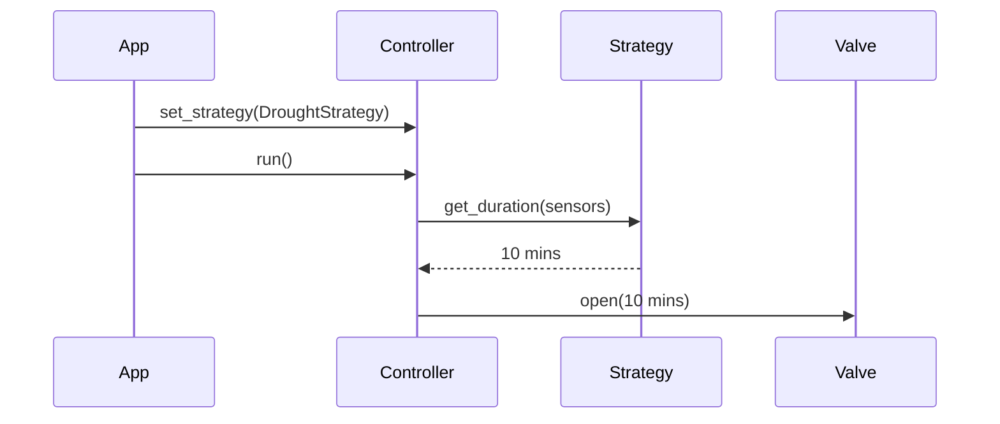

# 💧 Strategy Pattern: Dynamic Sprinkler Scheduler

## 📝 Overview
The **Strategy Pattern** defines a family of algorithms, encapsulates each one, and makes them interchangeable at runtime. It allows the behavior of an object (the Context) to be swapped dynamically without changing the object itself, favoring composition over inheritance.

!!! abstract "Core Concepts"
    - **Context:** The object that uses a strategy (e.g., the `SprinklerController`).
    - **Strategy Interface:** A common contract that all algorithms must follow (e.g., `WateringStrategy`).
    - **Interchangeable Behaviors:** Different "plays" (strategies) can be swapped in and out based on the situation (e.g., weather).

---

## 🏭 The Engineering Story & Problem

### 😡 The Villain (The Problem)
You're building a "Smart Sprinkler Controller." It needs to handle many rules:  
-   If it's raining, don't water.   
-   If it's a heatwave, water for 60 minutes.   
-   If there's a drought restriction, only water on Tuesdays for 10 minutes.    
The "Conditional Nightmare" version is a 500-line `activate()` method filled with nested `if/else` statements. Every time the city changes its water restrictions, you have to rewrite and re-deploy the entire controller's core logic. The code is brittle, hard to test, and violates the Open/Closed principle.

### 🦸 The Hero (The Solution)
The **Strategy Pattern** introduces the "Playbook." 
Instead of one giant method, we extract each watering rule into its own class: `RainyDayStrategy`, `HeatwaveStrategy`, and `DroughtStrategy`.   
The `SprinklerController` (Context) is now just a shell. It holds a reference to a `WateringStrategy`.  
1.  At 5:00 AM, the controller checks the weather.  
2.  It picks the right "play" (e.g., `controller.set_strategy(RainyDayStrategy())`).    
3.  When it's time to water, it just calls `strategy.get_duration()`.   
The controller doesn't care *why* it's watering for 0 or 60 minutes; it just follows the strategy it was given. You can add a `HolidayStrategy` next month without touching the controller's code.

### 📜 Requirements & Constraints
1.  **(Functional):** Support multiple watering schedules (Standard, Drought, Rainy).
2.  **(Technical):** Schedules must be swappable at runtime without restarting the controller.
3.  **(Technical):** All schedules must implement a common interface for duration calculation.

---

## 🏗️ Structure & Blueprint

### Class Diagram


### Runtime Context (Sequence)


---

## 💻 Implementation & Code

### 🧠 SOLID Principles Applied
- **Open/Closed:** Add a new `EcoModeStrategy` without modifying the `SprinklerController`.
- **Single Responsibility:** Each strategy class handles exactly one set of watering rules.

### 🐍 The Code

??? failure "The Villain's Code (Without Pattern)"
    ```python
    class SprinklerController:
        def run(self, weather, day):
            # 😡 Brittle, hardcoded logic
            if weather == "RAIN":
                duration = 0
            elif weather == "HEATWAVE":
                duration = 60
            elif day == "TUESDAY" and restriction == True:
                duration = 10
            # Adding a new rule requires editing this method
    ```

???+ success "The Hero's Code (With Pattern)"
    ```python
    --8<-- "design_patterns/behavioral/strategy/sprinkler_system/sprinkler_system.py"
    ```

---

## ⚖️ Trade-offs & Testing

| Pros (Why it works) | Cons (The Twist / Pitfalls) |
| :--- | :--- |
| **Clean Logic:** No giant `if/else` blocks. | **Overhead:** Creating many small classes for simple rules. |
| **Runtime Swapping:** Change behavior on the fly. | **Client Awareness:** The code that sets the strategy must know which one to pick. |
| **Isolated Testing:** Test each watering rule in a tiny unit test. | **Complexity:** Can be overkill for a system with only one set of rules. |

### 🧪 Testing Strategy
1.  **Unit Test Strategies:** Verify `RainyDayStrategy` always returns `0`. Verify `HeatwaveStrategy` returns `60` when temp > 35.
2.  **Test Controller:** Mock the strategy, call `run()`, and verify the controller calls `get_duration()` on the mock and opens the valve for that exact time.

---

## 🎤 Interview Toolkit

- **Interview Signal:** mastery of **composition over inheritance** and **algorithm encapsulation**.
- **When to Use:**
    - "Implement different payment methods (Credit Card, PayPal, Crypto)..."
    - "Support multiple compression formats (Zip, Gzip, Tar)..."
    - "Switch sorting algorithms based on data size..."
- **Scalability Probe:** "How to handle a controller with 1,000 different zones?" (Answer: Use a **Strategy Registry** or share strategy instances as **Flyweights** to save memory.)
- **Design Alternatives:**
    - **Template Method:** Uses inheritance to change *parts* of an algorithm; Strategy uses composition to change the *whole* algorithm.

## 🔗 Related Patterns
- [State](../../state/document_workflow/PROBLEM.md) — Like Strategy, but the "strategies" (states) can trigger transitions to each other.
- [Template Method](../../template/data_exporter/PROBLEM.md) — Defines the *skeleton* of an algorithm but lets subclasses fill in the steps.
- [Flyweight](../../../structural/flyweight/forest_simulator/PROBLEM.md) — Strategies are often stateless and can be shared.
