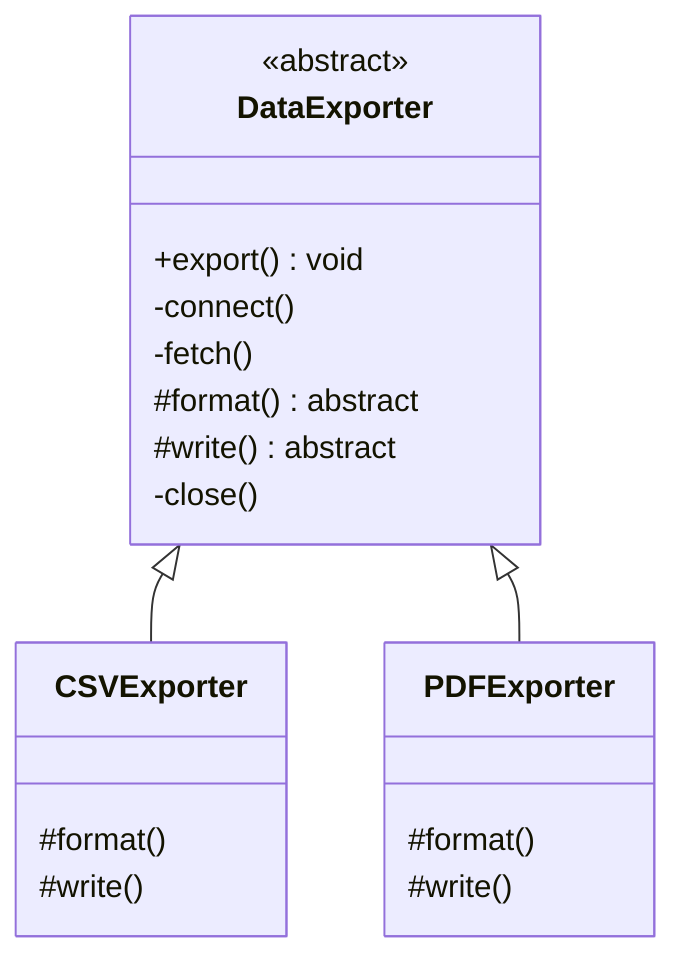
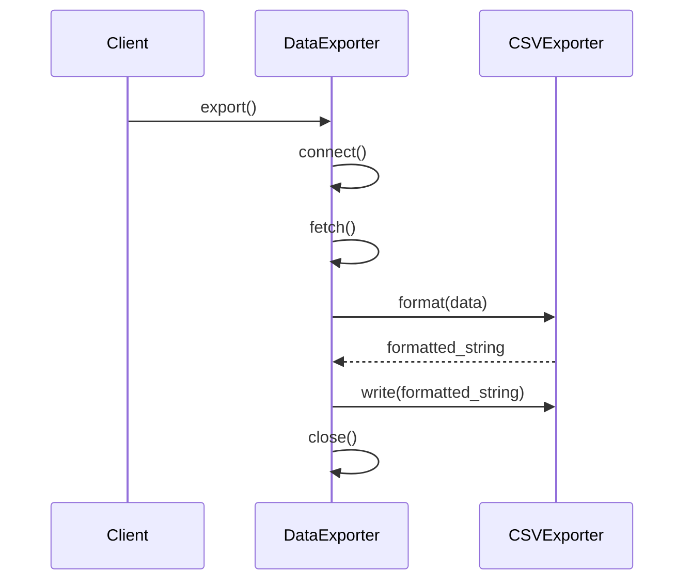

# 🏗️ Template Method: Universal Data Exporter

## 📝 Overview
The **Template Method** pattern defines the skeleton of an algorithm in a base class but lets subclasses override specific steps without changing the overall structure. It's the "recipe" approach to software design, where the sequence of steps is fixed, but the implementation of those steps can vary.

!!! abstract "Core Concepts"
    - **Invariant Steps:** Steps that are identical for all subclasses (e.g., connecting to a database).
    - **Variant Steps:** Steps that must be customized by subclasses (e.g., formatting data as CSV vs. PDF).
    - **Hollywood Principle:** "Don't call us, we'll call you"—the base class controls the flow and calls the subclass methods.

---

## 🏭 The Engineering Story & Problem

### 😡 The Villain (The Problem)
You're building a data export tool for a company. It needs to support `CSV`, `PDF`, and `JSON`. 
The "Copy-Paste Exporter" version has three separate classes. All three have identical code for connecting to the database, authenticating the user, and fetching the raw records. The only difference is the final formatting step.    
When you find a bug in the database connection logic, you have to fix it in three different files. If you add a `XML` exporter, you'll copy-paste the same 50 lines of boilerplate again. This is a maintenance nightmare.

### 🦸 The Hero (The Solution)
The **Template Method** introduces the "Abstract Recipe."   
We create a base class `DataExporter` with a final method `export()`. This method defines the mandatory sequence:   
1.  `open_connection()` (Implemented in base class - **Invariant**) 
2.  `fetch_data()` (Implemented in base class - **Invariant**)  
3.  `format_data()` (Abstract - **Variant**)    
4.  `write_to_file()` (Abstract - **Variant**)  
5.  `close_connection()` (Implemented in base class - **Invariant**)    
The `CSVExporter` subclass only has to implement `format_data()` and `write_to_file()`. It doesn't even know *how* the database connection works. The base class "calls back" to the subclass at the right moment.

### 📜 Requirements & Constraints
1.  **(Functional):** Support multiple export formats (CSV, PDF) with a shared data-fetching lifecycle.
2.  **(Technical):** Enforce the order of operations: Connect -> Fetch -> Format -> Write -> Close.
3.  **(Technical):** Subclasses should only be required to implement formatting and writing logic.

---

## 🏗️ Structure & Blueprint

### Class Diagram


### Runtime Context (Sequence)


---

## 💻 Implementation & Code

### 🧠 SOLID Principles Applied
- **Single Responsibility:** The base class handles infrastructure; subclasses handle formatting.
- **Open/Closed:** You can add a `JSONExporter` by extending the base class without modifying any existing code.

### 🐍 The Code

??? failure "The Villain's Code (Without Pattern)"
    ```python
    class CSVExporter:
        def export(self):
            # 😡 Boilerplate repeated in every exporter
            db = Database.connect()
            data = db.query("SELECT * FROM users")
            # ... CSV specific logic ...
            
    class PDFExporter:
        def export(self):
            # 😡 Same boilerplate again!
            db = Database.connect()
            data = db.query("SELECT * FROM users")
            # ... PDF specific logic ...
    ```

???+ success "The Hero's Code (With Pattern)"
    ```python
    --8<-- "design_patterns/behavioral/template/data_exporter/data_exporter.py"
    ```

---

## ⚖️ Trade-offs & Testing

| Pros (Why it works) | Cons (The Twist / Pitfalls) |
| :--- | :--- |
| **Code Reuse:** Zero duplication for shared logic (DB, Auth). | **Inflexibility:** Subclasses are forced to follow the base class's sequence. |
| **Enforced Order:** Guarantees cleanup (closing connections). | **Inheritance Issues:** Tightly couples subclasses to the base class's structure. |
| **Simplicity:** Adding a new format is fast and easy. | **Hidden Logic:** Subclasses might not see the "full picture" of the algorithm. |

### 🧪 Testing Strategy
1.  **Unit Test Base Class:** Verify that `export()` calls the steps in the correct order using a mock subclass.
2.  **Unit Test Subclasses:** Test `format_data()` in isolation to ensure it produces correct CSV/PDF strings.
3.  **Boundary Test:** Ensure the base class correctly handles database connection failures and still triggers the `close_connection()` cleanup if necessary.

---

## 🎤 Interview Toolkit

- **Interview Signal:** mastery of **inheritance-based reuse** and the **Hollywood Principle**.
- **When to Use:**
    - "Several classes share a nearly identical algorithm with minor differences..."
    - "Enforce a specific lifecycle for an operation (Open -> Process -> Close)..."
    - "Provide a base framework for others to extend..."
- **Scalability Probe:** "What if the sequence needs to change for one format?" (Answer: This is the weakness of Template Method. If the sequence is different, use the **Strategy Pattern** instead.)
- **Design Alternatives:**
    - **Strategy:** Uses composition to swap the *entire* algorithm.
    - **Template Method:** Uses inheritance to swap *parts* of an algorithm.

## 🔗 Related Patterns
- [Factory Method](../../../creational/factory/document_factory/PROBLEM.md) — Often used *inside* a Template Method to create format-specific objects.
- [Strategy](../../strategy/sprinkler_system/PROBLEM.md) — The more flexible (but complex) alternative to Template Method.
- [Hook Methods] — Small "do nothing" methods in the base class that subclasses *can* override if they want (optional steps).
