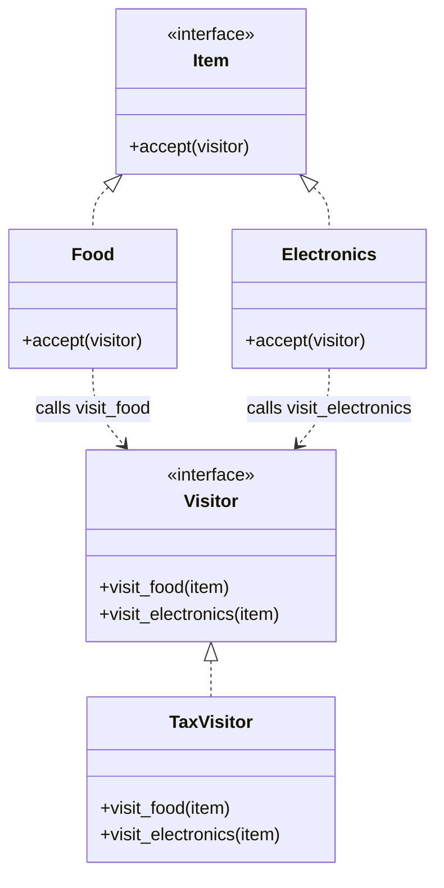
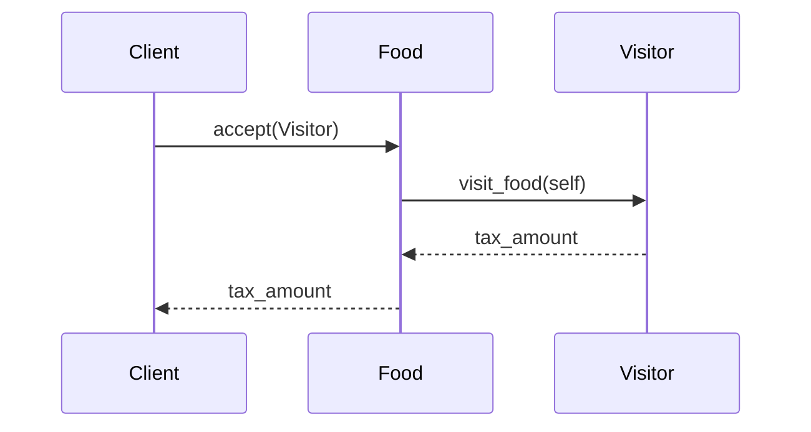

# 🛒 Visitor Pattern: Extensible Tax Engine

## 📝 Overview
The **Visitor Pattern** allows you to add new operations to an existing object structure without modifying the objects themselves. It achieves this by separating the data (Elements) from the algorithms (Visitors) that operate on them, using a technique called **Double Dispatch**.

!!! abstract "Core Concepts"
    - **Double Dispatch:** The operation performed depends on both the type of the Visitor and the type of the Element (`element.accept(visitor)` -> `visitor.visit(element)`).
    - **Separation of Concerns:** Data classes (Food, Electronics) stay focused on data; logic classes (Tax, Shipping) stay focused on behavior.
    - **Open/Closed:** You can add a `ShippingVisitor` or a `DiscountVisitor` without touching the `Item` classes.

---

## 🏭 The Engineering Story & Problem

### 😡 The Villain (The Problem)
You're building a shopping cart. You have `Food`, `Electronics`, and `Luxury` items.    
Initially, you just need to calculate the price. But then the government introduces a 10% tax on `Electronics`. Then they introduce a variable VAT on `Food`. Then a "Luxury Surcharge."    
If you keep adding methods like `calculate_vat()`, `calculate_gst()`, and `calculate_luxury_tax()` to every `Item` class, your simple data objects will become bloated "God Objects." Every time the tax law changes, you have to modify and re-test your core `Item` classes.

### 🦸 The Hero (The Solution)
The **Visitor Pattern** pulls the tax logic *out* of the items. 
We create a `TaxVisitor` class that has three methods: `visit_food()`, `visit_electronics()`, and `visit_luxury()`. 
The `Item` classes are now simple again. They only have one extra method: `accept(visitor)`.    
When you call `item.accept(tax_visitor)`:   
1.  If the item is `Food`, it calls `visitor.visit_food(self)`. 
2.  If the item is `Electronics`, it calls `visitor.visit_electronics(self)`.   
The item just says "Hello, I am Food, please process me." The visitor handles the math. You can add a `NewYorkTaxVisitor` or a `LondonTaxVisitor` without ever changing the `Food` class again.

### 📜 Requirements & Constraints
1.  **(Functional):** Support multiple tax rules (GST, VAT) for different item types.
2.  **(Technical):** The `Item` classes must remain stable (no new methods for new tax rules).
3.  **(Technical):** Use Double Dispatch to ensure the correct tax logic is applied based on the item type.

---

## 🏗️ Structure & Blueprint

### Class Diagram


### Runtime Context (Sequence)


---

## 💻 Implementation & Code

### 🧠 SOLID Principles Applied
- **Single Responsibility:** The `Item` classes manage data; the `Visitor` classes manage the algorithms.
- **Open/Closed:** You can add a `DiscountVisitor` without modifying any `Item` class.

### 🐍 The Code

??? failure "The Villain's Code (Without Pattern)"
    ```python
    class ShoppingCart:
        def calculate_tax(self, item):
            # 😡 Brittle type-checking nightmare
            if isinstance(item, Food):
                return item.price * 0.05
            elif isinstance(item, Electronics):
                return item.price * 0.15
            elif isinstance(item, Luxury):
                return item.price * 0.40
            # Adding a new item type or tax rule breaks this method
    ```

???+ success "The Hero's Code (With Pattern)"
    ```python
    # TODO: Add solution file for Visitor
    # --8<-- "design_patterns/behavioral/visitor/tax_visitor.py"
    ```

---

## ⚖️ Trade-offs & Testing

| Pros (Why it works) | Cons (The Twist / Pitfalls) |
| :--- | :--- |
| **Flexibility:** Add new operations (Visitors) easily. | **Rigidity:** Adding a new Element type (e.g., `Books`) requires updating ALL Visitors. |
| **Clean Data:** Item classes stay lightweight. | **Encapsulation:** Elements must expose their data to the Visitor. |
| **Logic Grouping:** All tax logic is in one place. | **Complexity:** Double dispatch can be confusing for beginners. |

### 🧪 Testing Strategy
1.  **Unit Test Visitor:** Pass a mock `Food` item to the `TaxVisitor` and verify it applies the correct 5% rule.
2.  **Test Dispatch:** Verify that calling `food.accept(visitor)` actually calls `visitor.visit_food()`.

---

## 🎤 Interview Toolkit

- **Interview Signal:** mastery of **double dispatch** and **extensibility vs. stability**.
- **When to Use:**
    - "Add many unrelated operations to a stable object structure..."
    - "Clean up a massive switch/isinstance block..."
    - "Apply operations over a complex tree (Composite pattern)..."
- **Scalability Probe:** "What if the object structure changes frequently?" (Answer: Visitor is a *bad* fit. It's only for stable structures. Use **Strategy** or **Decorator** instead.)
- **Design Alternatives:**
    - **Strategy:** Good if you have one operation that has multiple algorithms. Visitor is for many *different* operations.

## 🔗 Related Patterns
- [Composite](../../structural/composite/organisation_chart/PROBLEM.md) — Visitor is the standard way to traverse and process a Composite tree.
- [Interpreter](../interpreter/rule_engine/PROBLEM.md) — Visitor is often used to evaluate the nodes of an Abstract Syntax Tree (AST).
