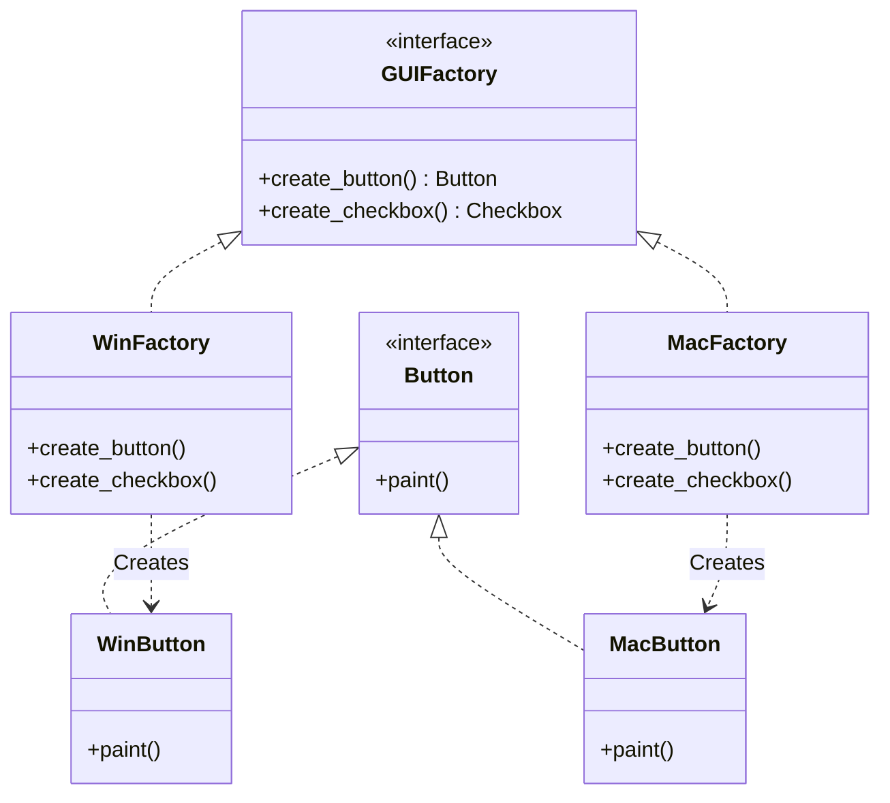
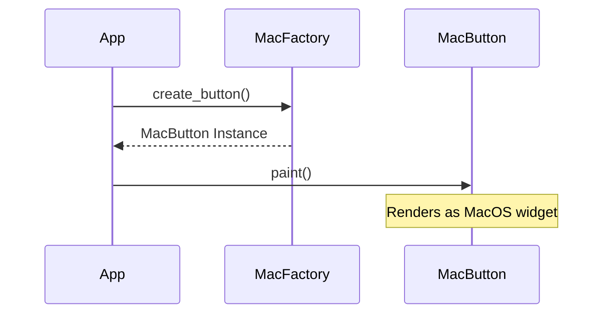

# 🎨 Abstract Factory: Cross-Platform UI Kit

## 📝 Overview
The **Abstract Factory** pattern provides an interface for creating families of related or dependent objects without specifying their concrete classes. It is often called a "Factory of Factories," ensuring that a system is independent of how its products are created, composed, and represented.

!!! abstract "Core Concepts"
    - **Product Families:** Ensuring that all components (Buttons, Checkboxes, Sliders) belong to the same visual theme or platform (e.g., Windows vs. macOS).
    - **Theme Isolation:** The client code remains agnostic of the specific platform; it only interacts with abstract interfaces.
    - **Consistency Guarantee:** Prevents the mixing of incompatible products (e.g., a Mac button on a Windows window).

---

## 🏭 The Engineering Story & Problem

### 😡 The Villain (The Problem)
You're building a cross-platform GUI library. You have `Buttons` and `Checkboxes`.
-   On Windows, they must look like Windows widgets.
-   On macOS, they must look like Mac widgets.
The "Dependency Chaos" version is filled with platform checks:
```python
if sys.platform == "win32":
    button = WinButton()
    checkbox = WinCheckbox()
elif sys.platform == "darwin":
    button = MacButton()
    checkbox = MacCheckbox()
```
Every time you add a new OS (Linux, Android, iOS), you have to find every place in your code where a widget is created and add another `elif` check. Your UI logic is now tightly coupled to every single platform's implementation.

### 🦸 The Hero (The Solution)
The **Abstract Factory** introduces the "Kit Provider."
We define a `GUIFactory` interface with methods like `create_button()` and `create_checkbox()`.
1.  **WinFactory:** Implements the interface and returns `WinButton` and `WinCheckbox`.
2.  **MacFactory:** Implements the interface and returns `MacButton` and `MacCheckbox`.
The application detects the OS *once* at startup and instantiates the correct factory. The rest of the app just asks the factory for a "Button." It doesn't know (or care) if it's a Windows button or a Mac button. It just knows it's a `Button` that has a `paint()` method. The platform-specific details are completely hidden.

### 📜 Requirements & Constraints
1.  **(Functional):** Provide a consistent set of UI widgets for different platforms.
2.  **(Technical):** The client code must never instantiate concrete products (e.g., `WinButton`) directly.
3.  **(Technical):** Adding a new platform (e.g., `Linux`) should not require modifying existing client code.

---

## 🏗️ Structure & Blueprint

### Class Diagram


### Runtime Context (Sequence)


---

## 💻 Implementation & Code

### 🧠 SOLID Principles Applied
- **Single Responsibility:** The Factory handles the complexity of product creation; the Client handles the product usage.
- **Open/Closed:** You can add a `LinuxFactory` and `LinuxButton` without changing any existing `App` or `WinFactory` code.

### 🐍 The Code

??? failure "The Villain's Code (Without Pattern)"
    ```python
    class Application:
        def render_ui(self, os_type):
            # 😡 Rigid platform checks scattered everywhere
            if os_type == "Windows":
                self.btn = WindowsButton()
            elif os_type == "Mac":
                self.btn = MacOSButton()
                
            self.btn.render()
    ```

???+ success "The Hero's Code (With Pattern)"
    ```python
    --8<-- "design_patterns/creational/abstract_factory/ui_toolkit/ui_toolkit.py"
    ```

---

## ⚖️ Trade-offs & Testing

| Pros (Why it works) | Cons (The Twist / Pitfalls) |
| :--- | :--- |
| **Consistency:** Products from one factory always work together. | **Rigidity:** Adding a new product (e.g., `Slider`) requires updating the Abstract Factory and ALL concrete factories. |
| **Decoupling:** Client is isolated from concrete platform classes. | **Complexity:** Many extra classes and interfaces. |
| **Flexibility:** Swap the entire UI theme with one line of code. | **Over-abstraction:** If you only support one platform, this is overkill. |

### 🧪 Testing Strategy
1.  **Unit Test Factories:** Verify `WinFactory.create_button()` returns an instance of `WinButton`.
2.  **Consistency Test:** Ensure that a `WinFactory` never returns a `MacButton`.
3.  **Mock Factory:** Inject a `MockFactory` into the App to test UI logic without rendering real pixels.

---

## 🎤 Interview Toolkit

- **Interview Signal:** mastery of **family-based creation** and **dependency injection**.
- **When to Use:**
    - "A system must be configured with one of multiple families of products..."
    - "You need to enforce visual/logical consistency across related objects..."
    - "Hide concrete implementation details of a library/framework..."
- **Scalability Probe:** "How to handle 50 different widgets?" (Answer: The 'Abstract Factory' can become too large. Use a **Prototype-based Factory** or a **Registry** where factories are configured with product classes.)
- **Design Alternatives:**
    - **Builder:** If the products are complex and need step-by-step construction.
    - **Factory Method:** If you only need to create *one* type of object.

## 🔗 Related Patterns
- [Factory Method](../../factory/document_factory/PROBLEM.md) — Concrete factories often use Factory Methods for each product.
- [Singleton](../../singleton/singleton_pattern/PROBLEM.md) — Concrete factories are usually Singletons.
- [Prototype](../../prototype/PROBLEM.md) — Concrete factories can use prototypes to clone objects instead of instantiating them.
