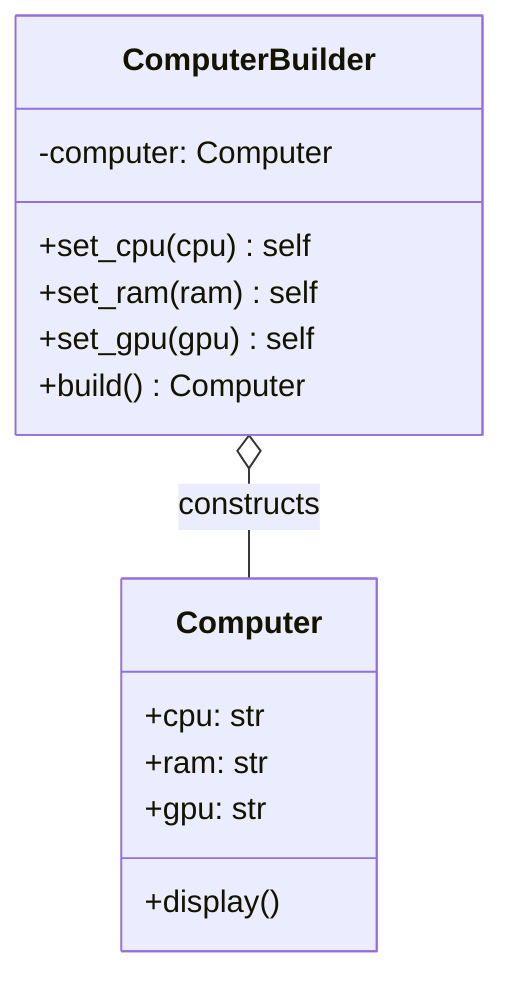
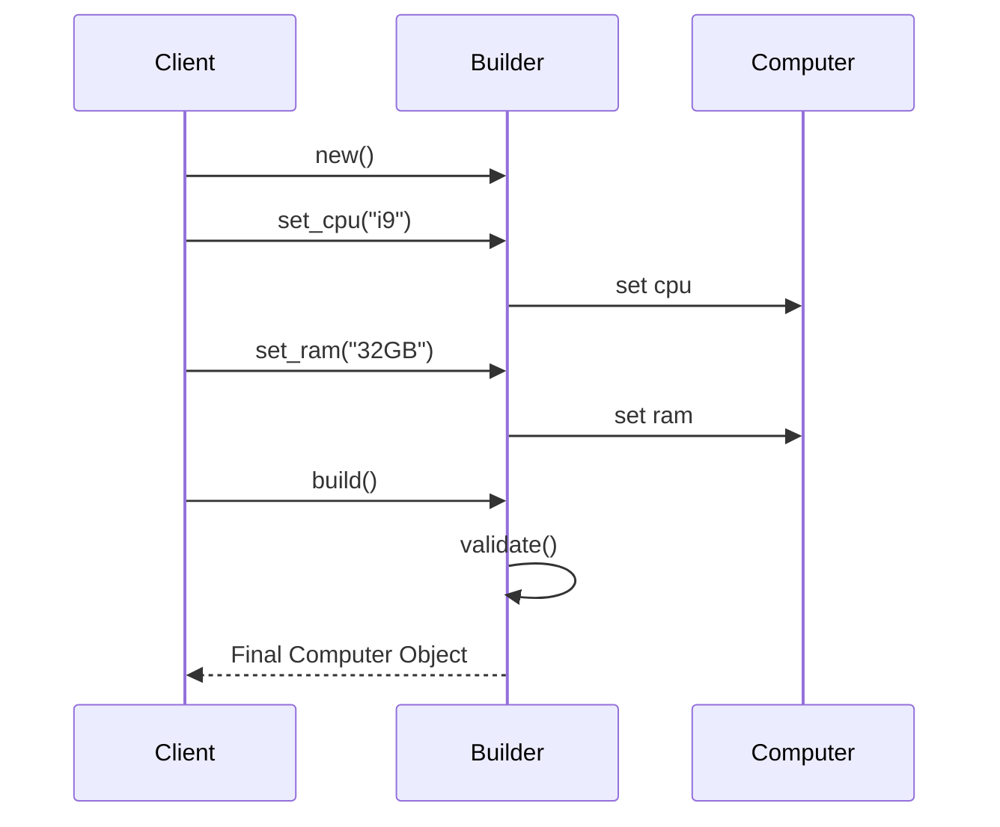

# 🖥️ Builder Pattern: High-End Workstation Configurator

## 📝 Overview
The **Builder Pattern** separates the construction of a complex object from its representation, allowing the same construction process to create different representations. It is the perfect solution for objects with many optional components or configurations, eliminating the "telescoping constructor" anti-pattern.

!!! abstract "Core Concepts"
    - **Step-by-Step Assembly:** Constructing an object through a series of semantic method calls (e.g., `add_cpu()`, `add_gpu()`).
    - **Fluent Interface:** Chaining methods together for a readable, configuration-like syntax.
    - **Validation at Build:** Ensuring the final product is valid (e.g., "Has a CPU") before it is officially "born."

---

## 🏭 The Engineering Story & Problem

### 😡 The Villain (The Problem)
You're building a `Computer` class. A computer can have many parts: CPU, RAM, GPU, HDD, SSD, Case, Cooling, PSU, etc.
Most parts are optional. Some users want a gaming PC (RTX 4090), others want a server (No GPU, 128GB RAM).
The "20-Parameter Constructor" looks like this:
```python
class Computer:
    def __init__(self, cpu, ram, gpu=None, hdd=None, ssd=None, case="ATX", psu="750W", ...):
        # 😡 Impossible to remember the order of arguments!
        # 😡 Hard to add new optional parts without breaking everything.
```
Every time you add a new component (like "Sound Card"), you have to modify the constructor, and every existing line of code that creates a computer might break. It's unreadable and error-prone.

### 🦸 The Hero (The Solution)
The **Builder Pattern** introduces the "PC Architect."
Instead of a giant constructor, we create a `ComputerBuilder`. It holds a "work-in-progress" PC. You tell the builder what you want, piece by piece, using a **Fluent API**.
```python
pc = ComputerBuilder() \
    .set_cpu("Intel i9") \
    .set_ram("64GB") \
    .set_gpu("RTX 4090") \
    .build()
```
The builder manages the complexity. When you call `.build()`, it performs "Quality Control"—checking that you didn't forget a CPU or a Motherboard—and returns the finished, fully-assembled `Computer` object. The construction logic is now separate from the product data.

### 📜 Requirements & Constraints
1.  **(Functional):** Build a computer with various optional components (CPU, RAM, GPU, etc.).
2.  **(Technical):** Implement a fluent interface (method chaining).
3.  **(Technical):** The `build()` method must validate that essential parts (CPU, Motherboard) are present.

---

## 🏗️ Structure & Blueprint

### Class Diagram


### Runtime Context (Sequence)


---

## 💻 Implementation & Code

### 🧠 SOLID Principles Applied
- **Single Responsibility:** The `Computer` class only stores data; the `ComputerBuilder` class handles assembly and validation.
- **Open/Closed:** You can add new components (like `set_liquid_cooling()`) to the builder without changing the `Computer` class or existing client code.

### 🐍 The Code

??? failure "The Villain's Code (Without Pattern)"
    ```python
    class Computer:
        def __init__(self, cpu, ram, gpu=None, storage=None, case="Generic"):
            # 😡 Telescoping constructor: hard to read, hard to maintain
            self.cpu = cpu
            self.ram = ram
            self.gpu = gpu
            self.storage = storage
            self.case = case

    # 😡 Is the 3rd argument RAM or GPU? Who knows.
    my_pc = Computer("i7", "16GB", "RTX 3060", "1TB", "NZXT")
    ```

???+ success "The Hero's Code (With Pattern)"
    ```python
    --8<-- "design_patterns/creational/builder/custom_pc_builder/custom_pc_builder.py"
    ```

---

## ⚖️ Trade-offs & Testing

| Pros (Why it works) | Cons (The Twist / Pitfalls) |
| :--- | :--- |
| **Readability:** Clear, semantic code (Fluent API). | **Verbosity:** More lines of code than a simple constructor. |
| **Safety:** Final validation happens in one place (`build`). | **Incomplete State:** The builder itself is in a "partial" state until `build` is called. |
| **Immutability:** The final product can be made read-only after assembly. | **Boilerplate:** Need a builder class for every complex product. |

### 🧪 Testing Strategy
1.  **Unit Test Builder:** Chain methods and verify the internal "work-in-progress" object has the correct values.
2.  **Test Validation:** Try to call `.build()` without a CPU and verify it raises a `ValueError`.
3.  **Test Immutability:** Verify that the returned `Computer` object's parts cannot be modified after creation.

---

## 🎤 Interview Toolkit

- **Interview Signal:** mastery of **fluent APIs**, **object integrity**, and **separating configuration from data**.
- **When to Use:**
    - "Create an object with 10+ optional parameters..."
    - "Build a complex tree structure (Composite)..."
    - "Implement a SQL query builder or HTML generator..."
- **Scalability Probe:** "How to handle 100 optional components?" (Answer: Use a dictionary in the builder for parts and a generic `add_part(key, value)` method.)
- **Design Alternatives:**
    - **Factory Method:** Good for creating objects in one shot; Builder is for step-by-step assembly.
    - **Abstract Factory:** For families of related objects; Builder is for a single complex object.

## 🔗 Related Patterns
- [Abstract Factory](../../abstract_factory/ui_toolkit/PROBLEM.md) — Both are creational; Abstract Factory is for "what" to create, Builder is for "how" to assemble it.
- [Composite](../../../structural/composite/organisation_chart/PROBLEM.md) — Builder is the standard way to construct deep Composite trees.
- [Singleton](../../singleton/singleton_pattern/PROBLEM.md) — The Director (if used) is often a Singleton.
