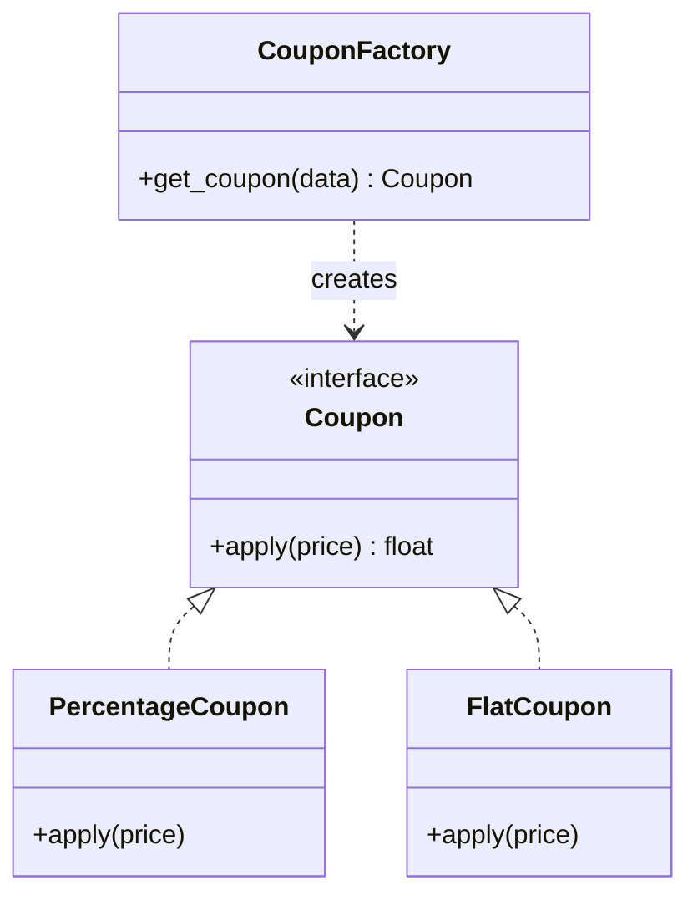
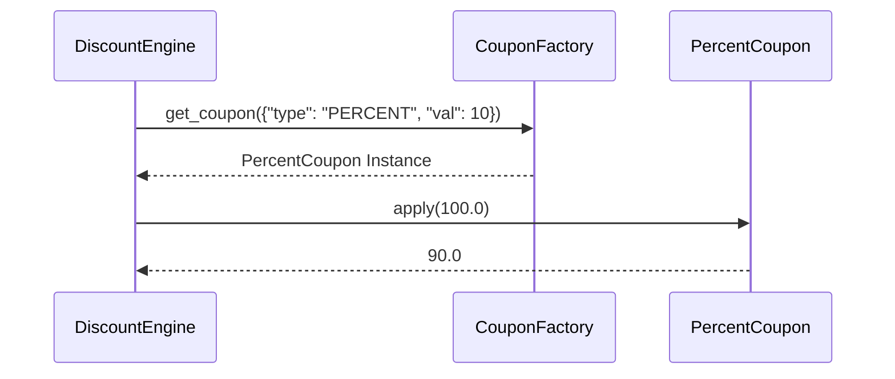

# 🎟️ Factory Pattern: Smart Coupon System

## 📝 Overview
The **Factory Method Pattern** provides an interface for creating objects in a superclass but allows subclasses to alter the type of objects that will be created. It centralizes object creation logic, making the code more flexible and easier to extend without modifying the existing business logic.

!!! abstract "Core Concepts"
    - **Creation Decoupling:** The code that *uses* the object (the Client) is separated from the code that *creates* it (the Factory).
    - **Polymorphic Creation:** The factory can return any object that implements a specific interface (e.g., `Coupon`).
    - **Null Object Fallback:** Handling unrecognized inputs by returning a safe "do-nothing" object instead of `None`.

---

## 🏭 The Engineering Story & Problem

### 😡 The Villain (The Problem)
You're building an e-commerce checkout system. Marketing keeps inventing new coupon types: `PercentageOff`, `FlatAmount`, `BuyOneGetOne`, `FirstPurchaseBonus`.
In the "Hardcoded Switch" version, your `DiscountEngine` is a mess:
```python
class DiscountEngine:
    def apply_coupon(self, code_data, total):
        # 😡 Maintenance nightmare: logic mixed with creation
        if code_data['type'] == 'PERCENT':
            coupon = PercentageDiscount(code_data['value'])
        elif code_data['type'] == 'FLAT':
            coupon = FlatDiscount(code_data['value'])
        # Adding a new type requires editing this engine!
        return coupon.apply(total)
```
Every time a new coupon type is added, you have to modify the core `DiscountEngine`. This violates the Open/Closed Principle and makes the engine risky to change.

### 🦸 The Hero (The Solution)
The **Factory Pattern** introduces the "Specialized Creator."
We pull the "How to create a coupon" logic out into a `CouponFactory`.
The `DiscountEngine` now just says: `coupon = CouponFactory.get_coupon(code_data)`.
It doesn't care if the factory returns a `PercentageDiscount` or a `BOGODiscount`. It just knows the result is a `Coupon` that has an `apply()` method.
You can now add 50 new coupon types by just updating the Factory. The `DiscountEngine` remains clean and never needs to change.

### 📜 Requirements & Constraints
1.  **(Functional):** Create different discount objects (Percentage, Flat) based on raw input data.
2.  **(Technical):** The main engine must depend only on the `Coupon` interface.
3.  **(Technical):** Return a `NoDiscount` object if the input is invalid (Null Object pattern).

---

## 🏗️ Structure & Blueprint

### Class Diagram


### Runtime Context (Sequence)


---

## 💻 Implementation & Code

### 🧠 SOLID Principles Applied
- **Single Responsibility:** The Factory handles creation; the Engine handles discount calculation.
- **Open/Closed:** Add a `HolidayDiscount` class without changing the `DiscountEngine`.

### 🐍 The Code

??? failure "The Villain's Code (Without Pattern)"
    ```python
    class DiscountEngine:
        def process(self, data, total):
            # 😡 Creation logic leaked into business logic
            if data['type'] == 'PERCENT':
                discount = total * (data['value'] / 100)
            elif data['type'] == 'FLAT':
                discount = data['value']
            return total - discount
    ```

???+ success "The Hero's Code (With Pattern)"
    ```python
    --8<-- "design_patterns/creational/factory/coupon_factory/coupon_factory.py"
    ```

---

## ⚖️ Trade-offs & Testing

| Pros (Why it works) | Cons (The Twist / Pitfalls) |
| :--- | :--- |
| **Decoupling:** Engine doesn't know about concrete classes. | **Boilerplate:** Can be overkill for simple systems. |
| **Extensibility:** Easy to add new types. | **Complexity:** Adds an extra layer of abstraction. |
| **Safety:** Centralized error handling for bad inputs. | **Testing:** Might need to mock the factory in some tests. |

### 🧪 Testing Strategy
1.  **Unit Test Factory:** Pass in various JSON strings and verify the correct class is instantiated.
2.  **Test Null Case:** Verify that an unknown type returns `NoDiscount`.
3.  **Mock Test Engine:** Verify that the engine correctly uses the object returned by the factory without knowing its type.

---

## 🎤 Interview Toolkit

- **Interview Signal:** mastery of **creational decoupling** and **interface-driven design**.
- **When to Use:**
    - "Don't know the exact types of objects your code will work with..."
    - "Consolidate complex creation logic in one place..."
    - "Allow users of your library to extend its components..."
- **Scalability Probe:** "How to handle 1,000 types?" (Answer: Use a **Registry**—a dictionary mapping type strings to classes—instead of a long `if/elif` inside the factory.)
- **Design Alternatives:**
    - **Abstract Factory:** If you're creating *families* of related objects.
    - **Builder:** If the object construction involves many steps/parts.

## 🔗 Related Patterns
- [Abstract Factory](../../abstract_factory/ui_toolkit/PROBLEM.md) — Factory Method is for one object; Abstract Factory is for a family.
- [Null Object](../../../behavioral/null_object/discount_system/PROBLEM.md) — Factories often return a Null Object as a safe default.
- [Prototype](../../prototype/PROBLEM.md) — A factory can use a "Registry of Prototypes" to clone objects instead of instantiating them.
