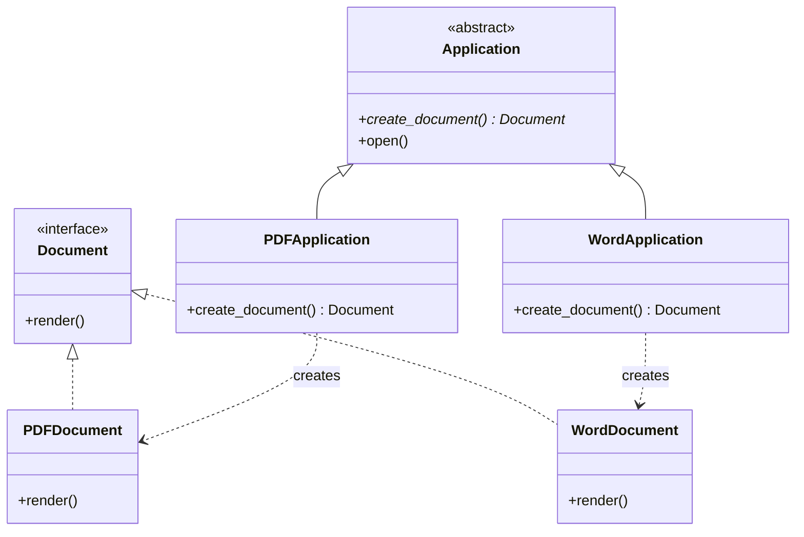
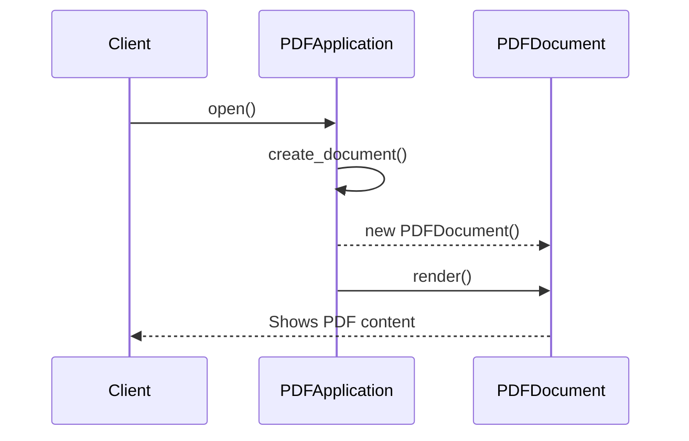

# 📄 Factory Method: Dynamic Document Creator

## 📝 Overview
The **Factory Method Pattern** defines an interface for creating an object in a base class but allows subclasses to decide which class to instantiate. This pattern is ideal for frameworks where the base code handles high-level logic (like "opening" or "rendering" a document) while delegating the specific object creation to specialized subclasses.

!!! abstract "Core Concepts"
    - **Deferred Instantiation:** The base class provides a method for creation but leaves the specific class choice to subclasses.
    - **Parallel Hierarchies:** A hierarchy of "Creators" (e.g., `Application`) mirrors a hierarchy of "Products" (e.g., `Document`).
    - **Framework Flexibility:** Allows a system to work with any new product type by simply adding a new creator subclass.

---

## 🏭 The Engineering Story & Problem

### 😡 The Villain (The Problem)
You're building a "Universal Document Editor." Initially, it only supports `.txt` files.
```python
class Editor:
    def open_file(self, path):
        # 😡 Hardcoded to one type
        self.doc = TextDocument(path)
        self.doc.render()
```
When the business asks for `PDF` and `DOCX` support, you start adding `if/elif` blocks to the `Editor` class. Soon, the `Editor` (which should handle UI and menus) is bloated with logic for every document format in existence. It's rigid, hard to test, and adding a new format requires hacking the core framework.

### 🦸 The Hero (The Solution)
The **Factory Method** introduces "Subclass Responsibility."    
We define an abstract `Application` class with an abstract method: `create_document()`. 
1.  **PDFApplication:** Overrides `create_document()` to return a `PDFDocument`.    
2.  **WordApplication:** Overrides `create_document()` to return a `WordDocument`.  
The base `Application` class has a method `run_editor()` that calls `self.create_document()`. It doesn't know *which* document it's getting; it just knows it's a `Document` that has a `render()` method. The high-level logic is decoupled from the low-level instantiation.

### 📜 Requirements & Constraints
1.  **(Functional):** Support multiple document formats (PDF, Word) with a unified rendering process.
2.  **(Technical):** The base application class must be decoupled from concrete document classes.
3.  **(Technical):** New formats must be addable by creating new subclasses, not by modifying existing ones.

---

## 🏗️ Structure & Blueprint

### Class Diagram


### Runtime Context (Sequence)


---

## 💻 Implementation & Code

### 🧠 SOLID Principles Applied
- **Dependency Inversion:** The base `Application` depends on the `Document` abstraction, not concrete classes like `PDFDocument`.
- **Open/Closed:** You can add a `MarkdownApplication` without changing any existing code.

### 🐍 The Code

??? failure "The Villain's Code (Without Pattern)"
    ```python
    class Editor:
        def open(self, type):
            # 😡 Core framework is coupled to every concrete type
            if type == "pdf":
                doc = PDFDocument()
            elif type == "word":
                doc = WordDocument()
            # Adding Markdown? Must edit this class!
            doc.render()
    ```

???+ success "The Hero's Code (With Pattern)"
    ```python
    --8<-- "design_patterns/creational/factory/document_factory/document_factory.py"
    ```

---

## ⚖️ Trade-offs & Testing

| Pros (Why it works) | Cons (The Twist / Pitfalls) |
| :--- | :--- |
| **Decoupling:** Framework doesn't know product classes. | **Class Explosion:** Need a new Application subclass for every Document type. |
| **Consistency:** Standardized interface for all products. | **Complexity:** Parallel hierarchies can be hard to track. |
| **Flexibility:** Subclasses can specialize the creation. | **Over-abstraction:** If creation is simple, a static factory is better. |

### 🧪 Testing Strategy
1.  **Unit Test Creators:** Verify `PDFApplication.create_document()` returns a `PDFDocument` instance.
2.  **Test Base Logic:** Use a `MockApplication` that returns a `MockDocument` to test the base `open()` logic independently of real file formats.

---

## 🎤 Interview Toolkit

- **Interview Signal:** mastery of **framework design** and **delegation-based creation**.
- **When to Use:**
    - "Designing a library where users need to create their own custom types..."
    - "A class can't anticipate the specific class of objects it needs to create..."
    - "You want to centralize creation logic that requires complex setup..."
- **Scalability Probe:** "How to avoid creating 50 subclasses?" (Answer: Use a **Parameterized Factory Method** where the base class takes a 'type' argument, or use a registry of constructors.)
- **Design Alternatives:**
    - **Abstract Factory:** For creating *sets* of related objects.
    - **Prototype:** If creation is expensive and you should clone existing objects instead.

## 🔗 Related Patterns
- [Abstract Factory](../../abstract_factory/ui_toolkit/PROBLEM.md) — Abstract Factories often use Factory Methods to create their products.
- [Template Method](../../../behavioral/template/data_exporter/PROBLEM.md) — Factory Methods are often called within a Template Method.
- [Prototype](../../prototype/PROBLEM.md) — Reduces subclassing by cloning objects.
