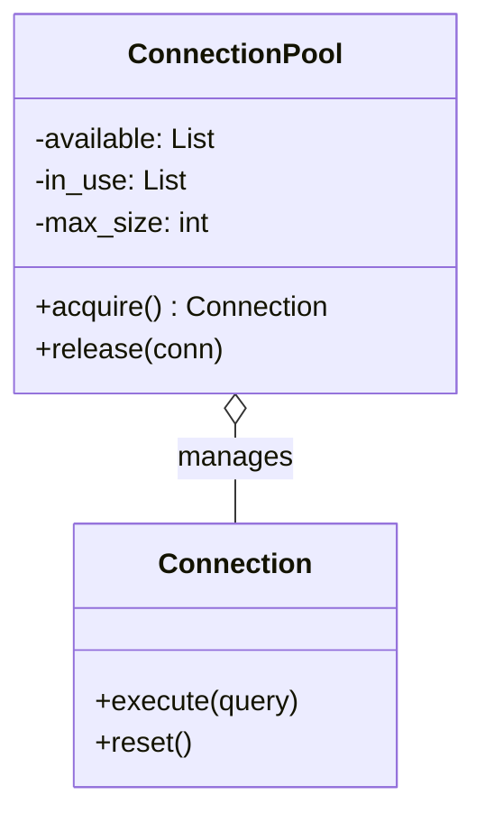
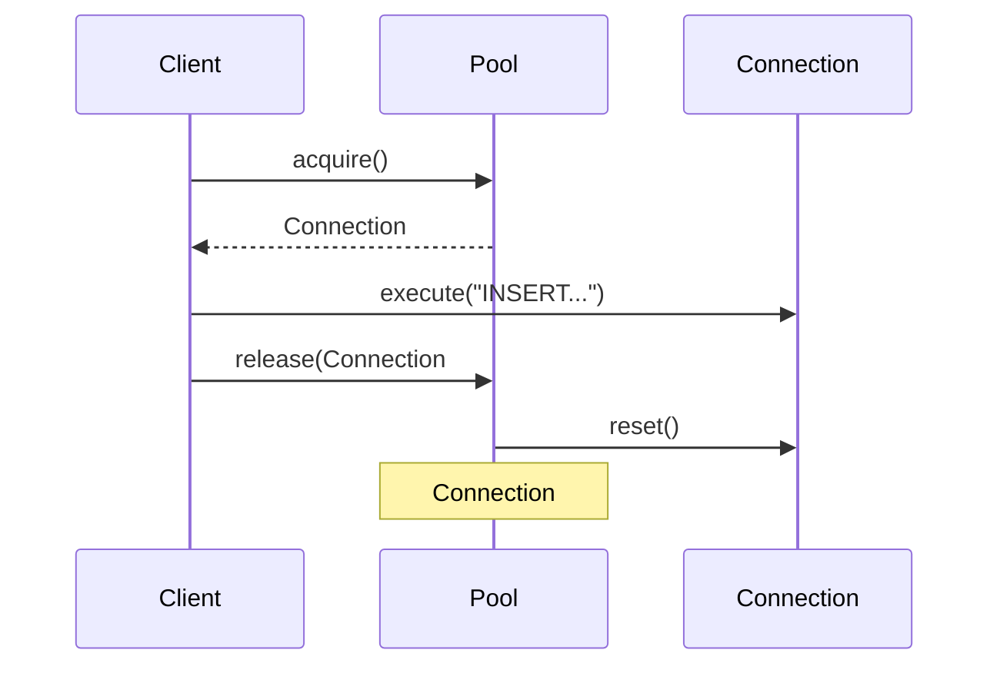

# 🏊 Object Pool: High-Frequency Database Proxy

## 📝 Overview
The **Object Pool Pattern** manages a set of initialized objects kept ready to use (a "pool") rather than creating and destroying them on demand. This is a critical optimization for resources that are expensive to create (like database connections or network sockets) or where only a limited number of instances can exist simultaneously.

!!! abstract "Core Concepts"
    - **Resource Recycling:** Reusing existing objects to avoid the overhead of instantiation, authentication, and memory allocation.
    - **Throttling (Backpressure):** Limiting the number of concurrent connections to prevent overwhelming the target system.
    - **Lease/Release Cycle:** Clients "borrow" an object from the pool and must explicitly "return" it when finished.

---

## 🏭 The Engineering Story & Problem

### 😡 The Villain (The Problem)
You're building a high-speed trading application. Every millisecond counts.
To log a trade, your app must connect to a database. However, the database takes **20ms** to perform a TLS handshake and authenticate.
If you create a new connection for every trade:
```python
def log_trade(trade):
    conn = Database.connect() # 😡 Takes 20ms!
    conn.execute("INSERT...")
    conn.close()
```
Your app is limited to 50 trades per second, and your server will eventually crash because it runs out of available network ports (Port Exhaustion). The "Handshake Latency" is killing your performance.

### 🦸 The Hero (The Solution)
The **Object Pool** introduces the "Stable Reservoir."
When the app starts, it creates a pool of 10 connections and keeps them alive.
When a trade needs to be logged:
1.  The app asks the pool for an available connection (`acquire`).
2.  The pool hands over an already-authenticated connection immediately (**0ms** latency).
3.  The app logs the trade and returns the connection to the pool (`release`).
The 20ms penalty is only paid once at startup. The app can now handle thousands of trades per second using just a few persistent connections.

### 📜 Requirements & Constraints
1.  **(Functional):** maintain a fixed-size pool of database connections.
2.  **(Technical):** The `acquire()` method must block if the pool is empty until a connection is returned.
3.  **(Technical):** Use Python's context managers (`with` statement) to ensure connections are always returned, even if an error occurs.

---

## 🏗️ Structure & Blueprint

### Class Diagram


### Runtime Context (Sequence)


---

## 💻 Implementation & Code

### 🧠 SOLID Principles Applied
- **Single Responsibility:** The `ConnectionPool` handles resource management; the `Connection` handles data execution.
- **Resource Integrity:** The pool ensures that the number of active connections never exceeds the system's capacity.

### 🐍 The Code

??? failure "The Villain's Code (Without Pattern)"
    ```python
    def process_request():
        # 😡 High latency and resource exhaustion
        db = Database.connect() 
        db.query("SELECT...")
        db.close()
    ```

???+ success "The Hero's Code (With Pattern)"
    ```python
    --8<-- "design_patterns/creational/object_pool/db_connection_pool/db_connection_pool.py"
    ```

---

## ⚖️ Trade-offs & Testing

| Pros (Why it works) | Cons (The Twist / Pitfalls) |
| :--- | :--- |
| **Speed:** Zero-latency access to pre-initialized objects. | **Memory:** Keeping objects alive in the pool consumes RAM constantly. |
| **Stability:** Prevents "Port Exhaustion" and DB overload. | **Complexity:** Requires thread-safe management (locks/semaphores). |
| **Predictability:** Fixed resource usage. | **Leaking:** Forgetting to `release` a connection can hang the whole app. |

### 🧪 Testing Strategy
1.  **Concurrency Test:** Start 20 threads trying to `acquire` from a pool of 5. Verify that only 5 are ever active at once.
2.  **Leak Test:** intentionally cause an error inside a `with pool.acquire()` block and verify that the connection was still returned to the pool.
3.  **Health Check:** Verify that the pool can detect and replace a "dead" connection (e.g., one that was closed by the DB server).

---

## 🎤 Interview Toolkit

- **Interview Signal:** mastery of **resource management**, **concurrency**, and **system optimization**.
- **When to Use:**
    - "Objects are expensive to create (DB, Sockets, Threads)..."
    - "A system has a hard limit on concurrent resources..."
    - "High-frequency operations require sub-millisecond latency..."
- **Scalability Probe:** "How to handle a sudden burst of 10,000 requests?" (Answer: Use a **Semaphore with a timeout**. If the pool is empty for too long, reject the request with a 'Busy' error to provide Backpressure.)
- **Design Alternatives:**
    - **Flyweight:** Shares objects *simultaneously* (read-only); Pool shares them *sequentially* (exclusive access).

## 🔗 Related Patterns
- [Singleton](../../singleton/singleton_pattern/PROBLEM.md) — The pool is almost always a Singleton.
- [Factory Method](../../factory/document_factory/PROBLEM.md) — Used by the pool to create new objects when it needs to grow.
- [Flyweight](../../../structural/flyweight/forest_simulator/PROBLEM.md) — Another way to share objects, but for smaller, immutable data.
