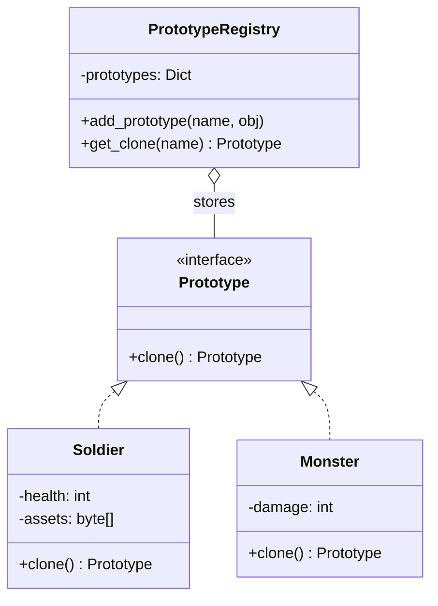
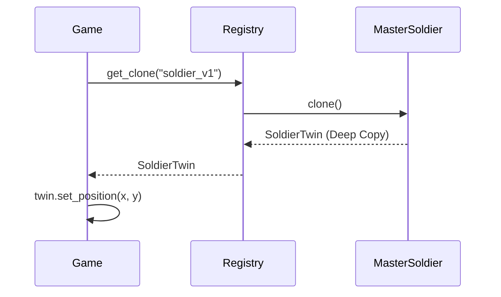

# 🐑 Prototype Pattern: Object Cloning Registry

## 📝 Overview
The **Prototype Pattern** allows you to create new objects by copying an existing instance (the "prototype") instead of creating them from scratch using a constructor. This is a powerful optimization when object creation is computationally expensive or when you want to avoid a complex hierarchy of factories.

!!! abstract "Core Concepts"
    - **Cloning:** Creating a "deep copy" of an object to ensure the original and the duplicate are independent.
    - **Prototype Registry:** A centralized "catalog" of pre-configured objects that can be cloned on demand.
    - **Initialization Avoidance:** Skipping heavy operations (like loading 3D models from disk) by copying an already-loaded object.

---

## 🏭 The Engineering Story & Problem

### 😡 The Villain (The Problem)
You're building a real-time strategy (RTS) game. When a battle starts, the game needs to spawn 100 `Soldier` NPCs at once.
In the "Stuttering Spawner" version, the `Soldier` constructor looks like this:
```python
class Soldier:
    def __init__(self):
        self.mesh = load_heavy_3d_model("soldier.obj") # 😡 Takes 100ms
        self.textures = load_heavy_textures("skin.png") # 😡 Takes 50ms
        self.ai_tree = build_complex_ai_behavior() # 😡 Takes 50ms
```
Spawning 100 soldiers takes 20 seconds of pure CPU time! The game freezes, the frame rate drops to zero, and the player is frustrated. You can't just call `new Soldier()` in a high-speed game loop.

### 🦸 The Hero (The Solution)
The **Prototype Pattern** introduces the "Instant Copy."
We create one "Master Soldier" at startup and store it in a `Registry`.
When we need 100 soldiers, we don't call the constructor. We call `master_soldier.clone()`.
Cloning a pre-loaded object in memory is **thousands of times faster** than loading it from disk. The game stays at a smooth 60 FPS because we're just copying bytes in RAM instead of re-parsing heavy assets. Each clone is an independent "Twin" that can have its own health and position.

### 📜 Requirements & Constraints
1.  **(Functional):** Create a registry of "Master" NPCs (Orc, Knight, Archer).
2.  **(Technical):** Implement a `clone()` method using **Deep Copy** to ensure clones don't share references to mutable data (like equipment lists).
3.  **(Technical):** allow the registry to store and retrieve prototypes by name.

---

## 🏗️ Structure & Blueprint

### Class Diagram


### Runtime Context (Sequence)


---

## 💻 Implementation & Code

### 🧠 SOLID Principles Applied
- **Open/Closed:** Add a new `Dragon` NPC prototype to the registry without changing any of the spawning or registry logic.
- **Single Responsibility:** The `Soldier` class handles its own data; the `Registry` handles the cataloging and duplication.

### 🐍 The Code

??? failure "The Villain's Code (Without Pattern)"
    ```python
    class Spawner:
        def mass_spawn(self, count):
            # 😡 Terrible performance: loading from disk 100 times
            for _ in range(count):
                npc = Soldier() # Calls heavy __init__
                npc.position = random_pos()
                world.add(npc)
    ```

???+ success "The Hero's Code (With Pattern)"
    ```python
    # TODO: Add solution file for Prototype
    # --8<-- "design_patterns/creational/prototype/npc_cloning_registry.py"
    ```

---

## ⚖️ Trade-offs & Testing

| Pros (Why it works) | Cons (The Twist / Pitfalls) |
| :--- | :--- |
| **Performance:** Instant object creation via memory copy. | **Deep Copy Complexity:** Cloning objects with circular references is hard. |
| **Flexibility:** Add/remove prototypes at runtime. | **Constructor Bypassing:** The standard `__init__` logic doesn't run for clones. |
| **Simplification:** Reduces the need for many specialized Factory classes. | **State Management:** Clones inherit the *exact* state of the prototype (be careful if it was damaged!). |

### 🧪 Testing Strategy
1.  **Deep Copy Test:** Clone a `Soldier` with a list of `weapons`. Modify a weapon in the clone and verify the original soldier's weapons remain unchanged.
2.  **Performance Test:** Compare the time taken to create 1000 objects via `new` vs. `clone`.
3.  **Registry Test:** Verify that `get_clone("Orc")` returns an `Orc` instance and not an `Archer`.

---

## 🎤 Interview Toolkit

- **Interview Signal:** mastery of **memory management**, **deep copying**, and **resource optimization**.
- **When to Use:**
    - "Object initialization is expensive (DB, Disk, API)..."
    - "You have many objects that share 90% of the same configuration..."
    - "Avoid a complex hierarchy of factory classes..."
- **Scalability Probe:** "How do you handle 'Dirty' prototypes (e.g., cloning a soldier that was already shot)?" (Answer: The Registry should always store "Clean" prototypes that are never used in the actual game world.)
- **Design Alternatives:**
    - **Flyweight:** If you want to share the *same* instance of the heavy data across 100 objects (shared state) rather than copying it (independent state).

## 🔗 Related Patterns
- [Factory Method](../factory/document_factory/PROBLEM.md) — Often uses Prototype internally to avoid subclassing the factory.
- [Flyweight](../../structural/flyweight/forest_simulator/PROBLEM.md) — Prototype clones state; Flyweight shares it.
- [Singleton](../singleton/singleton_pattern/PROBLEM.md) — The Prototype Registry is almost always a Singleton.
