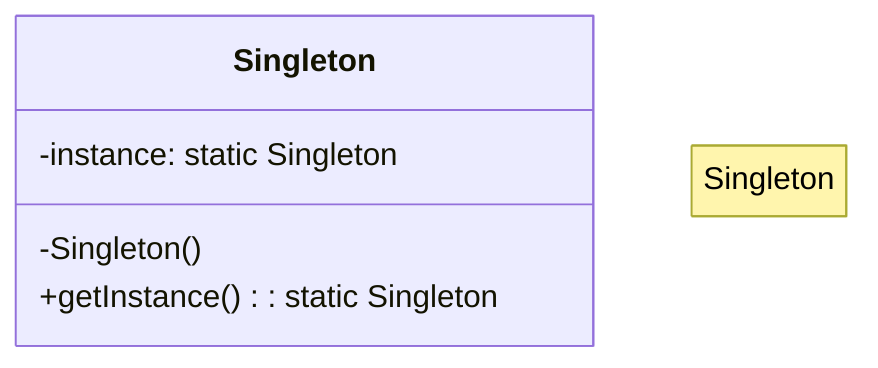
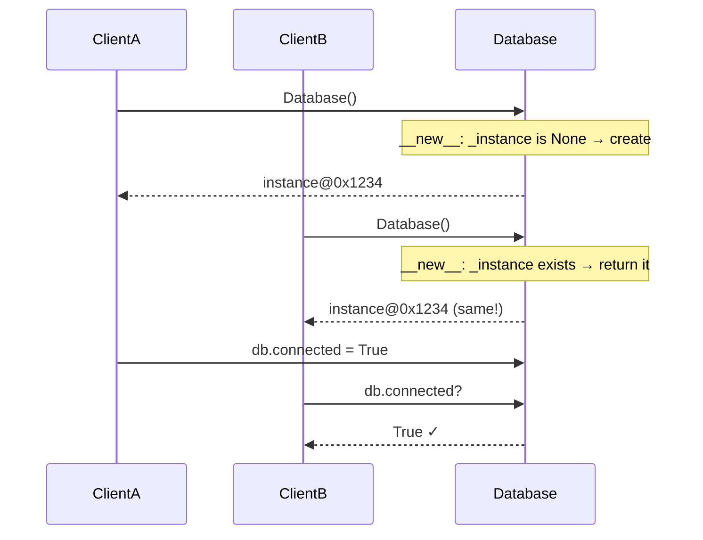

# 🦄 Singleton Pattern: Centralized Resource Manager

## 📝 Overview
The **Singleton Pattern** ensures that a class has only one instance and provides a global point of access to it. This is the gold standard for managing shared resources like database connections or global configuration settings.

!!! abstract "Core Concepts"
    - **Instance Control:** Overriding `__new__` or using a decorator to strictly manage the object's lifecycle and prevent multiple instantiations.
    - **Global Point of Access:** Providing a single, predictable source of truth for the entire application via a static method or instance variable.
    - **Lazy Initialization:** The instance is usually created only when it is first needed, saving system resources.

---

## 🏭 The Engineering Story & Problem

### 😡 The Villain (The Problem)
"The Multiple Truths." You have a configuration manager that reads from a file. Every time a new module starts, it creates a new `Config` object. One module updates a setting, but the others are still using the old values from their own instances. The app's behavior becomes unpredictable and impossible to debug.

### 🦸 The Hero (The Solution)
"The One and Only." We modify the `Config` class so it can't be instantiated more than once. No matter how many modules try to "create" a new configuration object, they all get the same memory address. There is only one source of truth.

### 📜 Requirements & Constraints
1.  **(Functional):** The class must guarantee that only one instance is created (unique instance).
2.  **(Functional):** Provide a global access point to retrieve the instance.
3.  **(Technical):** Multiple calls to the constructor must return the exact same memory address (identity guarantee).
4.  **(Technical):** In a concurrent environment, the instance must be created safely without race conditions (thread safety via `__new__` or locking).

---

## 🏗️ Structure & Blueprint

### Class Diagram


### Runtime Context (Sequence)


---

## 💻 Implementation & Code

### 🧠 SOLID Principles Applied
- **Single Responsibility:** *(Caveat)* A Singleton class is responsible for its own lifecycle AND its business logic — this is a known SRP trade-off.
- **Open/Closed:** Singleton subclasses can override behavior, but the single-instance guarantee is preserved by the base class.

### 🐍 The Code

??? failure "The Villain's Code (Without Pattern)"
    ```python
    # 😡 Multiple instances with inconsistent state
    config_a = Config("settings.yaml")  # Module A's copy
    config_b = Config("settings.yaml")  # Module B's copy

    config_a.set("debug", True)
    print(config_b.get("debug"))  # False! 💀 Stale data!
    # Each module has its own "truth" — bugs are everywhere
    ```

???+ success "The Hero's Code (With Pattern)"
    ```python
    --8<-- "design_patterns/creational/singleton/singleton_pattern/singleton_pattern.py"
    ```

---

## ⚖️ Trade-offs & Testing

| Pros (Why it works) | Cons (The Twist / Pitfalls) |
| :--- | :--- |
| **Resource Conservation:** Guarantees a single instance globally, saving memory. | **Global State:** Introduces global state, making unit testing very difficult. |
| **Strict Control:** Centralizes access to a shared resource like a DB connection. | **Concurrency Issues:** Requires careful lock management in multi-threaded environments. |

### 🧪 Testing Strategy
Testing singletons is notoriously tricky because state persists between tests. To mitigate this, always provide a `_reset()` class method or a testing fixture to explicitly clear the instance (set `_instance` to `None`) before each isolated test runs.

---

## 🎤 Interview Toolkit

- **Interview Signal:** Demonstrates understanding of **Object Lifecycles**, **Static vs Instance Members**, and **Thread Safety**.
- **When to Use:**
    - When a class in your program must have just a single instance available to all clients.
    - When you need stricter control over global variables.
    - For hardware access (e.g., a single serial port controller).
- **Scalability Probe:** How do you scale a singleton in a distributed system (multiple servers)? (Answer: You can't; you'd use a distributed lock or a centralized service like Redis).
- **Design Alternatives:**
    - **Singleton vs. Static Methods:** Singleton allows for inheritance and state management; Static methods are just a collection of functions.
    - **Module-level Singleton (Python):** In Python, modules are singletons by nature — sometimes a module-level variable is simpler than a class-based Singleton.

## 🔗 Related Patterns
- [Abstract Factory](../../abstract_factory/ui_toolkit/PROBLEM.md) — Abstract Factories are often implemented as Singletons.
- [Builder](../../builder/custom_pc_builder/PROBLEM.md) — Builders can be Singletons.
- [Facade](../../../structural/facade/smart_home_facade/PROBLEM.md) — Facades are often Singletons because only one facade object is required.
