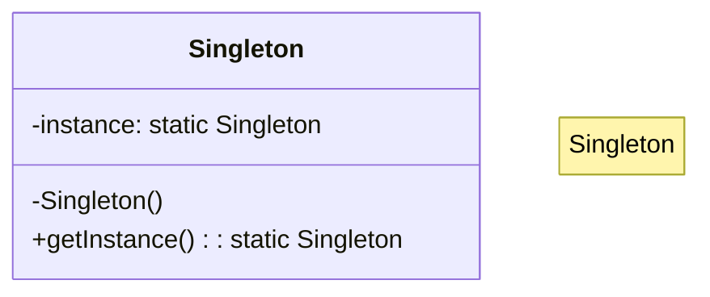

# 🦄 Singleton Pattern: Centralized Resource Manager

## 📝 Overview
The **Singleton Pattern** ensures that a class has only one instance and provides a global point of access to it. This is the gold standard for managing shared resources like database connections or global configuration settings.

!!! abstract "Concept"
    The **Singleton Pattern** is a creational pattern that restricts the instantiation of a class to one single instance. This is useful when exactly one object is needed to coordinate actions across the system.

!!! abstract "Core Concepts"

    - **Instance Control:** Overriding `__new__` or using a decorator to strictly manage the object's lifecycle and prevent multiple instantiations.
    - **Global Point of Access:** Providing a single, predictable source of truth for the entire application via a static method or instance variable.
    - **Lazy Initialization:** The instance is usually created only when it is first needed, saving system resources.

!!! example "Example"
    ```text
    Scenario: Database Connection.
    1. Request instance of DatabaseConnection.
    2. System checks if instance exists.
    3. If not, it creates one and returns it.
    4. Second request for DatabaseConnection returns the same instance created in step 3.
    ```

!!! info "Why Use This Pattern?"
    - **Resource Conservation:** Prevents unnecessary overhead of creating multiple expensive objects (like DB connections).
    - **Data Consistency:** Ensures all parts of the app are reading from and writing to the same state.
    - **Namespace Cleanliness:** Avoids polluting the global namespace with multiple variables that all represent the same concept.

## 🏭 The Engineering Story

### The Villain:
"The Multiple Truths." You have a configuration manager that reads from a file. Every time a new module starts, it creates a new `Config` object. One module updates a setting, but the others are still using the old values from their own instances. The app's behavior becomes unpredictable and impossible to debug.

### The Hero:
"The One and Only." We modify the `Config` class so it can't be instantiated more than once. No matter how many modules try to "create" a new configuration object, they all get the same memory address. There is only one source of truth.

### The Plot:
1. Define a class with a private class-level variable `_instance`.
2. Override the `__new__` method (in Python) or create a static `getInstance()` method.
3. Check if `_instance` is None.
4. If it is, create the object; if not, return the existing `_instance`.
5. Every part of the app now calls `Config()` and receives the same shared object.

### The Twist (Failure):
**The Threading Race.** In a multi-threaded application, two threads might check `if _instance is None` at the exact same millisecond, leading to both creating an instance. This is why "thread-safe" singletons use locking mechanisms.

### Interview Signal:
Demonstrates understanding of **Object Lifecycles**, **Static vs Instance Members**, and **Thread Safety**.

## 🚀 Problem Statement
Certain components in an application, such as a database connection pool or a logger, must have exactly one instance. Creating multiple instances can lead to resource exhaustion, inconsistent state, or conflicting file access.

## 🛠️ Requirements

1.  **Unique Instance:** The class must guarantee that only one instance is created.
2.  **Global Access:** Provide a static method or property to retrieve the instance.
3.  **Identity Guarantee:** Multiple calls to the constructor must return the exact same memory address.
4.  **Thread Safety:** In a concurrent environment, the instance must be created safely without race conditions.

### Technical Constraints

- **Pythonic Implementation:** Use `__new__` to intercept the creation process rather than a Java-style `getInstance()` method if possible.
- **Concurrency:** Ensure the implementation handles multiple threads correctly.

## 🧠 Thinking Process & Approach
The core challenge is ensuring a single instance across the entire application. In Python, the `__new__` method is the constructor that creates the instance, making it the perfect place to intercept and return an existing one. To handle concurrency, a thread lock ensures that two threads don't create separate instances at the same time.

### Key Observations:
- **`__new__` vs `__init__`:** `__new__` creates the object; `__init__` initializes it. For Singletons, we must control `__new__`.
- **Double-checked locking:** A common optimization to avoid the overhead of a lock once the instance is already created.
- **Testing Identity:** `obj1 is obj2` should always evaluate to `True`.

## 🧩 Runtime Context / Evaluation Flow
1. Client A calls `Database()`. `__new__` creates the first instance.
2. Client B calls `Database()`. `__new__` sees the instance already exists and returns the same one.
3. Client A changes `db.connected = True`.
4. Client B checks `db.connected` and sees `True` immediately.

## 💻 Solution Implementation

```python
--8<-- "design_patterns/creational/singleton/singleton_pattern/singleton_pattern.py"
```

!!! success "Why This Works"
    This design ensures that no matter where in the codebase you are, you are working with the same object. It eliminates synchronization issues and reduces memory usage for high-cost objects.

!!! tip "When to Use"
    - When a class in your program must have just a single instance available to all clients.
    - When you need stricter control over global variables.
    - For hardware access (e.g., a single serial port controller).

!!! warning "Common Pitfall"
    - **Global State Anti-pattern:** Overusing Singletons can make unit testing difficult because they carry state between tests.
    - **Violation of Single Responsibility:** A Singleton class is responsible for its own lifecycle AND its business logic.

## 🎤 Interview Follow-ups

- **Scalability Probe:** How do you scale a singleton in a distributed system (multiple servers)? (Answer: You can't; you'd use a distributed lock or a centralized service like Redis).
- **Design Trade-off:** Singleton vs. Static Methods. (Answer: Singleton allows for inheritance and state management; Static methods are just a collection of functions).
- **Production Readiness:** How do you reset a singleton for unit tests? (Answer: Add a `_reset()` class method that sets `_instance` to None).

## 🔗 Related Patterns
- [Abstract Factory](../../abstract_factory/ui_toolkit/PROBLEM.md) — Abstract Factories are often implemented as Singletons.
- [Builder](../../builder/custom_pc_builder/PROBLEM.md) — Builders can be Singletons.
- [Facade](../../../structural/facade/smart_home_facade/PROBLEM.md) — Facades are often Singletons because only one facade object is required.

## 🧩 Diagram

