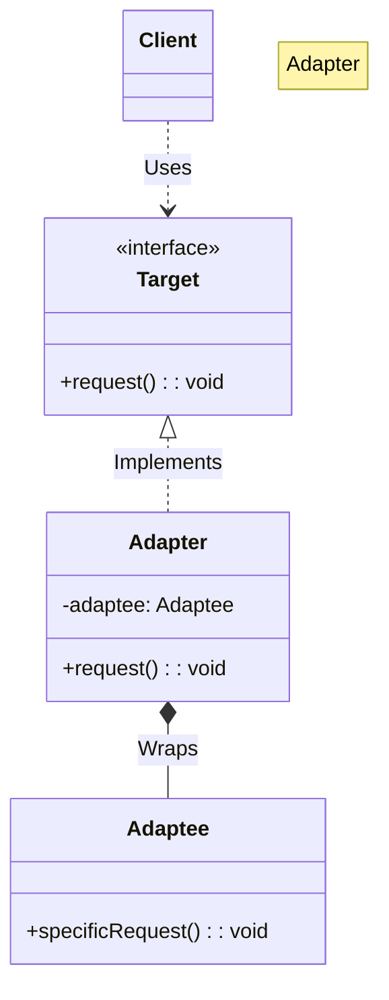

# 🔌 Adapter Pattern: Universal Data Translator

## 📝 Overview
The **Adapter Pattern** acts as a bridge between two incompatible interfaces. It allows classes to work together that couldn't otherwise because of differing method signatures or data formats, much like a power adapter converts different plug types to fit a wall socket.

!!! abstract "Concept"
    The **Adapter Pattern** wraps an existing class (the "Adaptee") with a new interface (the "Target") to make it compatible with a client's requirements. It's a structural pattern that resolves interface mismatches without modifying the source code of either party.

!!! abstract "Core Concepts"
    - **Target Interface:** The specific interface that the client code expects to use.
    - **Adaptee:** An existing class or third-party library with an incompatible interface that needs to be integrated.
    - **Adapter:** The middleman class that implements the Target interface and translates its calls into a format the Adaptee understands.
    - **Object Adapter:** Uses composition to hold an instance of the Adaptee (the most common and flexible approach).

!!! example "Example"
    Imagine a modern application that expects weather data via a `CloudWeather` interface returning JSON. You want to use a legacy `OldStation` library that only provides data in a fixed-width text format. An `OldStationAdapter` would implement `CloudWeather`, call `OldStation` internally, and parse the text into the expected JSON structure.

!!! info "Why Use This Pattern?"
    - **Interoperability:** Allows legacy or third-party code to work with modern systems.
    - **Open/Closed Principle:** You can introduce new adapters without changing the existing client or library code.
    - **Single Responsibility:** The translation logic is isolated in one place rather than scattered throughout the business logic.

## 🏭 The Engineering Story

### The Villain:
The "Incompatible Source" — a critical third-party analytics library that is perfect for your needs but speaks "XML," while your entire high-performance microservice architecture is built strictly on "JSON."

### The Hero:
The "Universal Plug" — the Adapter, which acts as a real-time translator, sitting between your service and the library to ensure they can communicate without either side knowing the other is different.

### The Plot:

1. **Identify the Gap:** Recognize that the client expects a `request_json()` method but the library only provides `fetch_xml()`.

2. **Define the Target:** Ensure the `JsonParser` interface is clearly defined in your domain.

3. **Create the Bridge:** Build the `XmlToJsonAdapter` that implements `JsonParser`.

4. **Translate:** Inside the adapter, call the library's XML method, convert the result to JSON, and return it.

### The Twist (Failure):
"The Adapter Chain." If you keep stacking adapters (Adapter A adapting to B, which adapts to C), you create a "Lava Layer" that is impossible to debug and incurs a significant performance penalty due to multiple data transformations.

### Interview Signal:
This pattern demonstrates a developer's ability to integrate disparate systems cleanly and their understanding of **Composition over Inheritance**. It shows they value non-invasive changes over "hacking" existing libraries.

## 🚀 Problem Statement
Your application expects data in JSON format via a `JsonParser` interface. However, you need to integrate a powerful third-party analytics tool, `XmlAnalytics`, which only provides data in XML. You cannot modify the third-party tool or your existing JSON-based architecture.

## 🛠️ Requirements

1.  **Interface Compliance:** The adapter must strictly implement the `JsonParser` interface.
2.  **Data Transformation:** The adapter must parse XML and produce valid JSON strings.
3.  **Encapsulation:** The client should have no knowledge of the `XmlAnalytics` class.

### Technical Constraints

- **Decoupling:** The client code should remain unaware that it is actually communicating with an XML source.
- **Format Conversion:** The adapter must handle the logic of translating XML structures into JSON strings on the fly.

## 🧠 Thinking Process & Approach
Legacy or 3rd party code often has incompatible interfaces. The approach is to create a translator (Adapter) that wraps the incompatible object and exposes the interface the rest of our application expects.

### Key Observations:

- **Non-Invasive Integration:** We avoid "Big Bang" refactors by bridging the gap.
- **Translation Cost:** Data conversion (XML to JSON) has a CPU cost that should be monitored.
- **Error Mapping:** The adapter must also translate error codes or exceptions from the XML tool into the JSON domain.

## 🧩 Runtime Context / Evaluation Flow

When the client calls `adapter.parse()`, the adapter internally calls `xml_tool.get_raw_xml()`. The adapter then uses a parser to convert that XML into a dictionary, serializes it into a JSON string, and returns it. To the client, it looks like a standard JSON source.

## 💻 Solution Implementation

```python
--8<-- "design_patterns/structural/adapter/format_translator/format_translator.py"
```

!!! success "Why This Works"
    The Adapter provides a bridge between incompatible interfaces, allowing them to work together without modifying their source code. This preserves the Open/Closed Principle and keeps the core business logic clean of messy translation code.

!!! tip "When to Use"
    - When you want to use an existing class, but its interface does not match the one you need.
    - When you need to standardize multiple disparate sources (e.g., three different vendors) into a single internal interface.
    - When using legacy code that is too risky to refactor.

!!! warning "Common Pitfall"
    - **Over-Adapting:** Don't use an adapter to fix a bad internal design; refactor the internal code if you own it.
    - **Hidden Complexity:** Ensure the adapter doesn't start doing "business logic"; its only job is translation.

## 🎤 Interview Follow-ups

- **Scalability Probe:** How would you handle a 1GB XML file? (Answer: Use a streaming/SAX parser inside the adapter instead of loading the whole DOM into memory).
- **Design Trade-off:** What are the pros/cons of Object Adapter (Composition) vs Class Adapter (Inheritance)? (Answer: Object Adapter is more flexible and supports multiple adaptees; Class Adapter is simpler but only works if the language supports multiple inheritance and you want to override behavior).
- **Production Readiness:** How do you handle a scenario where the XML schema changes but your JSON interface must remain stable? (Answer: The Adapter acts as a buffer; you only update the transformation logic inside the Adapter).

## 🔗 Related Patterns

- [Bridge](../../bridge/remote_control/PROBLEM.md) — Adapter makes things work after they're designed; Bridge makes them work before they are.
- [Decorator](../../decorator/pizza_builder_decorator/PROBLEM.md) — Adapter changes the interface; Decorator adds responsibilities without changing the interface.
- [Proxy](../../proxy/lazy_loading_proxy/PROBLEM.md) — Adapter provides a *different* interface; Proxy provides the *same* interface.
- [Facade](../../facade/smart_home_facade/PROBLEM.md) — Adapter wraps one object to change its interface; Facade wraps many objects to simplify their interface.

## 🧩 Diagram

