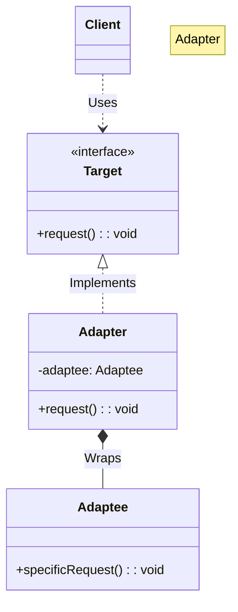
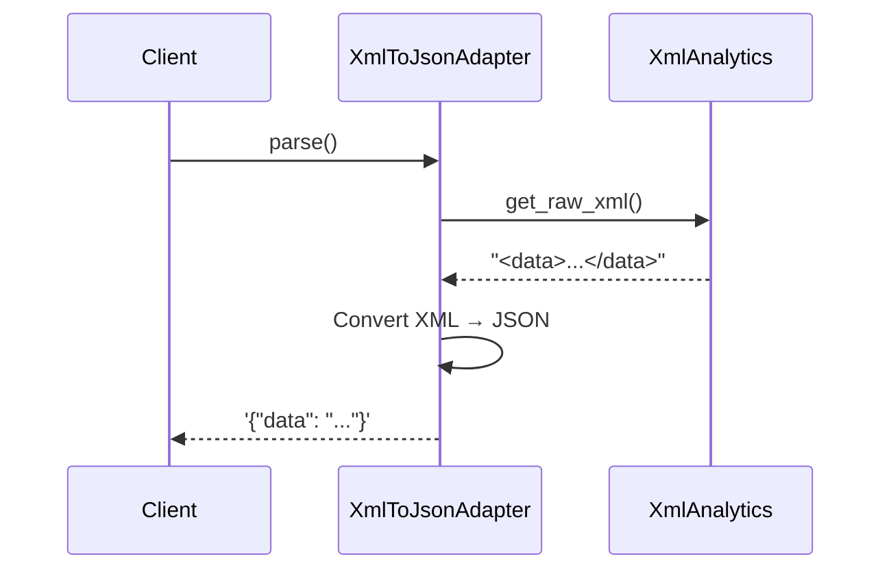

# 🔌 Adapter Pattern: Universal Data Translator

## 📝 Overview
The **Adapter Pattern** acts as a bridge between two incompatible interfaces. It allows classes to work together that couldn't otherwise because of differing method signatures or data formats, much like a power adapter converts different plug types to fit a wall socket.

!!! abstract "Core Concepts"
    - **Target Interface:** The specific interface that the client code expects to use.
    - **Adaptee:** An existing class or third-party library with an incompatible interface that needs to be integrated.
    - **Adapter:** The middleman class that implements the Target interface and translates its calls into a format the Adaptee understands.
    - **Object Adapter:** Uses composition to hold an instance of the Adaptee (the most common and flexible approach).

---

## 🏭 The Engineering Story & Problem

### 😡 The Villain (The Problem)
The "Incompatible Source" — a critical third-party analytics library that is perfect for your needs but speaks "XML," while your entire high-performance microservice architecture is built strictly on "JSON."

### 🦸 The Hero (The Solution)
The "Universal Plug" — the Adapter, which acts as a real-time translator, sitting between your service and the library to ensure they can communicate without either side knowing the other is different.

### 📜 Requirements & Constraints
1.  **(Functional):** The adapter must strictly implement the `JsonParser` interface so the client can use it as any other JSON source.
2.  **(Functional):** The adapter must parse XML and produce valid JSON strings (data transformation).
3.  **(Technical):** The client code should remain unaware that it is actually communicating with an XML source (encapsulation/decoupling).
4.  **(Technical):** The adapter must handle the logic of translating XML structures into JSON strings on the fly (format conversion).

---

## 🏗️ Structure & Blueprint

### Class Diagram


### Runtime Context (Sequence)


---

## 💻 Implementation & Code

### 🧠 SOLID Principles Applied
- **Single Responsibility:** The translation logic is isolated in the Adapter; the client handles business logic, and the Adaptee handles its own data domain.
- **Open/Closed:** You can introduce new adapters (e.g., `CsvToJsonAdapter`) without changing the existing client or library code.

### 🐍 The Code

??? failure "The Villain's Code (Without Pattern)"
    ```python
    class DataService:
        def get_data(self, source_type, source):
            # 😡 Tight coupling: every new format = edit this class
            if source_type == "xml":
                raw = source.get_raw_xml()
                # ... manual XML parsing scattered in business logic
                return json.dumps(parsed)
            elif source_type == "csv":
                raw = source.read_csv()
                # ... more manual parsing
                return json.dumps(parsed)
            # Adding a new format requires editing this core class!
    ```

???+ success "The Hero's Code (With Pattern)"
    ```python
    --8<-- "design_patterns/structural/adapter/format_translator/format_translator.py"
    ```

---

## ⚖️ Trade-offs & Testing

| Pros (Why it works) | Cons (The Twist / Pitfalls) |
| :--- | :--- |
| **Single Responsibility:** Isolates the data conversion/translation layer from core logic. | **Complexity:** Increases overall codebase complexity by introducing new interfaces and classes. |
| **Open/Closed:** You can introduce new adapters without breaking existing client code. | **Hidden Logic:** Risk of leaking business logic into the adapter instead of keeping it strictly to translation. |
| **Non-Invasive:** Allows using legacy or 3rd-party code without modifying its source. | **Band-aid Fix:** Sometimes used to "patch" bad internal designs that should instead be refactored. |

### 🧪 Testing Strategy
Adapter testing is highly isolated and straightforward. Mock the incompatible Adaptee, pass it to your Adapter, and assert that the Adapter correctly translates your inputs into the precise format the Target interface expects without dropping data.

---

## 🎤 Interview Toolkit

- **Interview Signal:** This pattern demonstrates a developer's ability to integrate disparate systems cleanly and their understanding of **Composition over Inheritance**. It shows they value non-invasive changes over "hacking" existing libraries.
- **When to Use:**
    - When you want to use an existing class, but its interface does not match the one you need.
    - When you need to standardize multiple disparate sources (e.g., three different vendors) into a single internal interface.
    - When using legacy code that is too risky to refactor.
- **Scalability Probe:** How would you handle a 1GB XML file? (Answer: Use a streaming/SAX parser inside the adapter instead of loading the whole DOM into memory).
- **Design Alternatives:**
    - **Object Adapter vs Class Adapter:** Object Adapter (Composition) is more flexible and supports multiple adaptees; Class Adapter (Inheritance) is simpler but only works if the language supports multiple inheritance and you want to override behavior.

## 🔗 Related Patterns
- [Bridge](../../bridge/remote_control/PROBLEM.md) — Adapter makes things work after they're designed; Bridge makes them work before they are.
- [Decorator](../../decorator/pizza_builder_decorator/PROBLEM.md) — Adapter changes the interface; Decorator adds responsibilities without changing the interface.
- [Proxy](../../proxy/lazy_loading_proxy/PROBLEM.md) — Adapter provides a *different* interface; Proxy provides the *same* interface.
- [Facade](../../facade/smart_home_facade/PROBLEM.md) — Adapter wraps one object to change its interface; Facade wraps many objects to simplify their interface.
