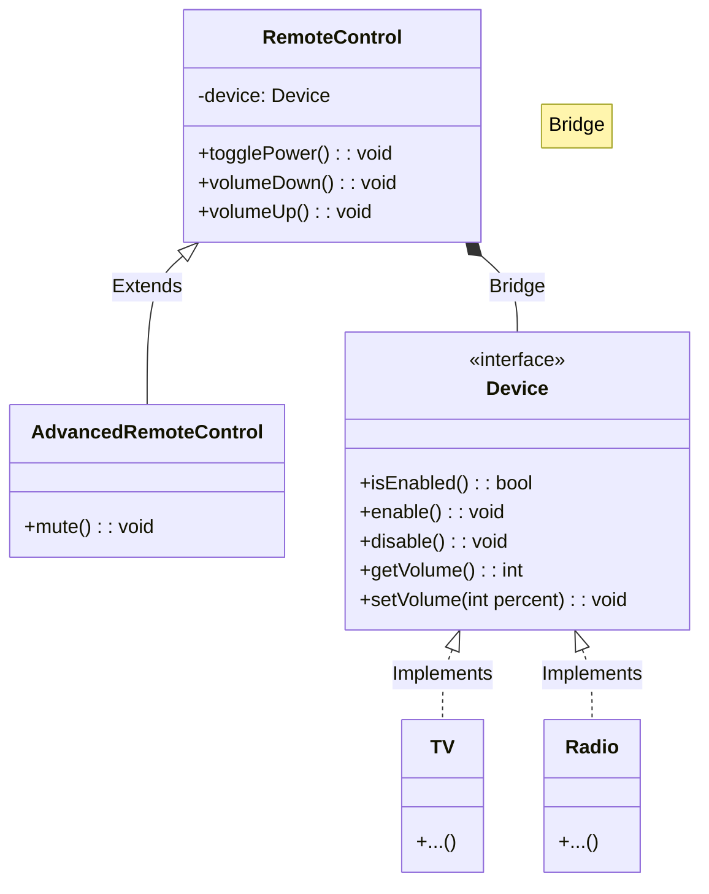
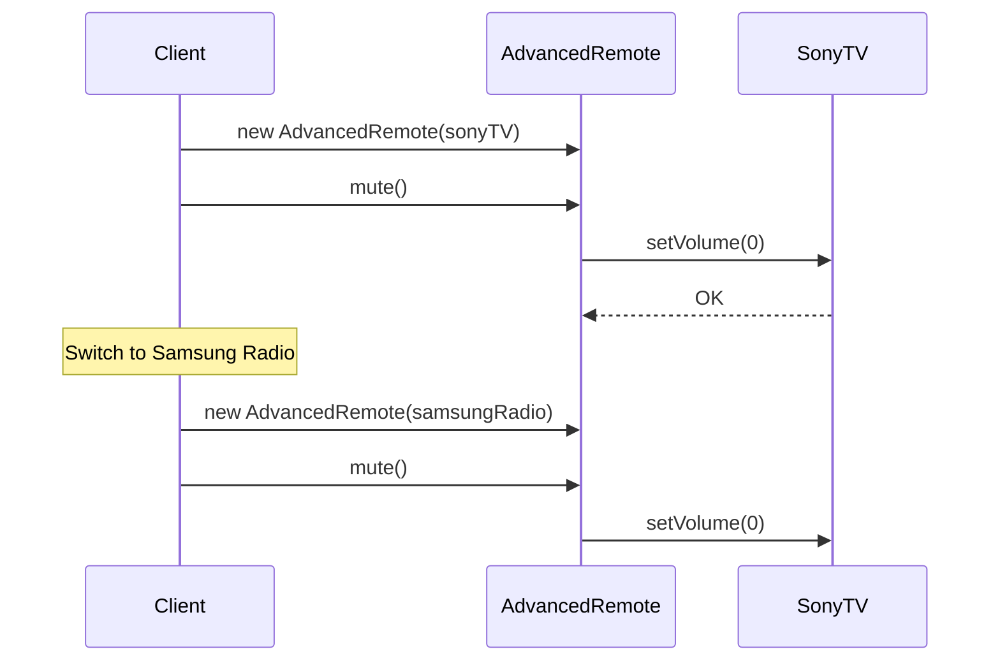

# 🌉 Bridge Pattern: Multi-Platform Remote Control

## 📝 Overview
The **Bridge Pattern** decouples an abstraction from its implementation so that the two can vary independently. It is the preferred alternative to inheritance when you face a "Cartesian Product" class explosion, where multiple dimensions of a system grow at the same time.

!!! abstract "Core Concepts"
    - **Abstraction:** The high-level control layer (e.g., the `RemoteControl`) that defines the user interface and delegates work to the implementation.
    - **Implementor:** The interface for the "platform" or "hardware" layer (e.g., the `Device`) that defines primitive operations.
    - **Refined Abstraction:** A specialized version of the abstraction (e.g., an `AdvancedRemote` with a "Mute" button).
    - **Concrete Implementor:** A platform-specific implementation (e.g., `SonyTV`, `SamsungRadio`).

---

## 🏭 The Engineering Story & Problem

### 😡 The Villain (The Problem)
The "Cartesian Product" — a project that starts with two devices (TV, Radio) and two brands (Sony, Samsung). Then you add two types of remotes (Basic, Advanced). Suddenly, you need 8 classes (`BasicSonyTVRemote`, `AdvancedSonyTVRemote`...). Adding one more brand now requires 4 new classes. The codebase is exploding.

### 🦸 The Hero (The Solution)
The "Bridge" — which realizes that a Remote and a TV are two different things. It separates "What the user presses" (The Abstraction) from "How the hardware responds" (The Implementation). Now you can create an `AdvancedRemote` and a `SonyTV` separately — any remote works with any device via a shared `Device` interface.

### 📜 Requirements & Constraints
1.  **(Functional):** Must support `BasicRemote` and `AdvancedRemote` abstraction hierarchies.
2.  **(Functional):** Must support `TV` and `Radio` device implementations with universal compatibility.
3.  **(Technical):** Adding a new `AdvancedRemoteControl` should not require any changes to the `TV` or `Radio` classes.
4.  **(Technical):** You should be able to add a `SonyTV` or a `BoseRadio` without touching the `RemoteControl` logic.

---

## 🏗️ Structure & Blueprint

### Class Diagram


### Runtime Context (Sequence)


---

## 💻 Implementation & Code

### 🧠 SOLID Principles Applied
- **Single Responsibility:** The Remote defines the policy (UI), while the Device handles the implementation (Hardware).
- **Open/Closed:** You can add new remotes or new devices independently without modifying existing classes.

### 🐍 The Code

??? failure "The Villain's Code (Without Pattern)"
    ```python
    # 😡 Cartesian Product: 2 remotes × 2 devices = 4 classes!
    class BasicSonyTVRemote:
        def toggle_power(self): ...
    class BasicSamsungRadioRemote:
        def toggle_power(self): ...
    class AdvancedSonyTVRemote:
        def toggle_power(self): ...
        def mute(self): ...
    class AdvancedSamsungRadioRemote:
        def toggle_power(self): ...
        def mute(self): ...
    # Adding one more brand = 2 more classes. Adding one more remote type = N more classes!
    ```

???+ success "The Hero's Code (With Pattern)"
    ```python
    --8<-- "design_patterns/structural/bridge/remote_control/remote_control.py"
    ```

---

## ⚖️ Trade-offs & Testing

| Pros (Why it works) | Cons (The Twist / Pitfalls) |
| :--- | :--- |
| **Decoupling:** True separation of abstractions from implementations prevents "class explosion". | **Cognitive Load:** Highly abstract design can make the code harder to read and trace initially. |
| **Independent Evolution:** You can add new abstractions or implementations independently of each other. | **Interface Bloat:** If the bridge interface becomes too specific, it limits the flexibility of new implementations. |
| **Open/Closed:** Follows OCP by keeping the system open for new devices/remotes but closed for modifications. | **Over-engineering:** Using a bridge for a single dimension of change adds unnecessary abstraction layers. |

### 🧪 Testing Strategy
Because the Abstraction and Implementation are decoupled, test them entirely independently! Use a Mock Implementation when testing the Abstraction's high-level routing logic, and test Concrete Implementations in isolation to ensure hardware calls work.

---

## 🎤 Interview Toolkit

- **Interview Signal:** Demonstrates mastery of **Composition over Inheritance**. It shows the developer can think in multiple dimensions and knows how to prevent architectural "lock-in" by decoupling high-level policy from low-level detail.
- **When to Use:**
    - When you want to avoid a permanent binding between an abstraction and its implementation.
    - When both the abstraction and its implementation should be extensible by subclassing.
    - When you have a "Cartesian Product" of classes.
- **Scalability Probe:** How would you handle 50 brands and 10 remote types? (Answer: The Bridge pattern handles this easily; you only need 50 + 10 = 60 classes instead of 50 * 10 = 500 classes).
- **Design Alternatives:**
    - **Adapter:** Adapter fixes things *after* they are built; Bridge is an architectural decision made *upfront* to allow independence.
    - **Multiple Inheritance:** Creates a complex web of dependencies and is not supported or recommended in many languages; Bridge uses composition which is cleaner and more flexible.

## 🔗 Related Patterns
- [Adapter](../../adapter/format_translator/PROBLEM.md) — Adapter makes things work after they're designed; Bridge makes them work before they are.
- [Abstract Factory](../../../creational/abstract_factory/ui_toolkit/PROBLEM.md) — Often used to create and configure a specific Bridge (matching the right Remote with the right Device).
