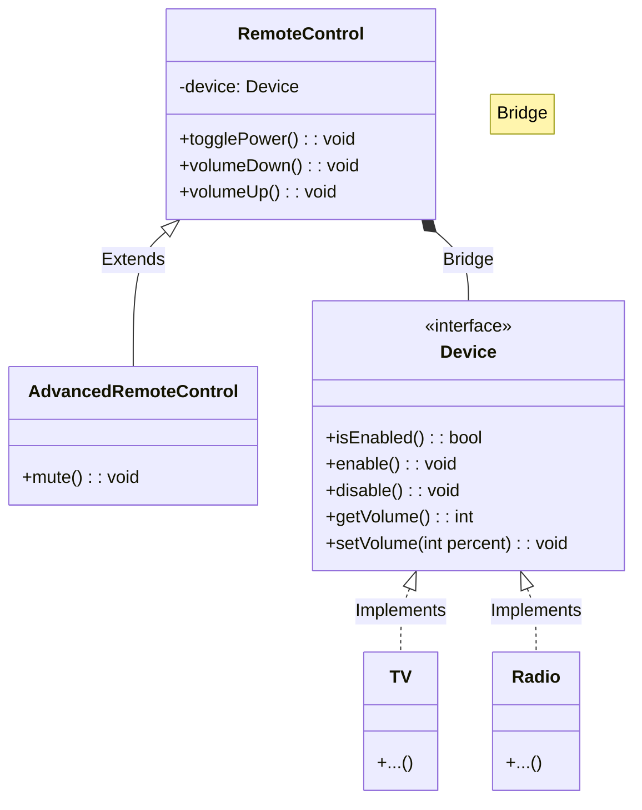

# 🌉 Bridge Pattern: Multi-Platform Remote Control

## 📝 Overview
The **Bridge Pattern** decouples an abstraction from its implementation so that the two can vary independently. It is the preferred alternative to inheritance when you face a "Cartesian Product" class explosion, where multiple dimensions of a system grow at the same time.

!!! abstract "Concept"
    The **Bridge Pattern** moves from an "is-a" (inheritance) relationship to a "has-a" (composition) relationship. By separating the high-level logic (Abstraction) from the platform-specific implementation (Implementor), you can develop and extend both hierarchies without them interfering with each other.

!!! abstract "Core Concepts"
    - **Abstraction:** The high-level control layer (e.g., the `RemoteControl`) that defines the user interface and delegates work to the implementation.
    - **Implementor:** The interface for the "platform" or "hardware" layer (e.g., the `Device`) that defines primitive operations.
    - **Refined Abstraction:** A specialized version of the abstraction (e.g., an `AdvancedRemote` with a "Mute" button).
    - **Concrete Implementor:** A platform-specific implementation (e.g., `SonyTV`, `SamsungRadio`).

!!! example "Example"
    Imagine you have a `RemoteControl` and a `Device`. Instead of creating `SonyTVRemote`, `SonyRadioRemote`, `SamsungTVRemote`, etc., you create a `RemoteControl` that *holds a reference* to a `Device`. Now, any remote can work with any device, and adding a new `BoseSpeaker` doesn't require creating new remote classes.

!!! info "Why Use This Pattern?"
    - **Avoids Class Explosion:** Prevents the exponential growth of classes that happens when you try to use inheritance for multiple dimensions of variation.
    - **Runtime Switching:** You can change the implementation object at runtime (e.g., the same remote switching from controlling the TV to the Radio).
    - **Independent Evolution:** The GUI/Logic team can work on the `Remote` while the Hardware/Firmware team works on the `Device` without breaking each other's code.

## 🏭 The Engineering Story

### The Villain:
The "Cartesian Product" — a project that starts with two devices (TV, Radio) and two brands (Sony, Samsung). Then you add two types of remotes (Basic, Advanced). Suddenly, you need 8 classes (`BasicSonyTVRemote`, `AdvancedSonyTVRemote`...). Adding one more brand now requires 4 new classes. The codebase is exploding.

### The Hero:
The "Bridge" — which realizes that a Remote and a TV are two different things. It separates "What the user presses" (The Abstraction) from "How the hardware responds" (The Implementation).

### The Plot:

1. **Identify Dimensions:** Recognize that "Remote Type" and "Device Brand" are independent.

2. **Define the Bridge:** Create a `Device` interface with low-level methods like `enable()`, `disable()`, and `set_volume()`.

3. **Build the Abstraction:** Create a `RemoteControl` class that contains a reference to a `Device`.

4. **Extend Independently:** Now you can create an `AdvancedRemote` (adding a `mute()` method) and a `SonyTV` (implementing `enable()`) separately. The `AdvancedRemote` can mute a `SonyTV` just as easily as it can mute a `SamsungRadio`.

### The Twist (Failure):
If the Bridge interface becomes too specific to one implementation (e.g., adding `set_channel()` to the `Device` interface when some devices don't have channels), the bridge begins to crumble, and you're back to tight coupling.

### Interview Signal:
This pattern demonstrates a mastery of **Composition over Inheritance**. It shows the developer can think in multiple dimensions and knows how to prevent architectural "lock-in" by decoupling high-level policy from low-level detail.

## 🚀 Problem Statement
You are designing a universal remote control system. You have multiple types of remotes (Basic, Advanced) and multiple types of devices (TV, Radio). If you use inheritance, you'll end up with a massive number of classes. You need a design that allows you to add new remotes and new devices independently.

## 🛠️ Requirements

1.  **Abstraction Hierarchy:** Must support `BasicRemote` and `AdvancedRemote`.
2.  **Implementation Hierarchy:** Must support `TV` and `Radio` devices.
3.  **Universal Compatibility:** Any remote must be able to control any device.

### Technical Constraints

- **Independence:** Adding a new `AdvancedRemoteControl` should not require any changes to the `TV` or `Radio` classes.
- **Extensibility:** You should be able to add a `SonyTV` or a `BoseRadio` without touching the `RemoteControl` logic.

## 🧠 Thinking Process & Approach
When we have two independent dimensions of growth (e.g., Remotes and Devices), inheritance fails. The approach is to bridge them via composition, so a Remote *has* a Device, allowing both to evolve without a class explosion.

### Key Observations:

- **Decouple Policy from Implementation:** The Remote defines the policy (UI), while the Device handles the implementation (Hardware).
- **Stronger than Adapter:** While Adapter fixes things *after* they are built, Bridge is an architectural decision made *upfront* to allow independence.

## 🧩 Runtime Context / Evaluation Flow

At runtime, you instantiate a `SonyTV`. Then, you instantiate an `AdvancedRemote` and pass the `SonyTV` into its constructor. When you call `remote.mute()`, the remote calls `device.set_volume(0)`. If you later switch the remote to control a `SamsungRadio`, the `remote.mute()` call still works perfectly because it only relies on the `Device` interface.

## 💻 Solution Implementation

```python
--8<-- "design_patterns/structural/bridge/remote_control/remote_control.py"
```

!!! success "Why This Works"
    By separating the abstraction from its implementation, both can be extended independently. This avoids the exponential growth of classes. It follows the **Open/Closed Principle** perfectly: the system is open for new devices and remotes but closed for modification of existing code.

!!! tip "When to Use"
    - When you want to avoid a permanent binding between an abstraction and its implementation.
    - When both the abstraction and its implementation should be extensible by subclassing.
    - When you have a "Cartesian Product" of classes.

!!! warning "Common Pitfall"
    - **Over-engineering:** Don't use Bridge if you only have one dimension of change. If you only ever have one type of remote, a simple interface/implementation is enough.
    - **Interface Bloat:** Keep the Implementor interface (the Bridge) as minimal as possible.

## 🎤 Interview Follow-ups

- **Scalability Probe:** How would you handle 50 brands and 10 remote types? (Answer: The Bridge pattern handles this easily; you only need 50 + 10 = 60 classes instead of 50 * 10 = 500 classes).
- **Design Trade-off:** Why not just use multiple inheritance? (Answer: Multiple inheritance creates a complex web of dependencies and is not supported or recommended in many languages; Bridge uses composition which is cleaner and more flexible).
- **Production Readiness:** How do you handle devices with slightly different capabilities (e.g., a Radio doesn't have "Source" input)? (Answer: Use the **Null Object Pattern** or a capability-checking system within the implementation classes).

## 🔗 Related Patterns

- [Adapter](../../adapter/format_translator/PROBLEM.md) — Adapter makes things work after they're designed; Bridge makes them work before they are.
- [Abstract Factory](../../../creational/abstract_factory/ui_toolkit/PROBLEM.md) — Often used to create and configure a specific Bridge (matching the right Remote with the right Device).

## 🧩 Diagram

