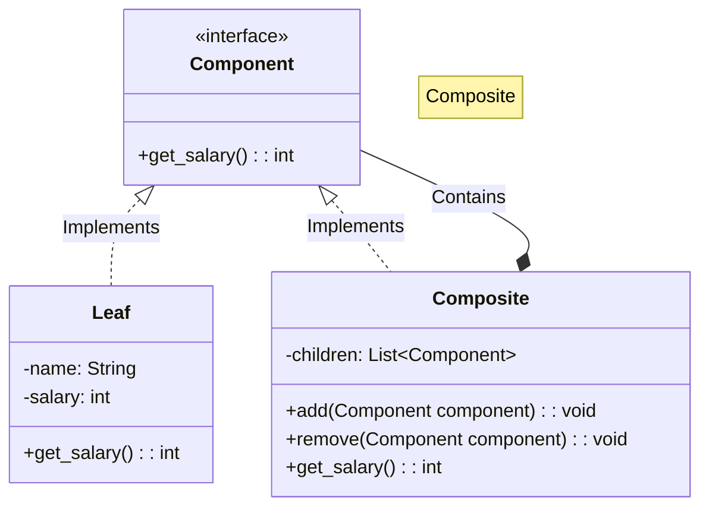

# 🌿 Composite Pattern: Unified Organization Chart

## 📝 Overview
The **Composite Pattern** allows you to compose objects into tree structures to represent part-whole hierarchies. It lets clients treat individual objects and compositions of objects uniformly, simplifying code that deals with complex recursive structures.

!!! abstract "Concept"
    The **Composite Pattern** organizes objects into a tree structure where both individual items (leaves) and groups of items (composites) share the same interface. This allows recursive operations to traverse the entire structure without the caller needing to know the specific type of each node.

!!! abstract "Core Concepts"
    - **Component Interface:** The common base or interface that declares operations for both simple and complex objects in the composition.
    - **Leaf:** The basic building block of the composition that has no children. It implements the base interface operations directly.
    - **Composite:** A complex element that contains children (leaves or other composites). It implements the base interface by delegating work to its children.
    - **Recursive Composition:** The ability for a container to hold other containers, enabling the creation of deeply nested, tree-like structures.

!!! example "Example"
    Consider a file system. A `File` is a leaf, and a `Directory` is a composite. Both implement a `getSize()` method. When you call `getSize()` on a directory, it recursively calls `getSize()` on all its files and sub-directories, returning the total.

!!! info "Why Use This Pattern?"
    - **Uniformity:** Clients can treat simple and complex elements the same way.
    - **Flexibility:** It's easy to add new types of components without changing existing client code.
    - **Hierarchy Management:** Naturally represents hierarchies like organization charts, UI component trees, or file systems.

## 🏭 The Engineering Story

### The Villain:
The "Nested Loop Nightmare" — a codebase riddled with `if (isinstance(node, Department))` checks and deeply nested loops. Adding a new level to the hierarchy requires rewriting the traversal logic everywhere.

### The Hero:
The "Unified Node" — the Composite Pattern, which mandates that a single employee and an entire 500-person division must speak the same language (interface).

### The Plot:

1. **Define the Contract:** Create a `Component` interface (e.g., `OrganizationEntity`) with methods like `get_salary()`.

2. **Build the Leaves:** Implement `Employee` classes that return their specific salary.

3. **Build the Composites:** Implement `Department` classes that hold a list of `OrganizationEntity` objects.

4. **Recurse:** The `Department.get_salary()` method simply iterates through its list and calls `entity.get_salary()` on each, regardless of whether it's an employee or a sub-department.

### The Twist (Failure):
The "Interface Bloat." If you try to force management methods (like `add_employee`) into the base `Component` interface, the `Employee` leaf node is forced to implement a method it can't use, often throwing an "Unsupported Operation" exception.

### Interview Signal:
This pattern demonstrates a developer's ability to handle recursive data structures and their commitment to the "Open/Closed Principle"—the system is open for expansion (new component types) but closed for modification (traversal logic stays the same).

## 🚀 Problem Statement
You need to build a system to calculate the total salary of an entire company. The company is structured into departments, sub-departments, and individual employees. The challenge is calculating the sum without the client needing to know whether they are dealing with a single person or a whole division.

## 🛠️ Requirements

1.  **Uniform Interface:** Both `Employee` and `Department` must implement a shared interface.
2.  **Transparent Calculation:** Calculating the salary of a `Department` must automatically include all sub-entities.
3.  **Dynamic Hierarchy:** The system must support adding/removing employees or departments at any level.

### Technical Constraints

- **Hierarchy Transparency:** A `Department` should be able to contain any `Entity`, whether it's a `Developer` (leaf) or another `Department` (composite).
- **Recursive Summation:** Calling `get_salary()` on the root node should automatically trigger a recursive traversal of the entire tree.

## 🧠 Thinking Process & Approach
Managing part-whole hierarchies (like Org Charts) usually requires different logic for individuals vs groups. The approach is to treat both as the same interface, allowing recursive operations like 'get_salary' to work transparently.

### Key Observations:

- **Uniformity over Type-Checking:** Avoid `if-else` blocks based on object type; rely on polymorphism instead.
- **Tree Traversal:** The pattern naturally maps to a depth-first search (DFS) traversal.
- **Base Case:** Individual employees act as the base case for the recursion.

## 🧩 Runtime Context / Evaluation Flow

When the client calls `root_dept.get_salary()`, the call stack grows as it dives into each sub-department. Each sub-department waits for its children (employees or further sub-departments) to return their values before summing them up and returning the result to its parent.

## 💻 Solution Implementation

```python
--8<-- "design_patterns/structural/composite/organisation_chart/organisation_chart.py"
```

!!! success "Why This Works"
    By using a common interface, the client code can interact with individual objects and compositions identically. This removes the need for type checking and simplifies recursive operations. It perfectly adheres to the "Single Responsibility Principle" by letting nodes manage their own state and children.

!!! tip "When to Use"
    - When you need to represent part-whole hierarchies of objects.
    - When you want clients to be able to ignore the difference between compositions of objects and individual objects.
    - When the structure can be arbitrarily deep.

!!! warning "Common Pitfall"
    - **Over-Generalization:** Making the interface too broad can lead to "dummy" implementations in leaf nodes.
    - **Circular References:** Be careful not to create a loop (e.g., Department A containing Department B, which contains Department A), as this will cause infinite recursion.

## 🎤 Interview Follow-ups

- **Scalability Probe:** How would you handle a tree with 1 million nodes? (Answer: Use memoization/caching of results at each composite node, invalidating the cache only when a child is added/removed).
- **Design Trade-off:** Should management methods (`add`/`remove`) be in the Component interface? (Answer: Putting them in Component provides *Transparency* but loses *Type Safety*. Keeping them in Composite provides *Safety* but requires the client to cast).
- **Production Readiness:** How do you prevent infinite loops in the tree? (Answer: Implement a cycle detection algorithm or use a Parent reference check when adding children).

## 🔗 Related Patterns

- [Decorator](../../decorator/pizza_builder_decorator/PROBLEM.md) — Both have similar recursive structures, but Decorator has only one child.
- [Visitor](../../../behavioral/visitor/PROBLEM.md) — Visitor can be used to apply an operation over a Composite tree without changing the node classes.
- [Chain of Responsibility](../../../behavioral/chain_of_responsibility/PROBLEM.md) — Often used in conjunction with Composite where a component passes a request up to its parent.

## 🧩 Diagram

