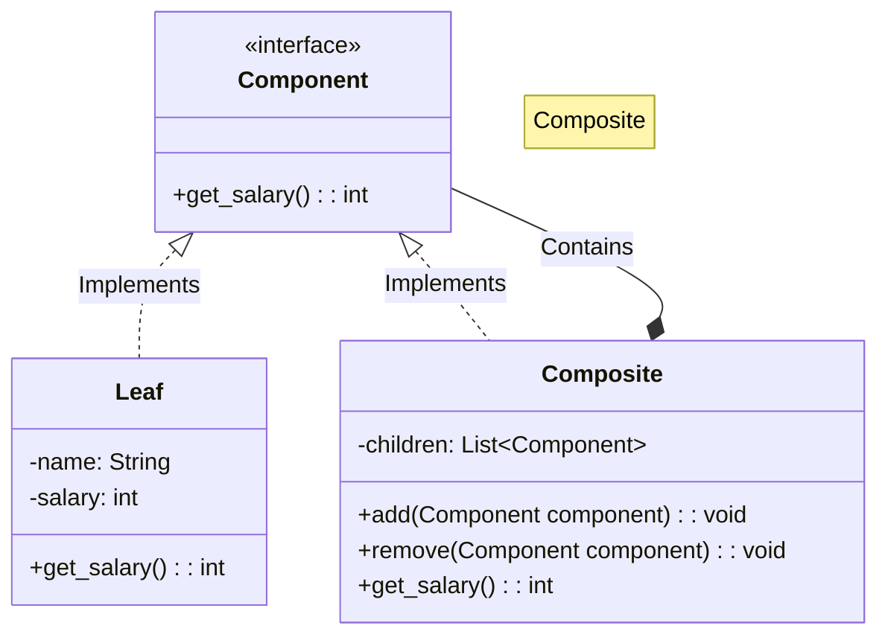
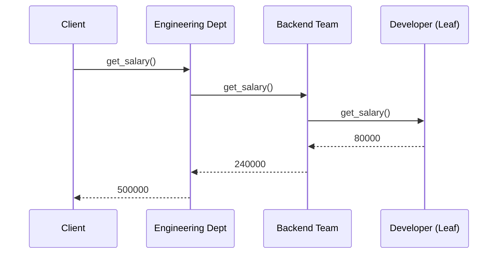

# 🌿 Composite Pattern: Unified Organization Chart

## 📝 Overview
The **Composite Pattern** allows you to compose objects into tree structures to represent part-whole hierarchies. It lets clients treat individual objects and compositions of objects uniformly, simplifying code that deals with complex recursive structures.

!!! abstract "Core Concepts"
    - **Component Interface:** The common base or interface that declares operations for both simple and complex objects in the composition.
    - **Leaf:** The basic building block of the composition that has no children. It implements the base interface operations directly.
    - **Composite:** A complex element that contains children (leaves or other composites). It implements the base interface by delegating work to its children.
    - **Recursive Composition:** The ability for a container to hold other containers, enabling the creation of deeply nested, tree-like structures.

---

## 🏭 The Engineering Story & Problem

### 😡 The Villain (The Problem)
The "Nested Loop Nightmare" — a codebase riddled with `if (isinstance(node, Department))` checks and deeply nested loops. Adding a new level to the hierarchy requires rewriting the traversal logic everywhere.

### 🦸 The Hero (The Solution)
The "Unified Node" — the Composite Pattern, which mandates that a single employee and an entire 500-person division must speak the same language (interface). The `Department.get_salary()` method simply iterates through its list and calls `entity.get_salary()` on each, regardless of whether it's an employee or a sub-department.

### 📜 Requirements & Constraints
1.  **(Functional):** Both `Employee` and `Department` must implement a shared interface (`OrganizationEntity`).
2.  **(Functional):** Calculating the salary of a `Department` must automatically include all sub-entities (transparent calculation).
3.  **(Technical):** A `Department` should be able to contain any `Entity`, whether it's a `Developer` (leaf) or another `Department` (composite).
4.  **(Technical):** Calling `get_salary()` on the root node should automatically trigger a recursive traversal of the entire tree.

---

## 🏗️ Structure & Blueprint

### Class Diagram


### Runtime Context (Sequence)


---

## 💻 Implementation & Code

### 🧠 SOLID Principles Applied
- **Single Responsibility:** Each node manages its own state; leaves return their value, composites aggregate their children.
- **Open/Closed:** Adding a new component type (e.g., `Contractor`) requires no changes to the traversal logic.

### 🐍 The Code

??? failure "The Villain's Code (Without Pattern)"
    ```python
    class OrgCalculator:
        def total_salary(self, org):
            total = 0
            for dept in org.departments:
                # 😡 Type-checking nightmare
                if isinstance(dept, Department):
                    for team in dept.teams:
                        if isinstance(team, Team):
                            for emp in team.employees:
                                total += emp.salary
                        else:
                            total += team.salary
                else:
                    total += dept.salary
            return total
            # Adding a new hierarchy level requires rewriting everything!
    ```

???+ success "The Hero's Code (With Pattern)"
    ```python
    --8<-- "design_patterns/structural/composite/organisation_chart/organisation_chart.py"
    ```

---

## ⚖️ Trade-offs & Testing

| Pros (Why it works) | Cons (The Twist / Pitfalls) |
| :--- | :--- |
| **Uniformity:** Clients treat complex trees and simple leaves strictly identically without `if-else` checks. | **Over-Generalization:** Makes it hard to restrict certain container types (e.g., "Only Folders can contain Folders"). |
| **Easy Expansion:** Adding a new component type into the composition tree is trivial. | **Infinite Recursion:** Risk of circular references (e.g., A contains B, B contains A) breaking traversal logic. |
| **Clean Traversal:** Eliminates type-checking and nested loops from business logic. | **Bloat:** Base interface might have methods (like `add()`) that are irrelevant for leaf nodes. |

### 🧪 Testing Strategy
Start from the bottom: Test an individual `Leaf` first. Then, test a `Composite` containing multiple leaves. Finally, test a `Composite` containing another `Composite` to ensure the recursive aggregation smoothly propagates up the tree.

---

## 🎤 Interview Toolkit

- **Interview Signal:** Demonstrates a developer's ability to handle recursive data structures and their commitment to the "Open/Closed Principle"—the system is open for expansion (new component types) but closed for modification (traversal logic stays the same).
- **When to Use:**
    - When you need to represent part-whole hierarchies of objects.
    - When you want clients to be able to ignore the difference between compositions of objects and individual objects.
    - When the structure can be arbitrarily deep (file systems, UI trees, org charts).
- **Scalability Probe:** How would you handle a tree with 1 million nodes? (Answer: Use memoization/caching of results at each composite node, invalidating the cache only when a child is added/removed).
- **Design Alternatives:**
    - **Transparency vs Safety:** Putting management methods (`add`/`remove`) in Component provides *Transparency* but loses *Type Safety*. Keeping them in Composite provides *Safety* but requires the client to cast.

## 🔗 Related Patterns
- [Decorator](../../decorator/pizza_builder_decorator/PROBLEM.md) — Both have similar recursive structures, but Decorator has only one child.
- [Visitor](../../../behavioral/visitor/PROBLEM.md) — Visitor can be used to apply an operation over a Composite tree without changing the node classes.
- [Chain of Responsibility](../../../behavioral/chain_of_responsibility/PROBLEM.md) — Often used in conjunction with Composite where a component passes a request up to its parent.
