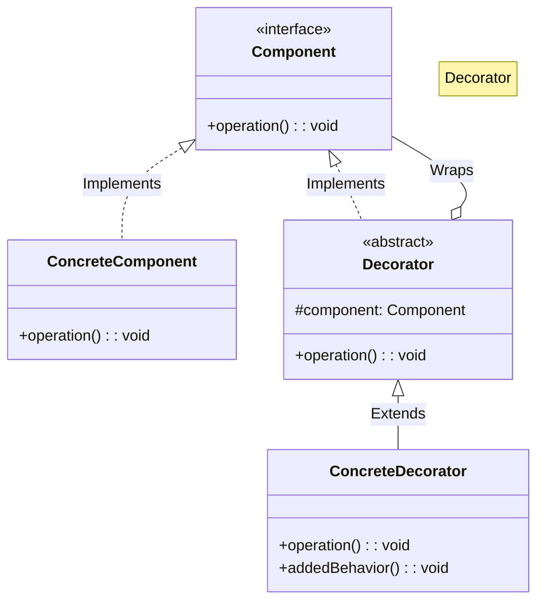

# 🍕 Decorator: Dynamic Pizza Customizer

## 📝 Overview
The **Decorator Pattern** allows you to dynamically attach new behaviors to an object at runtime without affecting other objects of the same class. It provides a flexible alternative to subclassing for extending functionality, especially when you have many independent ways to extend an object.

!!! abstract "Concept"
    The **Decorator Pattern** follows the "Onion" principle: you have a core object and you wrap it in multiple layers of decorators. Each layer implements the same interface as the core, allowing you to stack an infinite number of extensions (like toppings on a pizza) while the client continues to see a single object.

!!! abstract "Core Concepts"
    - **Component Interface:** The common base or interface for both the original object and all its decorators.
    - **Concrete Component:** The basic object being decorated (e.g., the `PlainPizza`).
    - **Base Decorator:** A class that implements the component interface and contains a reference to a component object.
    - **Concrete Decorators:** Classes that add specific state or behavior to the component (e.g., `Cheese`, `Pepperoni`).

!!! example "Example"
    In a coffee shop app, you start with a `SimpleCoffee` ($2). You wrap it in a `MilkDecorator` (+$0.5) and then a `SugarDecorator` (+$0.2). When you call `getCost()`, the `SugarDecorator` asks the `MilkDecorator` for its cost, which in turn asks the `SimpleCoffee`. The total ($2.7) is returned to the user.

!!! info "Why Use This Pattern?"
    - **Runtime Flexibility:** You can add or remove responsibilities from an object at runtime, which is impossible with inheritance.
    - **Open/Closed Principle:** You can introduce new decorators without changing the existing base classes or other decorators.
    - **Avoids Class Explosion:** Instead of creating 100 classes for every combination of features, you create 10 decorators that can be combined in 100 ways.

## 🏭 The Engineering Story

### The Villain:
The "Inheritance Explosion" — a developer at a pizza chain who tried to create a class for every menu item. They started with `CheesePizza`, then `PepperoniPizza`. Then they needed `CheeseAndPepperoniPizza`. By the time they got to 5 toppings, they had 31 classes. Adding a 6th topping would double that number.

### The Hero:
The "Onion" — the Decorator Pattern, which realizes that toppings aren't new types of pizzas; they are just layers wrapped around a base pizza.

### The Plot:

1. **Define the Base:** Create a `Pizza` interface with `get_cost()` and `get_description()`.

2. **The Foundation:** Implement `PlainPizza` as the core object.

3. **The Wrapper:** Create a `ToppingDecorator` that *is-a* `Pizza` and *has-a* `Pizza`.

4. **Stack the Toppings:** Create `Cheese`, `Pepperoni`, and `Mushroom` decorators. A customer's order `Cheese(Pepperoni(PlainPizza()))` behaves like a single pizza object.

### The Twist (Failure):
"The Order of Operations." If you have a `DiscountDecorator` that gives 10% off, applying it *before* the `TaxDecorator` vs. *after* the `TaxDecorator` results in different final prices. The order of wrapping becomes a hidden business logic dependency.

### Interview Signal:
This pattern demonstrates a developer's ability to prioritize **Composition over Inheritance**. It shows they know how to build systems that are "Easy to extend, but hard to break."

## 🚀 Problem Statement
You are building a POS system for a pizza parlor. Customers can add any combination of toppings to a base pizza. Using inheritance to create classes like `CheesePepperoniMushroomPizza` is impossible due to the sheer number of combinations and the possibility of "double" toppings. You need a way to calculate the cost and description of any arbitrary combination of toppings dynamically.

## 🛠️ Requirements

1.  **Uniform Interface:** The final decorated object must still be treated as a `Pizza`.
2.  **Recursive Calculation:** Costs must be calculated by summing the cost of the topping plus the cost of the inner pizza.
3.  **Dynamic Description:** The description must build up as a comma-separated list of all added toppings.

### Technical Constraints

- **Identity:** The decorated object must still be recognized as a `Pizza` by the system.
- **Cumulative Behavior:** Both `get_cost()` and `get_description()` must correctly aggregate values from all layers of the "onion."

## 🧠 Thinking Process & Approach
When you have a base object that can be extended in numerous combinations, inheritance leads to a 'class explosion'. The approach is to create a decorator class that implements the same interface as the object it wraps. This allows for dynamic, runtime composition of features.

### Key Observations:

- **Inheritance vs. Decoration:** Inheritance happens at compile-time; Decoration happens at run-time.
- **Transparency:** The client doesn't (and shouldn't) know if they are talking to a `PlainPizza` or a `PlainPizza` wrapped in 5 decorators.
- **Interface Consistency:** Every layer must strictly adhere to the `Pizza` interface for the recursion to work.

## 🧩 Runtime Context / Evaluation Flow

When you call `order.get_cost()`, the outermost decorator (e.g., `Cheese`) pauses its execution to call `inner_pizza.get_cost()`. This propagates down to the base `PlainPizza`, which returns its base price (e.g., 10). The value then bubbles back up, with each decorator adding its specific cost (+2, +3...) until the final total is returned to the caller.

## 💻 Solution Implementation

```python
--8<-- "design_patterns/structural/decorator/pizza_builder_decorator/pizza_builder_decorator.py"
```

!!! success "Why This Works"
    This design adheres to the Open/Closed principle and ensures high maintainability by decoupling concerns. It allows for infinite combinations of toppings without creating a complex class hierarchy. It also allows for "Double" or "Triple" toppings just by wrapping the object in the same decorator multiple times.

!!! tip "When to Use"
    - When you need to add responsibilities to objects dynamically and transparently.
    - When you can't use inheritance because the number of combinations is too high.
    - When you want to add functionality that can be withdrawn later.

!!! warning "Common Pitfall"
    - **The "Lots of Little Objects" Problem:** Using Decorator can result in a system with many small objects that look alike, making debugging harder.
    - **Order Dependency:** If the order of decoration changes the outcome, you must manage that complexity (e.g., always ensuring Discounts are applied last).

## 🎤 Interview Follow-ups

- **Scalability Probe:** How do you handle a pizza with 100 toppings? (Answer: While the recursion will work, the stack depth might be a concern. However, for a few hundred toppings, modern languages handle this easily. Alternatively, use a "Topping List" in a single decorator).
- **Design Trade-off:** Decorator vs. Strategy? (Answer: Decorator changes the *skin* of the object (adding features); Strategy changes the *guts* of the object (changing how it does something)).
- **Production Readiness:** How do you handle removing a topping (e.g., a customer changes their mind)? (Answer: Decorators are hard to "unwrap" from the middle. Usually, it's better to rebuild the decorator chain from scratch or use a different pattern like **Command** for the order).

## 🔗 Related Patterns

- [Adapter](../../adapter/format_translator/PROBLEM.md) — Adapter changes the interface; Decorator adds responsibilities without changing the interface.
- [Proxy](../../proxy/lazy_loading_proxy/PROBLEM.md) — Proxy controls access and has the same interface; Decorator adds functionality and has the same interface.
- [Composite](../../composite/organisation_chart/PROBLEM.md) — Both are based on recursive composition, but Decorator has only one child component and adds functionality, while Composite "sums up" results from multiple children.

## 🧩 Diagram

