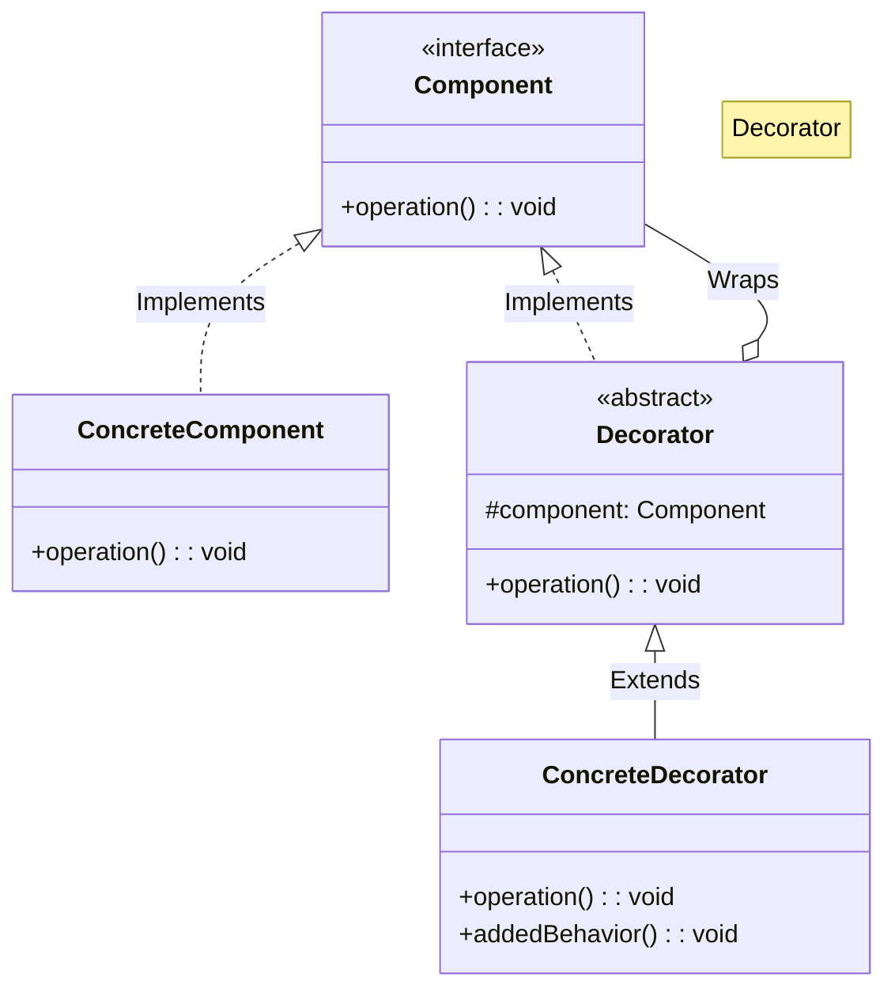
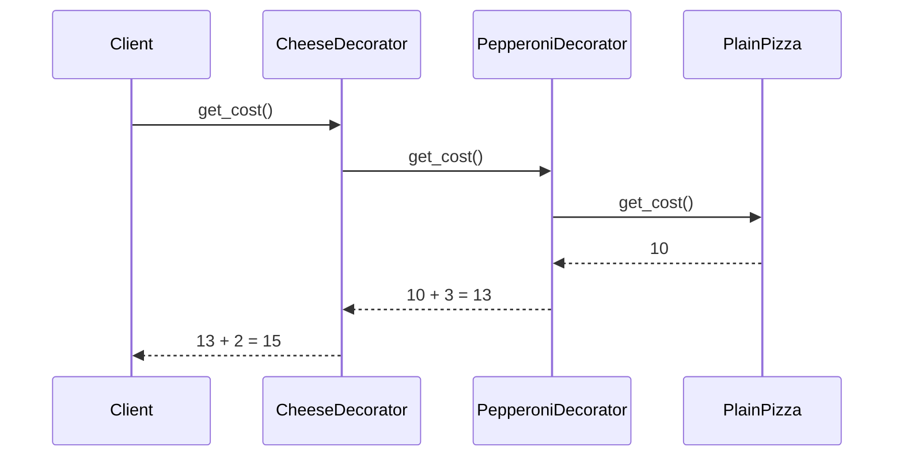

# 🍕 Decorator: Dynamic Pizza Customizer

## 📝 Overview
The **Decorator Pattern** allows you to dynamically attach new behaviors to an object at runtime without affecting other objects of the same class. It provides a flexible alternative to subclassing for extending functionality, especially when you have many independent ways to extend an object.

!!! abstract "Core Concepts"
    - **Component Interface:** The common base or interface for both the original object and all its decorators.
    - **Concrete Component:** The basic object being decorated (e.g., the `PlainPizza`).
    - **Base Decorator:** A class that implements the component interface and contains a reference to a component object.
    - **Concrete Decorators:** Classes that add specific state or behavior to the component (e.g., `Cheese`, `Pepperoni`).

---

## 🏭 The Engineering Story & Problem

### 😡 The Villain (The Problem)
The "Inheritance Explosion" — a developer at a pizza chain who tried to create a class for every menu item. They started with `CheesePizza`, then `PepperoniPizza`. Then they needed `CheeseAndPepperoniPizza`. By the time they got to 5 toppings, they had 31 classes. Adding a 6th topping would double that number.

### 🦸 The Hero (The Solution)
The "Onion" — the Decorator Pattern, which realizes that toppings aren't new types of pizzas; they are just layers wrapped around a base pizza. A customer's order `Cheese(Pepperoni(PlainPizza()))` behaves like a single pizza object, with costs and descriptions aggregated recursively through the chain.

### 📜 Requirements & Constraints
1.  **(Functional):** The final decorated object must still be treated as a `Pizza` (uniform interface).
2.  **(Functional):** Costs must be calculated by summing the cost of the topping plus the cost of the inner pizza (recursive calculation).
3.  **(Technical):** The decorated object must still be recognized as a `Pizza` by the system (identity).
4.  **(Technical):** Both `get_cost()` and `get_description()` must correctly aggregate values from all layers of the "onion" (cumulative behavior).

---

## 🏗️ Structure & Blueprint

### Class Diagram


### Runtime Context (Sequence)


---

## 💻 Implementation & Code

### 🧠 SOLID Principles Applied
- **Single Responsibility:** Each decorator class handles exactly one extension (one topping).
- **Open/Closed:** Add a new `MushroomDecorator` without modifying `PlainPizza` or any existing decorator.

### 🐍 The Code

??? failure "The Villain's Code (Without Pattern)"
    ```python
    # 😡 Inheritance explosion: 2^N classes for N toppings!
    class CheesePizza: ...
    class PepperoniPizza: ...
    class CheesePepperoniPizza: ...
    class CheesePepperoniMushroomPizza: ...
    class CheesePepperoniMushroomOlivePizza: ...
    # Adding a 6th topping doubles the number of classes!
    ```

???+ success "The Hero's Code (With Pattern)"
    ```python
    --8<-- "design_patterns/structural/decorator/pizza_builder_decorator/pizza_builder_decorator.py"
    ```

---

## ⚖️ Trade-offs & Testing

| Pros (Why it works) | Cons (The Twist / Pitfalls) |
| :--- | :--- |
| **Dynamic Flexibility:** Much more flexible than inheritance for adding behaviors at runtime. | **Class Proliferation:** Creates a large number of visually identical, tiny wrapper classes. |
| **Recursive Composition:** You can combine multiple behaviors recursively like an "onion". | **Order Dependency:** If the sequence of decoration matters (e.g. discount before tax), it must be manually managed. |
| **OCP Adherence:** Add new functionality (toppings) without modifying the base component or existing wrappers. | **Ugly Initialization:** Decorating an object many levels deep can look chaotic without a Factory. |

### 🧪 Testing Strategy
Unit testing decorators requires verifying that they correctly call their wrapped component (the inner layer) and properly augment the result before returning it. Test each decorator independently by injecting a mock base component.

---

## 🎤 Interview Toolkit

- **Interview Signal:** Demonstrates a developer's ability to prioritize **Composition over Inheritance**. It shows they know how to build systems that are "Easy to extend, but hard to break."
- **When to Use:**
    - When you need to add responsibilities to objects dynamically and transparently.
    - When you can't use inheritance because the number of combinations is too high.
    - When you want to add functionality that can be withdrawn later.
- **Scalability Probe:** How do you handle a pizza with 100 toppings? (Answer: While the recursion will work, the stack depth might be a concern. Alternatively, use a "Topping List" in a single decorator).
- **Design Alternatives:**
    - **Strategy:** Decorator changes the *skin* of the object (adding features); Strategy changes the *guts* of the object (changing how it does something).
    - **Command:** Decorators are hard to "unwrap" from the middle. For removing toppings, it's better to rebuild the chain or use **Command** for the order.

## 🔗 Related Patterns
- [Adapter](../../adapter/format_translator/PROBLEM.md) — Adapter changes the interface; Decorator adds responsibilities without changing the interface.
- [Proxy](../../proxy/lazy_loading_proxy/PROBLEM.md) — Proxy controls access and has the same interface; Decorator adds functionality and has the same interface.
- [Composite](../../composite/organisation_chart/PROBLEM.md) — Both are based on recursive composition, but Decorator has only one child component and adds functionality, while Composite "sums up" results from multiple children.
