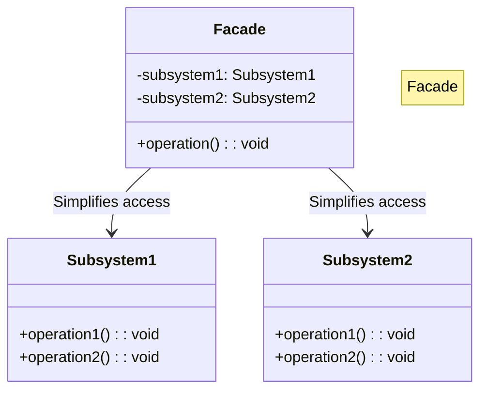

# 🏠 Facade Pattern: One-Touch Smart Home

## 📝 Overview
The **Facade Pattern** provides a simplified interface to a complex set of classes, library, or framework. It hides the "messy" inner workings of a subsystem behind a single, easy-to-use "front" class, making the system easier to use and maintain.

!!! abstract "Concept"
    The **Facade Pattern** serves as a front-facing interface masking more complex underlying or structural code. It doesn't add new functionality but rather provides a convenient "wrapper" around existing complex logic to reduce the cognitive load on the client.

!!! abstract "Core Concepts"
    - **Simplified API:** Reducing a 10-step manual process into a single, semantic method call (e.g., `start_movie()`).
    - **Subsystem Decoupling:** Shielding the client from the complexities and frequent internal changes within the underlying components.
    - **Coordination:** The Facade is responsible for the orchestration of multiple subsystem components in the correct order.

!!! example "Example"
    Think of a car's ignition system. Turning the key (the Facade) triggers a complex sequence: checking the battery, engaging the starter motor, injecting fuel, and firing spark plugs. The driver doesn't need to know these details; they just want the engine to start.

!!! info "Why Use This Pattern?"
    - **Ease of Use:** Dramatically simplifies the interaction for the end-user or client developer.
    - **Reduced Coupling:** The client code depends only on the Facade, making it resilient to changes in the subsystem's implementation.
    - **Standardization:** Ensures that complex processes are always performed in the same, correct order.

## 🏭 The Engineering Story

### The Villain:
The "Complexity Explosion" — a developer who has to manage 15 different smart home devices, each with its own API, just to watch a movie. They end up writing "glue code" everywhere, leading to a brittle and unreadable codebase.

### The Hero:
The "Unified Front" — the Facade Pattern, which provides a single "Big Green Button" for the entire "Movie Night" experience.

### The Plot:

1. **Identify the Workflow:** Recognize that "Watching a Movie" always involves dimming lights, turning on the projector, and setting the sound system.

2. **Wrap the Subsystems:** Create classes for each device (Lights, Projector, Sound) with their specific technical APIs.

3. **Build the Facade:** Create a `SmartHomeFacade` that takes instances of these devices.

4. **Expose High-Level Methods:** Implement `watch_movie()` which calls the device methods in the exact sequence required.

### The Twist (Failure):
"The God Facade." If the Facade starts containing actual business logic or becomes the only way to interact with the system, it becomes a bottleneck and a violation of the Single Responsibility Principle.

### Interview Signal:
This pattern demonstrates an understanding of the **Principle of Least Knowledge (Law of Demeter)**—that a client should only talk to its immediate friends (the Facade) and not the internal "strangers" (the subsystems).

## 🚀 Problem Statement
Setting up a "Movie Night" in a modern smart home is a chore. You have to turn on the projector, set the input, power up the sound system, adjust the volume, and dim the lights. Doing this manually via separate remote calls is tedious and error-prone. We need a way to trigger this entire sequence with a single command.

## 🛠️ Requirements

1.  **Subsystem Integration:** Must coordinate `Lights`, `Projector`, `SoundSystem`, and `StreamingService`.
2.  **Sequential Execution:** Devices must be activated in a specific order (e.g., sound on before volume set).
3.  **One-Touch Interface:** The client should only interact with a single `SmartHomeFacade` class.

### Technical Constraints

- **Coordination:** The Facade must ensure that subsystem actions happen in the correct logical sequence.
- **Dependency Injection:** The Facade should receive subsystem instances rather than creating them, allowing for easier testing and swapping of hardware.

## 🧠 Thinking Process & Approach
Interacting with a complex subsystem (e.g., Home Theater) requires calling multiple methods in order. The approach is to provide a single, higher-level interface that coordinates the subsystem components, simplifying life for the client.

### Key Observations:

- **Orchestration vs. Implementation:** The Facade should *orchestrate* calls to subsystems but not *implement* the logic of those subsystems.
- **Layering:** Facades can be layered (e.g., a "Security Facade" could be part of a larger "Home Facade").
- **Direct Access:** Subsystems should still be accessible directly if the client needs fine-grained control.

## 🧩 Runtime Context / Evaluation Flow

When the user presses "Watch Movie" in the app, the `SmartHomeFacade.start_movie_night()` is invoked. It immediately calls `lights.dim()`, then `screen.down()`, then `projector.on()`, and finally `sound.set_movie_mode()`. If any step fails, the Facade can handle the exception and potentially "roll back" the state.

## 💻 Solution Implementation

```python
--8<-- "design_patterns/structural/facade/smart_home_facade/smart_home_facade.py"
```

!!! success "Why This Works"
    The Facade pattern simplifies client interactions with complex systems by providing a high-level interface. This reduces coupling and makes the system easier to use and maintain. It allows the underlying hardware or libraries to change completely without affecting the client code.

!!! tip "When to Use"
    - When you want to provide a simple interface to a complex subsystem.
    - When you want to structure a subsystem into layers.
    - When you need to integrate a third-party library that has a confusing or bloated API.

!!! warning "Common Pitfall"
    - **Hiding Too Much:** Don't make the Facade so restrictive that advanced users can't bypass it for specialized tasks.
    - **Business Logic Leakage:** Avoid putting core business rules inside the Facade; it should strictly be about orchestration.

## 🎤 Interview Follow-ups

- **Scalability Probe:** What if you have 100 different "scenes" (Movie, Dinner, Party)? (Answer: Use a Command pattern inside the Facade or create multiple specialized Facades for different categories like 'Entertainment', 'Security', and 'Climate').
- **Design Trade-off:** Facade vs. Mediator? (Answer: A Facade is a one-way simplification of a subsystem for a *client*; a Mediator centralizes *communication between objects* within the subsystem itself).
- **Production Readiness:** How do you handle a scenario where the `Projector` fails to turn on? (Answer: The Facade should implement error handling and potentially alert the user or try a secondary device).

## 🔗 Related Patterns

- [Adapter](../../adapter/format_translator/PROBLEM.md) — Adapter wraps one object to change its interface; Facade wraps many objects to simplify their interface.
- [Singleton](../../../creational/singleton/singleton_pattern/PROBLEM.md) — Facades are often implemented as Singletons since one "entry point" to the subsystem is usually enough.
- [Abstract Factory](../../../creational/abstract_factory/ui_toolkit/PROBLEM.md) — Facade can use an Abstract Factory to create the subsystem objects in a decoupled way.

## 🧩 Diagram

