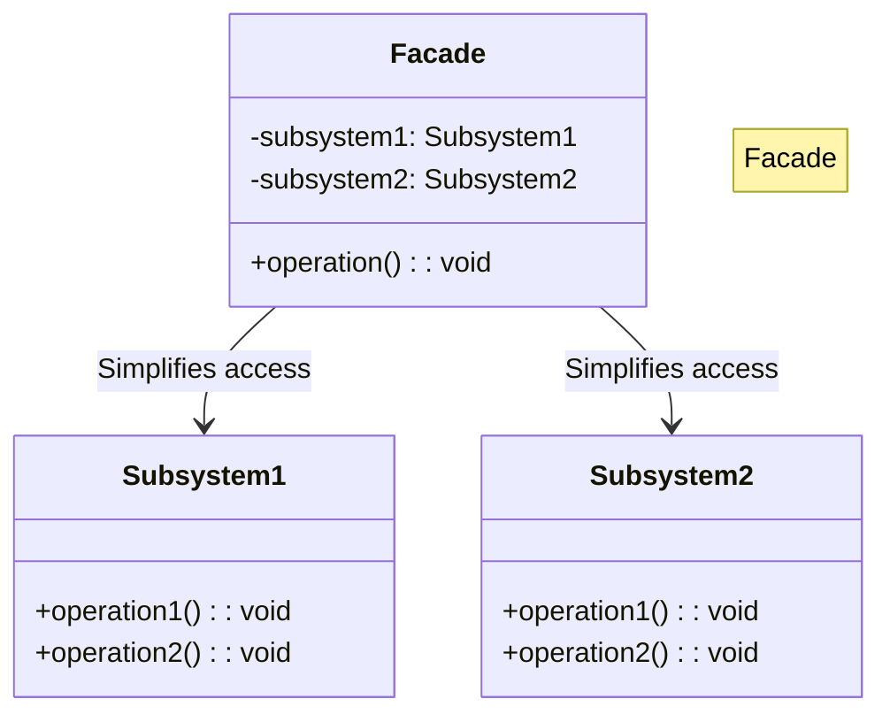
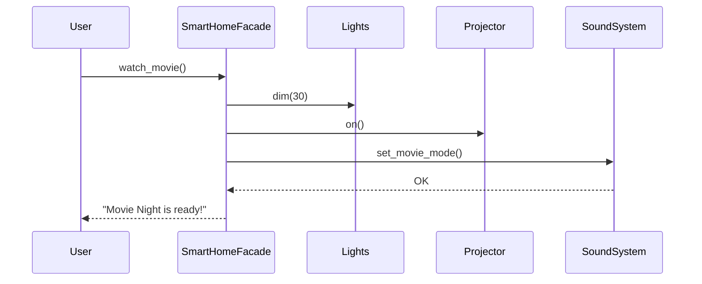

# 🏠 Facade Pattern: One-Touch Smart Home

## 📝 Overview
The **Facade Pattern** provides a simplified interface to a complex set of classes, library, or framework. It hides the "messy" inner workings of a subsystem behind a single, easy-to-use "front" class, making the system easier to use and maintain.

!!! abstract "Core Concepts"
    - **Simplified API:** Reducing a 10-step manual process into a single, semantic method call (e.g., `start_movie()`).
    - **Subsystem Decoupling:** Shielding the client from the complexities and frequent internal changes within the underlying components.
    - **Coordination:** The Facade is responsible for the orchestration of multiple subsystem components in the correct order.

---

## 🏭 The Engineering Story & Problem

### 😡 The Villain (The Problem)
The "Complexity Explosion" — a developer who has to manage 15 different smart home devices, each with its own API, just to watch a movie. They end up writing "glue code" everywhere, leading to a brittle and unreadable codebase.

### 🦸 The Hero (The Solution)
The "Unified Front" — the Facade Pattern, which provides a single "Big Green Button" for the entire "Movie Night" experience. The `SmartHomeFacade` takes instances of the devices and orchestrates the `watch_movie()` sequence: dim lights → screen down → projector on → sound to movie mode.

### 📜 Requirements & Constraints
1.  **(Functional):** Must coordinate `Lights`, `Projector`, `SoundSystem`, and `StreamingService` subsystems.
2.  **(Functional):** Devices must be activated in a specific order (e.g., sound on before volume set).
3.  **(Technical):** The client should only interact with a single `SmartHomeFacade` class (one-touch interface).
4.  **(Technical):** The Facade should receive subsystem instances via dependency injection rather than creating them, allowing for easier testing and swapping of hardware.

---

## 🏗️ Structure & Blueprint

### Class Diagram


### Runtime Context (Sequence)


---

## 💻 Implementation & Code

### 🧠 SOLID Principles Applied
- **Single Responsibility:** The Facade *orchestrates* calls to subsystems but doesn't *implement* the logic of those subsystems.
- **Open/Closed:** You can add new "scenes" (like `dinner_mode()`) without modifying the underlying device classes.

### 🐍 The Code

??? failure "The Villain's Code (Without Pattern)"
    ```python
    class MovieApp:
        def start_movie(self):
            # 😡 Client must know every device's API and the correct order
            self.lights.set_brightness(30)
            self.lights.set_color("warm")
            self.screen.lower()
            self.projector.power_on()
            self.projector.set_input("HDMI-2")
            self.sound.power_on()
            self.sound.set_mode("surround")
            self.sound.set_volume(25)
            self.streamer.open("Netflix")
            # Changing one device's API breaks this entire class!
    ```

???+ success "The Hero's Code (With Pattern)"
    ```python
    --8<-- "design_patterns/structural/facade/smart_home_facade/smart_home_facade.py"
    ```

---

## ⚖️ Trade-offs & Testing

| Pros (Why it works) | Cons (The Twist / Pitfalls) |
| :--- | :--- |
| **Simplicity:** Radically simplifies the client's API by hiding a massive, complex subsystem. | **God Object:** The Facade itself can easily become an overgrown class coupled to every subsystem. |
| **Loose Coupling:** Decouples the client from the fragile and complex internal components. | **Hiding Too Much:** Can become too restrictive for advanced users who need direct access to subsystem detail. |
| **Flexible Implementation:** Subsystems can be refactored or swapped without affecting client code. | **Logic Leakage:** Risk of "business rules" creeping into the facade instead of staying in the subsystems. |

### 🧪 Testing Strategy
A Facade is best tested procedurally by injecting mocks for all underlying subsystems, executing the Facade command (e.g., `movie_mode()`), and asserting that the exact correct sequence of calls was triggered on the internal mocks.

---

## 🎤 Interview Toolkit

- **Interview Signal:** Demonstrates an understanding of the **Principle of Least Knowledge (Law of Demeter)**—that a client should only talk to its immediate friends (the Facade) and not the internal "strangers" (the subsystems).
- **When to Use:**
    - When you want to provide a simple interface to a complex subsystem.
    - When you want to structure a subsystem into layers.
    - When you need to integrate a third-party library that has a confusing or bloated API.
- **Scalability Probe:** What if you have 100 different "scenes" (Movie, Dinner, Party)? (Answer: Use a Command pattern inside the Facade or create multiple specialized Facades for different categories like 'Entertainment', 'Security', and 'Climate').
- **Design Alternatives:**
    - **Mediator:** A Facade is a one-way simplification of a subsystem for a *client*; a Mediator centralizes *communication between objects* within the subsystem itself.

## 🔗 Related Patterns
- [Adapter](../../adapter/format_translator/PROBLEM.md) — Adapter wraps one object to change its interface; Facade wraps many objects to simplify their interface.
- [Singleton](../../../creational/singleton/singleton_pattern/PROBLEM.md) — Facades are often implemented as Singletons since one "entry point" to the subsystem is usually enough.
- [Abstract Factory](../../../creational/abstract_factory/ui_toolkit/PROBLEM.md) — Facade can use an Abstract Factory to create the subsystem objects in a decoupled way.
