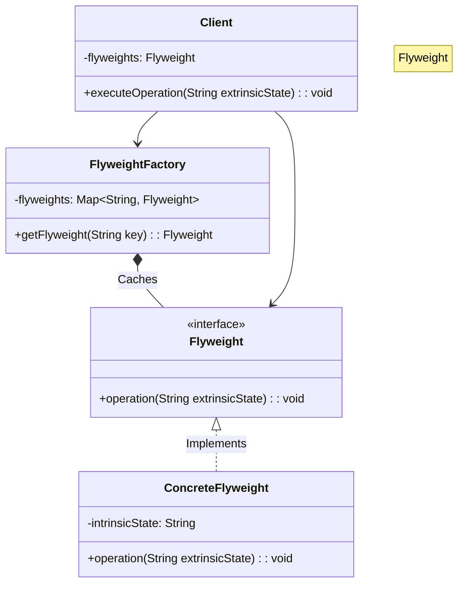

# 🌳 Flyweight Pattern: High-Performance Forest Simulator

## 📝 Overview
The **Flyweight Pattern** is a structural optimization technique used to support large numbers of fine-grained objects efficiently by sharing as much data as possible. It is particularly useful when an application is running out of RAM due to millions of similar objects.

!!! abstract "Concept"
    The **Flyweight Pattern** minimizes memory usage by sharing as much data as possible with other similar objects; it is a way to use objects in large numbers when a simple repeated representation would use an unacceptable amount of memory.

!!! abstract "Core Concepts"
    - **Intrinsic State:** Constant data shared across many objects (e.g., tree texture/color, 3D mesh). This data is stored within the Flyweight.
    - **Extrinsic State:** Unique data specific to each instance (e.g., X, Y coordinates, individual health). This data is passed to the Flyweight at runtime.
    - **Flyweight Factory:** A manager that ensures identical flyweights are reused rather than recreated, typically using a cache or pool.

!!! example "Example"
    In a forest simulator, an `OakTree` flyweight contains the heavy 4K texture and 3D mesh (Intrinsic). The `Forest` class maintains a list of `TreeInstance` objects, each containing only coordinates and a reference to the `OakTree` flyweight (Extrinsic). This allows rendering millions of trees with only a few actual `OakTree` objects in memory.

!!! info "Why Use This Pattern?"
    - **Memory Optimization:** Dramatically reduces the RAM footprint when dealing with massive object counts.
    - **Performance Gain:** Fewer objects mean less pressure on the Garbage Collector and better cache locality.
    - **Centralized State:** Changes to intrinsic state (e.g., updating a texture) propagate to all instances instantly.

## 🏭 The Engineering Story

### The Villain:
The "Memory Hog" — an application that crashes or crawls because it attempts to allocate millions of heavy objects (like trees, bullets, or particles), each carrying redundant, identical data.

### The Hero:
The "Shared Blueprint" — the Flyweight Pattern, which realizes that 90% of an object's data is identical across all instances and can be factored out into a shared resource.

### The Plot:

1. **Identify Redundancy:** Determine which parts of the object's state are identical (Intrinsic) and which are unique (Extrinsic).

2. **Extract Flyweight:** Create a Flyweight class to hold the Intrinsic state and provide methods that accept Extrinsic state as parameters.

3. **Implement Factory:** Build a Flyweight Factory that caches existing Flyweights and returns them based on a unique key.

4. **Refactor Client:** The client now stores only the Extrinsic state and requests Flyweights from the factory when needed.

### The Twist (Failure):
If the Flyweight Factory is not thread-safe in a multi-threaded environment, or if the extrinsic state becomes so large that it outweighs the savings from sharing the intrinsic state, the pattern can actually degrade performance.

### Interview Signal:
This pattern demonstrates a developer's ability to optimize system resources, understand memory layout, and differentiate between state that is "essential to the identity" vs "contextual to the instance."

## 🚀 Problem Statement
Imagine building a game like Minecraft where you need to render 1,000,000 trees. Creating a full object for each tree, including heavy sprite and texture data, would quickly exhaust the system's memory. We need a way to represent these trees efficiently while maintaining their individual positions and properties.

## 🛠️ Requirements

1.  **Flyweight Interface:** Define how shared objects receive unique context.
2.  **Concrete Flyweight:** Store shared state (textures, meshes).
3.  **Flyweight Factory:** Manage the creation and reuse of Flyweight objects.
4.  **Client Context:** Maintain the unique state (coordinates) and references to Flyweights.

### Technical Constraints

- **Memory Efficiency:** Identical tree types (e.g., "Oak", "Pine") must share the same memory address.
- **Data Separation:** Extrinsic state (coordinates) must be passed to the flyweight at drawing time, not stored within it.

## 🧠 Thinking Process & Approach
Creating millions of identical objects exhausts RAM. The approach is to split state into Intrinsic (shared) and Extrinsic (unique). The shared part is cached in a factory, so we only ever store one instance of each type.

### Key Observations:

- Shared memory for constant state prevents redundant allocations.
- Extrinsic state passed in at runtime allows a single object to represent many entities.
- The Factory ensures that we don't accidentally create duplicate shared states.

## 🧩 Runtime Context / Evaluation Flow

When the simulation starts, the `Forest` (Client) requests a tree type from the `TreeFactory`. The factory checks its internal cache. If an "Oak" Flyweight exists, it returns it; otherwise, it creates one. The `Forest` then stores a `TreeContext` (X, Y, TreeRef). During rendering, the `Forest` iterates through all contexts, calling `TreeRef.draw(X, Y)`.

## 💻 Solution Implementation

```python
--8<-- "design_patterns/structural/flyweight/forest_simulator/forest_simulator.py"
```

!!! success "Why This Works"
    This design ensures memory efficiency by caching shared state and only storing unique coordinates externally. It adheres to the Flyweight principle by separating intrinsic and extrinsic data, allowing the application to scale to millions of objects without linear memory growth.

!!! tip "When to Use"
    - When an application uses a vast number of similar objects.
    - When storage costs are high because of the quantity of objects.
    - When most object state can be made extrinsic.

!!! warning "Common Pitfall"
    - **Over-engineering:** Don't use this if you only have a few hundred objects; the complexity overhead isn't worth it.
    - **State Leakage:** Ensure extrinsic state is truly external and doesn't accidentally get baked into the Flyweight.

## 🎤 Interview Follow-ups

- **Scalability Probe:** How would this design hold up if we had 100 million trees? (Answer: We might need to combine this with a Quadtree for spatial partitioning to avoid iterating over all 100M).
- **Design Trade-off:** What is the trade-off between CPU cycles and Memory? (Answer: Flyweight saves Memory but might cost slightly more CPU due to factory lookups and passing state).
- **Production Readiness:** How do we ensure thread safety in the Factory? (Answer: Use a lock or a thread-safe dictionary for the Flyweight cache).

## 🔗 Related Patterns

- [Composite](../../composite/organisation_chart/PROBLEM.md) — Composite can use Flyweight to share leaf nodes.
- [State](../../../behavioral/state/document_workflow/PROBLEM.md) — State objects are often shared as Flyweights.
- [Strategy](../../../behavioral/strategy/sprinkler_system/PROBLEM.md) — Strategy objects can be shared as Flyweights.

## 🧩 Diagram

