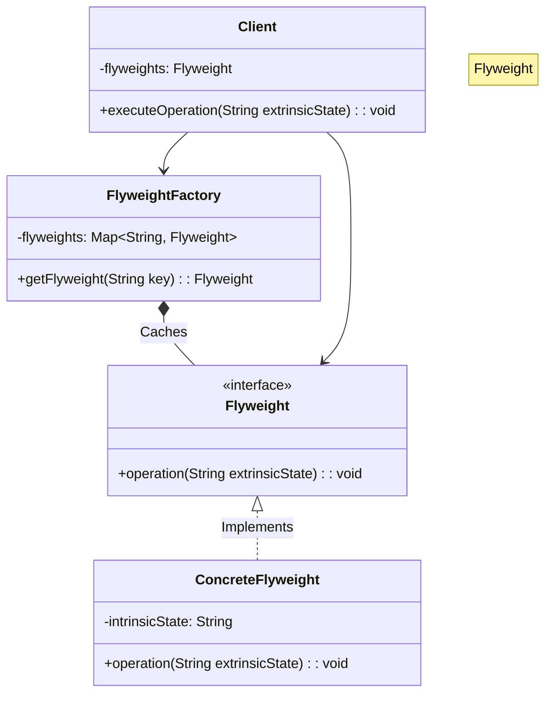
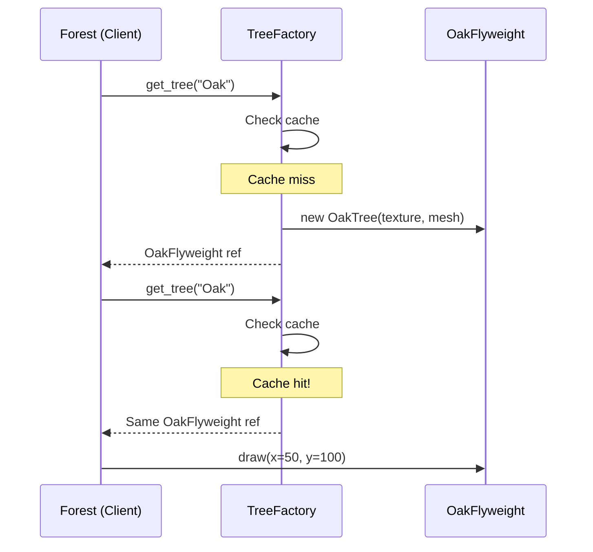

# 🌳 Flyweight Pattern: High-Performance Forest Simulator

## 📝 Overview
The **Flyweight Pattern** is a structural optimization technique used to support large numbers of fine-grained objects efficiently by sharing as much data as possible. It is particularly useful when an application is running out of RAM due to millions of similar objects.

!!! abstract "Core Concepts"
    - **Intrinsic State:** Constant data shared across many objects (e.g., tree texture/color, 3D mesh). This data is stored within the Flyweight.
    - **Extrinsic State:** Unique data specific to each instance (e.g., X, Y coordinates, individual health). This data is passed to the Flyweight at runtime.
    - **Flyweight Factory:** A manager that ensures identical flyweights are reused rather than recreated, typically using a cache or pool.

---

## 🏭 The Engineering Story & Problem

### 😡 The Villain (The Problem)
The "Memory Hog" — an application that crashes or crawls because it attempts to allocate millions of heavy objects (like trees, bullets, or particles), each carrying redundant, identical data. Imagine building a game like Minecraft where you need to render 1,000,000 trees — creating a full object for each tree, including heavy sprite and texture data, would quickly exhaust the system's memory.

### 🦸 The Hero (The Solution)
The "Shared Blueprint" — the Flyweight Pattern, which realizes that 90% of an object's data is identical across all instances and can be factored out into a shared resource. An `OakTree` flyweight contains the heavy 4K texture and 3D mesh (Intrinsic), while the `Forest` maintains `TreeInstance` objects with only coordinates (Extrinsic) and a reference to the shared flyweight.

### 📜 Requirements & Constraints
1.  **(Functional):** Define how shared objects receive unique context via a Flyweight Interface.
2.  **(Functional):** Manage the creation and reuse of Flyweight objects via a Factory.
3.  **(Technical):** Identical tree types (e.g., "Oak", "Pine") must share the same memory address.
4.  **(Technical):** Extrinsic state (coordinates) must be passed to the flyweight at drawing time, not stored within it.

---

## 🏗️ Structure & Blueprint

### Class Diagram


### Runtime Context (Sequence)


---

## 💻 Implementation & Code

### 🧠 SOLID Principles Applied
- **Single Responsibility:** The Factory manages caching; the Flyweight manages shared rendering; the Client manages coordinates.
- **Open/Closed:** Add a new tree type (e.g., `BirchTree`) by creating a new Flyweight class without modifying the Factory's caching logic.

### 🐍 The Code

??? failure "The Villain's Code (Without Pattern)"
    ```python
    class Forest:
        def plant_trees(self):
            self.trees = []
            for i in range(1_000_000):
                # 😡 Each tree carries its own copy of the heavy texture!
                tree = Tree(
                    x=random.randint(0, 1000),
                    y=random.randint(0, 1000),
                    texture=load_texture("oak_4k.png"),  # 4MB per tree!
                    mesh=load_mesh("oak_model.obj"),      # 2MB per tree!
                )
                self.trees.append(tree)
            # Total: ~6TB of RAM for 1M trees. 💀
    ```

???+ success "The Hero's Code (With Pattern)"
    ```python
    --8<-- "design_patterns/structural/flyweight/forest_simulator/forest_simulator.py"
    ```

---

## ⚖️ Trade-offs & Testing

| Pros (Why it works) | Cons (The Twist / Pitfalls) |
| :--- | :--- |
| **Massive Memory Savings:** Shares heavy intrinsic state (textures, arrays) across millions of objects. | **State Leakage:** Risk of "intrinsic" shared state accidentally being modified by one instance. |
| **Cache Optimization:** Improves cache-hits for CPUs doing batch processing of homogeneous objects. | **CPU Overhead:** Dynamically passing extrinsic state (coordinates) can be slightly slower than having it local. |
| **Scalability:** Allows the system to scale to millions of objects without linear memory growth. | **Over-engineering:** Don't use for small sets of objects where the cache management overhead isn't worth it. |

### 🧪 Testing Strategy
Create two identical objects via the internal Flyweight Factory and assert they share the exact same memory address (`object1 is object2`). Ensure modifying an object's external state during a method call doesn't mutate the internal shared state.

---

## 🎤 Interview Toolkit

- **Interview Signal:** Demonstrates a developer's ability to optimize system resources, understand memory layout, and differentiate between state that is "essential to the identity" vs "contextual to the instance."
- **When to Use:**
    - When an application uses a vast number of similar objects.
    - When storage costs are high because of the quantity of objects.
    - When most object state can be made extrinsic.
- **Scalability Probe:** How would this design hold up if we had 100 million trees? (Answer: We might need to combine this with a Quadtree for spatial partitioning to avoid iterating over all 100M).
- **Design Alternatives:**
    - **Object Pool:** Flyweight shares *state*; Object Pool shares *instances* that are checked out and returned. Use Object Pool when objects are expensive to create but not identical.

## 🔗 Related Patterns
- [Composite](../../composite/organisation_chart/PROBLEM.md) — Composite can use Flyweight to share leaf nodes.
- [State](../../../behavioral/state/document_workflow/PROBLEM.md) — State objects are often shared as Flyweights.
- [Strategy](../../../behavioral/strategy/sprinkler_system/PROBLEM.md) — Strategy objects can be shared as Flyweights.
