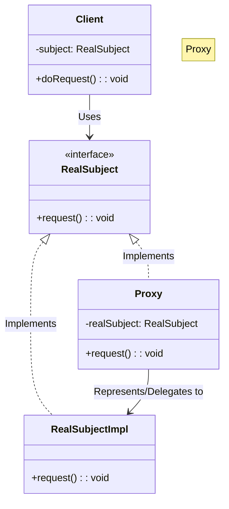
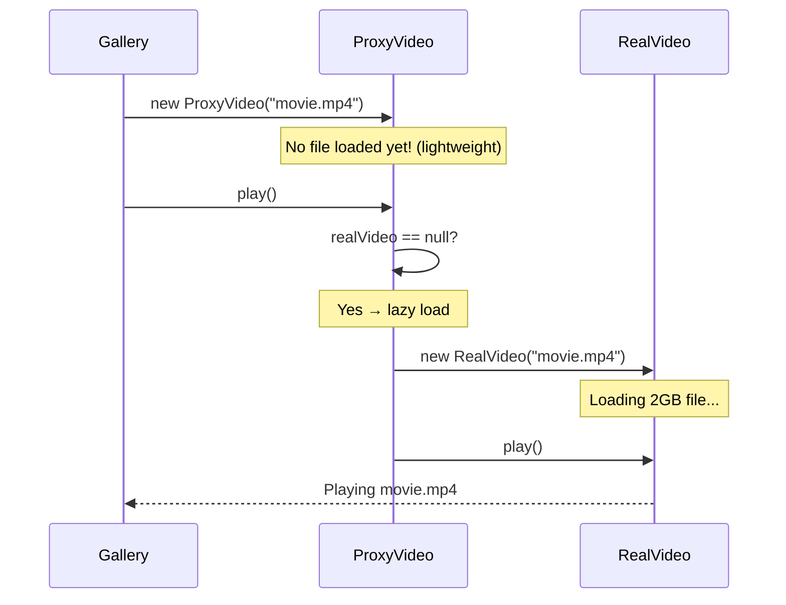

# 🕵️ Proxy: Smart Lazy-Loading Video Player

## 📝 Overview
The **Proxy Pattern** provides a surrogate or placeholder for another object to control access to it. It is commonly used to delay the creation of "expensive" objects until they are absolutely necessary, a technique known as lazy loading, or to add a layer of security and logging around a sensitive resource.

!!! abstract "Core Concepts"
    - **Subject Interface:** The common interface shared by both the Proxy and the Real Subject, ensuring transparency for the client.
    - **Real Subject:** The heavy or sensitive object that the proxy represents (e.g., a `HighResVideo` or a `DatabaseConnection`).
    - **Proxy:** The lightweight object that manages access to the Real Subject.
    - **Virtual Proxy:** A specific type of proxy used for lazy loading of resource-intensive objects.

---

## 🏭 The Engineering Story & Problem

### 😡 The Villain (The Problem)
The "Startup Crash" — a video library application that attempts to load 100 high-definition video files (totalling 50GB) into RAM as soon as the app opens. The system freezes, the memory is exhausted, and the app crashes before the user can even see the menu.

### 🦸 The Hero (The Solution)
The "Stunt Double" — the Proxy Pattern, which provides a lightweight placeholder for every video. It knows the title and the thumbnail but leaves the heavy video data on the disk until the user actually clicks "Play." When `ProxyVideo.play()` is called, it checks if `RealVideo` exists — if not, it creates it (triggering the load) and then delegates the call.

### 📜 Requirements & Constraints
1.  **(Functional):** The client must be able to use `ProxyVideo` and `RealVideo` interchangeably via a shared interface.
2.  **(Functional):** The expensive disk I/O must only happen when the `display()` or `play()` method is invoked (on-demand loading).
3.  **(Technical):** The `ProxyVideo` must implement the exact same interface as the `RealVideo` so the client can't tell the difference (transparency).
4.  **(Technical):** The client should not be responsible for managing the lifecycle of the `RealVideo` object (encapsulation).

---

## 🏗️ Structure & Blueprint

### Class Diagram


### Runtime Context (Sequence)


---

## 💻 Implementation & Code

### 🧠 SOLID Principles Applied
- **Single Responsibility:** The Proxy handles lifecycle management (when to load); the Real Subject handles the actual work (playing video).
- **Open/Closed:** You can add new proxy types (Protection, Logging, Caching) without modifying the Real Subject.

### 🐍 The Code

??? failure "The Villain's Code (Without Pattern)"
    ```python
    class VideoGallery:
        def __init__(self, filenames):
            # 😡 Eagerly loads ALL 100 videos at startup!
            self.videos = []
            for name in filenames:
                video = RealVideo(name)  # Each one reads a 2GB file
                self.videos.append(video)
            # App crashes before the user even sees the menu 💀
    ```

???+ success "The Hero's Code (With Pattern)"
    ```python
    --8<-- "design_patterns/structural/proxy/lazy_loading_proxy/lazy_loading_proxy.py"
    ```

???+ success "The Hero's Code (With Pattern)"
    ```python
    --8<-- "design_patterns/structural/proxy/lazy_loading_proxy/lazy_loading_proxy.py"
    ```

---

## ⚖️ Trade-offs & Testing

| Pros (Why it works) | Cons (The Twist / Pitfalls) |
| :--- | :--- |
| **Access Control:** Controls access to the real object without the client ever knowing it. | **User Latency (Jank):** Lazy loading can cause sudden UI freezes if the real object is heavy and loaded synchronously. |
| **Lifecycle Management:** Can delay instantiation of a heavy object until it's actually accessed (Lazy Loading). | **Indirection Layer:** Code is slightly more complex and harder to trace due to the extra defensive layer. |
| **Startup Speed:** Significantly improves initial app load time by deferring heavy resource allocation. | **Over-abstraction:** Using a proxy for lightweight objects adds unnecessary classes and method calls. |

### 🧪 Testing Strategy
The hallmark proxy test: Verify that the `RealSubject`'s constructor or expensive network call is strictly NOT executed when the Proxy is created, but is perfectly triggered exactly the first time the relevant proxy method is accessed by the client.

---

## 🎤 Interview Toolkit

- **Interview Signal:** Demonstrates a developer's concern for **System Performance** and **Memory Management**. It shows they know how to handle "heavy" resources and understand the trade-offs between eager and lazy loading.
- **When to Use:**
    - **Virtual Proxy:** When you have a resource-heavy object that should be loaded on demand.
    - **Protection Proxy:** When you need to check access rights before letting a client use an object.
    - **Logging Proxy:** When you want to keep a history of calls to a service without modifying the service code.
- **Scalability Probe:** How would you handle a user playing 50 videos in a row? Won't memory still fill up? (Answer: Implement a **Least Recently Used (LRU) Cache** inside the proxy system to dispose of the `RealVideo` objects that haven't been played recently).
- **Design Alternatives:**
    - **Decorator:** A Proxy controls the *lifecycle* and *access* to its object; a Decorator *adds features* to an object that already exists.

## 🔗 Related Patterns
- [Adapter](../../adapter/format_translator/PROBLEM.md) — Adapter provides a *different* interface; Proxy provides the *same* interface.
- [Decorator](../../decorator/pizza_builder_decorator/PROBLEM.md) — Decorator adds functionality; Proxy controls access and lifecycle.
- [Facade](../../facade/smart_home_facade/PROBLEM.md) — Facade simplifies access to a *subsystem* of many objects; Proxy represents a *single* object.
