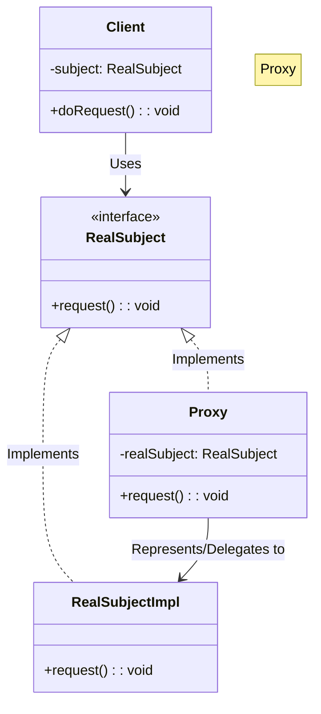

# 🕵️ Proxy: Smart Lazy-Loading Video Player

## 📝 Overview
The **Proxy Pattern** provides a surrogate or placeholder for another object to control access to it. It is commonly used to delay the creation of "expensive" objects until they are absolutely necessary, a technique known as lazy loading, or to add a layer of security and logging around a sensitive resource.

!!! abstract "Concept"
    The **Proxy Pattern** creates a "stand-in" object that implements the same interface as the real object. To the client, the proxy is indistinguishable from the real thing. Internally, the proxy manages the lifecycle of the real object, only instantiating it when a method is called that requires the real object's presence.

!!! abstract "Core Concepts"
    - **Subject Interface:** The common interface shared by both the Proxy and the Real Subject, ensuring transparency for the client.
    - **Real Subject:** The heavy or sensitive object that the proxy represents (e.g., a `HighResVideo` or a `DatabaseConnection`).
    - **Proxy:** The lightweight object that manages access to the Real Subject.
    - **Virtual Proxy:** A specific type of proxy used for lazy loading of resource-intensive objects.

!!! example "Example"
    In a document editor like Microsoft Word, images are often represented by a Proxy. As you scroll, you see placeholders (proxies) for the images. The actual high-resolution image (Real Subject) is only loaded from disk and rendered when that specific page becomes visible on the screen.

!!! info "Why Use This Pattern?"
    - **Resource Efficiency:** Avoids loading heavy objects into memory until they are actually used.
    - **Controlled Access:** Can add security checks to ensure the caller has permission to access the real object.
    - **Enhanced Performance:** Reduces startup time and memory footprint for applications with many potential resources.

## 🏭 The Engineering Story

### The Villain:
The "Startup Crash" — a video library application that attempts to load 100 high-definition video files (totalling 50GB) into RAM as soon as the app opens. The system freezes, the memory is exhausted, and the app crashes before the user can even see the menu.

### The Hero:
The "Stunt Double" — the Proxy Pattern, which provides a lightweight placeholder for every video. It knows the title and the thumbnail but leaves the heavy video data on the disk until the user actually clicks "Play."

### The Plot:

1. **Define the Interface:** Create a `Video` interface with a `play()` method.

2. **The Heavy Hitter:** Implement `RealVideo`, which loads the multi-gigabyte file in its constructor.

3. **The Stand-in:** Implement `ProxyVideo` which only stores the filename. It implements `play()` but doesn't load the file yet.

4. **Lazy Loading:** When `ProxyVideo.play()` is called, it checks if `RealVideo` exists. if not, it creates it (triggering the load) and then calls `real_video.play()`.

### The Twist (Failure):
"The UX Jank." If the "loading" process takes too long (e.g., 10 seconds), the user might think the app has frozen when they click "Play." A good proxy needs to handle the "loading state" gracefully, perhaps by showing a progress bar or using an asynchronous loader.

### Interview Signal:
This pattern demonstrates a developer's concern for **System Performance** and **Memory Management**. It shows they know how to handle "heavy" resources and understand the trade-offs between eager and lazy loading.

## 🚀 Problem Statement
Loading high-resolution video files from disk is a heavy operation that consumes significant CPU and memory. If a user has a library of 100 videos, creating all 100 `Video` objects at startup will crash the app, even if they only watch one. We need a way to represent these videos in the UI without actually loading them until they are played.

## 🛠️ Requirements

1.  **Interface Consistency:** The client must be able to use `ProxyVideo` and `RealVideo` interchangeably via a shared interface.
2.  **On-Demand Loading:** The expensive disk I/O must only happen when the `display()` or `play()` method is invoked.
3.  **Encapsulation:** The client should not be responsible for managing the lifecycle of the `RealVideo` object.

### Technical Constraints

- **Transparency:** The `ProxyVideo` must implement the exact same interface as the `RealVideo` so the client can't tell the difference.
- **Deferred Instantiation:** The "Loading..." message must only appear when `display()` is actually called, not when the object is created.

## 🧠 Thinking Process & Approach
Creating heavy objects (like video files) at startup wastes resources. The approach uses a lightweight Proxy that stands in for the real object. The heavy creation only happens at the moment of first use (Lazy Loading).

### Key Observations:

- **Virtual Proxy vs. Remote Proxy:** While we're using a Virtual Proxy (lazy loading), the same structure could be used for a Remote Proxy (talking to a server) or a Protection Proxy (checking permissions).
- **Indirection:** The pattern adds a level of indirection, which allows us to perform actions before or after the real object is called.
- **Client Simplicity:** The client doesn't need to write `if (video == null) loadVideo();` everywhere; the proxy handles it internally.

## 🧩 Runtime Context / Evaluation Flow

At runtime, the `Gallery` creates a list of 100 `ProxyVideo` objects. This is near-instant as no files are read. When the user scrolls to video #5 and clicks it, the `ProxyVideo` for #5 instantiates the `RealVideo`. The `RealVideo` constructor reads the file. The `ProxyVideo` then passes the command to the `RealVideo`.

## 💻 Solution Implementation

```python
--8<-- "design_patterns/structural/proxy/lazy_loading_proxy/lazy_loading_proxy.py"
```

!!! success "Why This Works"
    This design ensures high maintainability by decoupling the *usage* of the video from the *loading* of the video. It optimizes resource usage by ensuring expensive objects are only created when truly needed, significantly improving app startup speed and reducing the memory footprint.

!!! tip "When to Use"
    - **Virtual Proxy:** When you have a resource-heavy object that should be loaded on demand.
    - **Protection Proxy:** When you need to check access rights before letting a client use an object.
    - **Logging Proxy:** When you want to keep a history of calls to a service without modifying the service code.

!!! warning "Common Pitfall"
    - **Jank:** Lazy loading can cause the UI to freeze temporarily during the load.
    - **Complexity:** Don't use a proxy if the real object is lightweight; the extra layer of indirection will just add unnecessary complexity.

## 🎤 Interview Follow-ups

- **Scalability Probe:** How would you handle a user playing 50 videos in a row? Won't memory still fill up? (Answer: Implement a **Least Recently Used (LRU) Cache** inside the proxy system to dispose of the `RealVideo` objects that haven't been played recently).
- **Design Trade-off:** Proxy vs. Decorator? (Answer: A Proxy controls the *lifecycle* and *access* to its object; a Decorator *adds features* to an object that already exists).
- **Production Readiness:** How do you handle a "File Not Found" error during lazy loading? (Answer: The Proxy should catch the exception and potentially return a "Broken Video" placeholder or alert the UI via a callback).

## 🔗 Related Patterns

- [Adapter](../../adapter/format_translator/PROBLEM.md) — Adapter provides a *different* interface; Proxy provides the *same* interface.
- [Decorator](../../decorator/pizza_builder_decorator/PROBLEM.md) — Decorator adds functionality; Proxy controls access and lifecycle.
- [Facade](../../facade/smart_home_facade/PROBLEM.md) — Facade simplifies access to a *subsystem* of many objects; Proxy represents a *single* object.

## 🧩 Diagram

