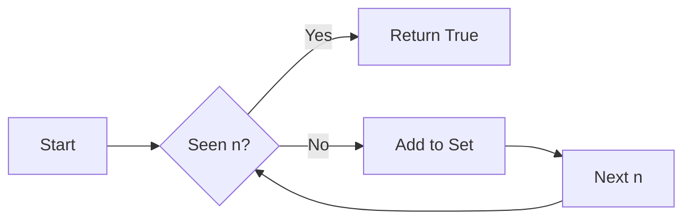

# 🚫 Arrays & Hashing: Contains Duplicate

## 📝 Problem Description
Given an integer array `nums`, return `true` if any value appears at least twice in the array, and return `false` if every element is distinct.

!!! info "Real-World Application"
    Used in data cleaning pipelines to remove redundant records or in streaming systems to detect duplicate event IDs within a time window to prevent double-processing.

## 🛠️ Constraints & Edge Cases
- $1 \le nums.length \le 10^5$
- $-10^9 \le nums[i] \le 10^9$
- **Edge Cases to Watch:**
    - Empty or single-element array (always false).
    - Array with all identical elements.
    - Large range of values ($10^9$) prevents using a direct frequency array.

---

## 🧠 Approach & Intuition

!!! success "The Aha! Moment"
    Use a hash set to store seen elements. A hash set provides $O(1)$ average time complexity for lookups, allowing us to detect a repeat in a single pass.

### 🐢 Brute Force (Naive)
Check every element against every other element using nested loops. This results in $O(N^2)$ time complexity, which is too slow for $N = 10^5$.

### 🐇 Optimal Approach
1. Initialize an empty hash set `seen`.
2. Iterate through each number `n` in `nums`.
3. If `n` is in `seen`, a duplicate exists; return `true`.
4. Otherwise, add `n` to `seen`.
5. If the loop completes, return `false`.

### 🧩 Visual Tracing


---

## 💻 Solution Implementation

```python
(Implementation details need to be added...)
```

### ⏱️ Complexity Analysis
- **Time Complexity:** $\mathcal{O}(N)$ — We iterate through the array exactly once, and set operations are $O(1)$ on average.
- **Space Complexity:** $\mathcal{O}(N)$ — In the worst case (no duplicates), we store all $N$ elements in the hash set.

---

## 🎤 Interview Toolkit

- **Harder Variant:** What if you are only allowed $O(1)$ extra space? (Hint: Sort the array first, then check neighbors).
- **Scale Question:** If the dataset is too large for memory, use a Bloom Filter or external sorting.

## 🔗 Related Problems
- [Valid Anagram](../valid_anagram/PROBLEM.md)
- [Two Sum](../two_sum/PROBLEM.md)
