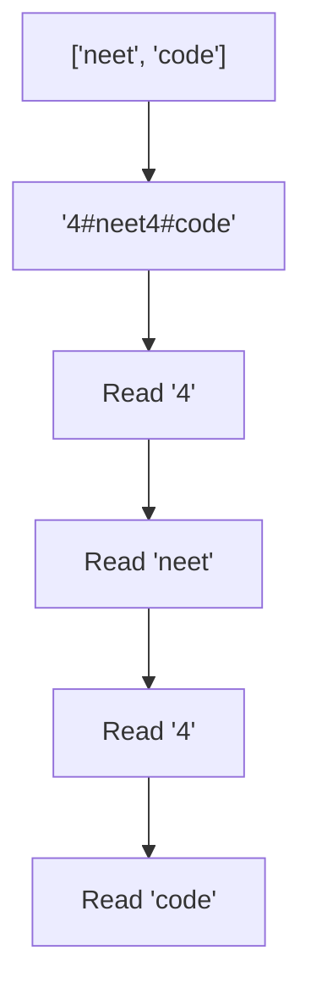

# 🔒 Arrays & Hashing: Encode and Decode Strings

## 📝 Problem Description
Design an algorithm to encode a list of strings to a string. The encoded string is then sent over the network and is decoded back to the original list of strings.

!!! info "Real-World Application"
    Serialization in network protocols (like HTTP/2) or storage formats where list data must be represented as a single stream of bytes for transmission.

## 🛠️ Constraints & Edge Cases
- $1 \le strs.length \le 10^5$
- Strings can contain any character (including delimiters).
- **Edge Cases to Watch:**
    - Empty list of strings.
    - List containing empty strings (e.g., `["", ""]`).
    - Strings containing the delimiter character itself.

---

## 🧠 Approach & Intuition

!!! success "The Aha! Moment"
    Use a **Length-Prefix Protocol**. Prefix each string with its length followed by a special delimiter (e.g., `4#`). This ensures that even if the delimiter appears in the string, the decoder knows exactly how many characters to read.

### 🐢 Brute Force (Naive)
Joining strings with a simple delimiter like `,` or `#`. This fails if the input strings themselves contain that delimiter, leading to "Delimiter Collision."

### 🐇 Optimal Approach
1. **Encode:** For each string, append its `length`, a `#` character, and the string itself to a result builder.
2. **Decode:** Iterate through the encoded string. Find the `#` to determine the length of the next string, read that many characters, and repeat until the end of the string.

### 🧩 Visual Tracing


---

## 💻 Solution Implementation

```python
(Implementation details need to be added...)
```

### ⏱️ Complexity Analysis
- **Time Complexity:** $\mathcal{O}(N)$ — Where $N$ is the total number of characters across all strings. Each character is processed once during encoding and once during decoding.
- **Space Complexity:** $\mathcal{O}(1)$ — Excluding the space for the output string/list. We only use a few pointers.

---

## 🎤 Interview Toolkit

- **Alternative Delimiters:** Could we use a non-printable ASCII character? Yes, but length-prefix is more robust.
- **Harder Variant:** Can you encode/decode without using the `#` delimiter? (Hint: Use a fixed-size header for length).

## 🔗 Related Problems
- [Group Anagrams](../group_anagrams/PROBLEM.md)
- [Valid Anagram](../valid_anagram/PROBLEM.md)
