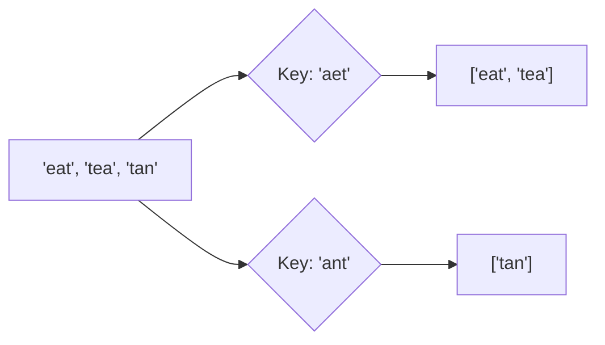

# 📦 Arrays & Hashing: Group Anagrams

## 📝 Problem Description
Given an array of strings `strs`, group the anagrams together. You can return the answer in any order.

!!! info "Real-World Application"
    Dictionary grouping, text processing for plagiarism detection, or search engine indexing where different word forms map to the same conceptual root.

## 🛠️ Constraints & Edge Cases
- $1 \le strs.length \le 10^4$
- $0 \le strs[i].length \le 100$
- **Edge Cases to Watch:**
    - Empty list of strings.
    - Strings with all the same characters.
    - Single character strings.

---

## 🧠 Approach & Intuition

!!! success "The Aha! Moment"
    Create a **Canonical Key** for each string. Since anagrams contain the exact same characters, they will share the same canonical form (either a sorted string or a frequency count).

### 🐢 Brute Force (Naive)
Compare every pair of strings to check if they are anagrams. For $N$ strings of length $K$, this takes $O(N^2 \cdot K)$.

### 🐇 Optimal Approach
1. Initialize a hash map where keys are canonical forms and values are lists of strings.
2. For each string:
    - Generate a key (e.g., sort the string or count character frequencies).
    - Append the string to the list corresponding to that key in the map.
3. Return all values from the hash map.

### 🧩 Visual Tracing


---

## 💻 Solution Implementation

```python
(Implementation details need to be added...)
```

### ⏱️ Complexity Analysis
- **Time Complexity:** $\mathcal{O}(N \cdot K \log K)$ using sorting, or $\mathcal{O}(N \cdot K)$ using a frequency count (26 characters).
- **Space Complexity:** $\mathcal{O}(N \cdot K)$ — To store the hash map containing all the strings.

---

## 🎤 Interview Toolkit

- **Key Generation:** Sorting is $O(K \log K)$. Counting is $O(K)$. Which is better? (Usually counting for large $K$).
- **Follow-up:** How would you handle Unicode characters (emojis, different languages)? Use a larger frequency array or a generic hash map for counts.

## 🔗 Related Problems
- [Valid Anagram](../valid_anagram/PROBLEM.md)
- [Top K Frequent Elements](../top_k_frequent_elements/PROBLEM.md)
