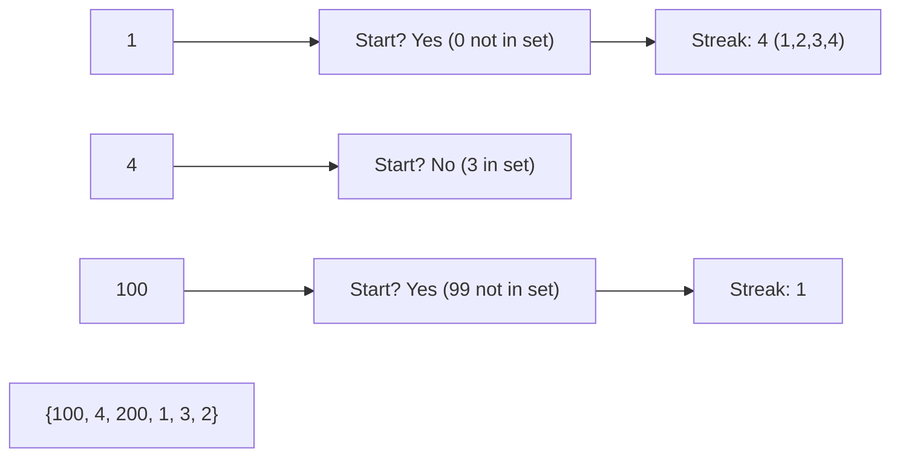

# 🔗 Arrays & Hashing: Longest Consecutive Sequence

## 📝 Problem Description
Given an unsorted array of integers `nums`, return the length of the longest consecutive elements sequence. You must write an algorithm that runs in $O(N)$ time.

!!! info "Real-World Application"
    Used in genomic data analysis to find long DNA sequences or in database query optimization to identify contiguous ranges of IDs for efficient batch processing.

## 🛠️ Constraints & Edge Cases
- $0 \le nums.length \le 10^5$
- $-10^9 \le nums[i] \le 10^9$
- **Edge Cases to Watch:**
    - Empty array (result should be 0).
    - Array with all same elements (result should be 1).
    - Array with no consecutive elements.

---

## 🧠 Approach & Intuition

!!! success "The Aha! Moment"
    Use a Hash Set for $O(1)$ lookups. The key trick is to **only start counting a sequence from its smallest element**. We identify the start of a sequence by checking if `num - 1` exists in the set.

### 🐢 Brute Force (Naive)
Sort the array first and then iterate to find the longest streak. This takes $O(N \log N)$ time, which violates the $O(N)$ requirement.

### 🐇 Optimal Approach
1. Insert all numbers into a hash set.
2. Iterate through each number `n` in the set.
3. Check if `n - 1` is in the set. If not, `n` is the start of a sequence.
4. If `n` is a start, keep checking for `n + 1`, `n + 2`, etc., and keep track of the current streak length.
5. Update the maximum streak length found so far.

### 🧩 Visual Tracing


---

## 💻 Solution Implementation

```python
(Implementation details need to be added...)
```

### ⏱️ Complexity Analysis
- **Time Complexity:** $\mathcal{O}(N)$ — Each number is visited at most twice (once in the main loop and once in a `while` loop across all sequences).
- **Space Complexity:** $\mathcal{O}(N)$ — We store all $N$ elements in a hash set.

---

## 🎤 Interview Toolkit

- **Why not sort?** Sorting is $O(N \log N)$. The problem explicitly asks for $O(N)$.
- **Follow-up:** How would you handle this if the numbers were too large to fit in memory? (Hint: External merge sort or distributed Union-Find).

## 🔗 Related Problems
- [Group Anagrams](../group_anagrams/PROBLEM.md)
- [Contains Duplicate](../contains_duplicate/PROBLEM.md)
