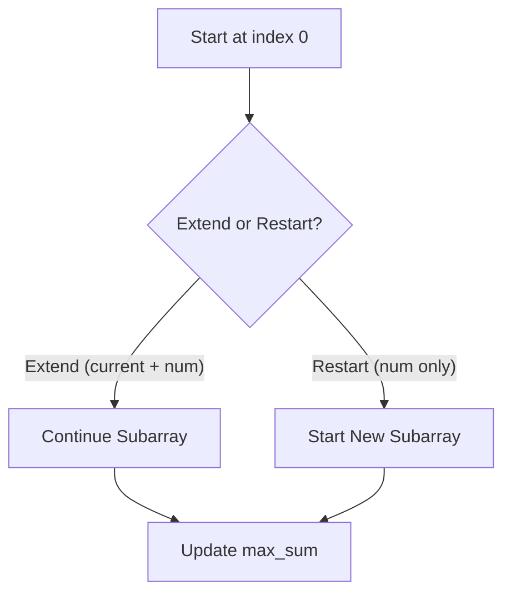

# 📈 Kadane’s Algorithm: Maximum Subarray

## 📝 Problem Description

Given an integer array `nums`, find the **contiguous subarray** (containing at least one number) which has the **largest sum**, and return its sum.

[LeetCode 53](https://leetcode.com/problems/maximum-subarray/)

!!! info "Real-World Application"
   Used in **Financial Analysis** (max profit streak), **Signal Processing**, and **Performance Tracking** to identify the most beneficial continuous segment in a dataset.

## 🛠️ Constraints & Edge Cases

* $1 \le nums.length \le 10^5$
* $-10^4 \le nums[i] \le 10^4$
* **Edge Cases to Watch:**

  * All negative numbers → return the maximum element
  * Single element array
  * Large alternating positive/negative values

---

## 🧠 Approach & Intuition

!!! success "The Aha! Moment"
   At every index, decide:
   👉 **Extend the current subarray** OR
   👉 **Start a new subarray from here**

### 🐢 Brute Force (Naive)

Check all possible subarrays and compute their sums.

* **Time Complexity:** $\mathcal{O}(N^2)$ (or $\mathcal{O}(N^3)$ without prefix sum)
* **Why it fails:** Too slow for large inputs

### 🐇 Optimal Approach (Kadane’s Algorithm)

1. Initialize:

   * `current_sum = nums[0]`
   * `max_sum = nums[0]`
2. Iterate through array:

   * `current_sum = max(num, current_sum + num)`
   * `max_sum = max(max_sum, current_sum)`
3. Return `max_sum`

---

### 🧩 Visual Tracing



---

## 💻 Solution Implementation

```python
(Implementation details need to be added...)
```

### ⏱️ Complexity Analysis

* **Time Complexity:** $\mathcal{O}(N)$ — Single pass
* **Space Complexity:** $\mathcal{O}(1)$ — Constant space

---

## 🎤 Interview Toolkit

* **Key Insight:** Negative running sum hurts future results → reset
* **Kadane’s Rule:** `current_sum = max(num, current_sum + num)`
* **Handles All Negatives:** Since we initialize with `nums[0]`
* **Follow-up:** Track subarray indices by storing start/end pointers

## 🔗 Related Problems

* [Maximum Product Subarray](../../13_1d_dynamic_programming/maximum_product_subarray/PROBLEM.md)
* [Best Time to Buy and Sell Stock](../../03_sliding_window/best_time_to_buy_sell_stock/PROBLEM.md)
* [Split Array Largest Sum](../../13_1d_dynamic_programming/split_array_largest_sum/PROBLEM.md)
