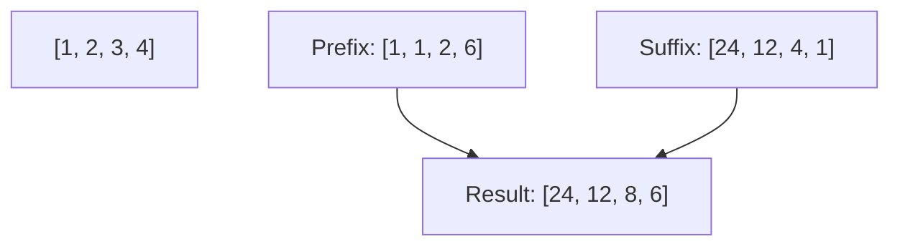

# ✖️ Arrays & Hashing: Product of Array Except Self

## 📝 Problem Description
Given an integer array `nums`, return an array `answer` such that `answer[i]` is equal to the product of all the elements of `nums` except `nums[i]`. You must write an algorithm that runs in $O(N)$ time and without using the division operation.

!!! info "Real-World Application"
    Used in probability calculations (calculating the joint likelihood of independent events excluding one) or in computer vision for pixel-wise normalization where division is computationally expensive or risky.

## 🛠️ Constraints & Edge Cases
- $2 \le nums.length \le 10^5$
- The product fits in a 32-bit integer.
- **Edge Cases to Watch:**
    - Array containing one zero (all products zero except at the index of zero).
    - Array containing multiple zeros (all products zero).
    - Array with negative numbers.

---

## 🧠 Approach & Intuition

!!! success "The Aha! Moment"
    The product of all elements except `i` is the **(Product of everything to the left of i) × (Product of everything to the right of i)**. By pre-calculating prefixes and suffixes, we avoid the need for division.

### 🐢 Brute Force (Naive)
For each element, iterate through the rest of the array to calculate the product. This results in $O(N^2)$, which is too slow. Using division is $O(N)$ but is explicitly forbidden and fails if any element is zero.

### 🐇 Optimal Approach
1. Create an `output` array.
2. **Left Pass:** Iterate forward, storing the cumulative product of all elements to the left of `i` in `output[i]`.
3. **Right Pass:** Iterate backward, maintaining a running `right_product`. Multiply `output[i]` by this `right_product` and update `right_product` by multiplying it with `nums[i]`.

### 🧩 Visual Tracing


---

## 💻 Solution Implementation

```python
(Implementation details need to be added...)
```

### ⏱️ Complexity Analysis
- **Time Complexity:** $\mathcal{O}(N)$ — We make two linear passes over the array.
- **Space Complexity:** $\mathcal{O}(1)$ — If we don't count the output array as extra space, we only use a single variable for the right product.

---

## 🎤 Interview Toolkit

- **Why no division?** Division by zero is a major edge case. Also, it tests your ability to think about prefix/suffix patterns.
- **Follow-up:** Can you solve this in exactly one pass? (Not really, but you can compute prefix/suffix simultaneously).

## 🔗 Related Problems
- [Trapping Rain Water](../../02_two_pointers/trapping_rain_water/PROBLEM.md)
- [Valid Sudoku](../valid_sudoku/PROBLEM.md)
