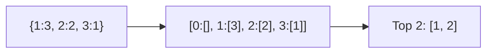

# 🔝 Arrays & Hashing: Top K Frequent Elements

## 📝 Problem Description
Given an integer array `nums` and an integer `k`, return the `k` most frequent elements. You may return the answer in any order.

!!! info "Real-World Application"
    Trending topics on social media, identifying the most frequent system errors in logs, or cache replacement policies like LFU (Least Frequently Used).

## 🛠️ Constraints & Edge Cases
- $1 \le nums.length \le 10^5$
- $k$ is valid ($1 \le k \le$ number of unique elements).
- **Edge Cases to Watch:**
    - $k = 1$ in a large array.
    - All elements have the same frequency.
    - Array has only one unique element.

---

## 🧠 Approach & Intuition

!!! success "The Aha! Moment"
    Use **Bucket Sort**. Since the frequency of any element is at most $N$, we can use the frequency as an index in an array of buckets. This avoids the $O(N \log N)$ cost of sorting frequencies.

### 🐢 Brute Force (Naive)
Count frequencies using a hash map, then sort the unique elements by their frequency. This takes $O(N \log N)$.

### 🐇 Optimal Approach
1. Count the frequency of each element using a hash map.
2. Create an array of lists (buckets), where the index `i` represents a frequency of `i`.
3. Iterate through the hash map and place each element into the bucket corresponding to its frequency.
4. Iterate through the buckets from $N$ down to $0$, collecting elements until we have $k$ elements.

### 🧩 Visual Tracing


---

## 💻 Solution Implementation

```python
(Implementation details need to be added...)
```

### ⏱️ Complexity Analysis
- **Time Complexity:** $\mathcal{O}(N)$ — We iterate through the array to count, then through the map to bucket, and finally through the buckets. All steps are linear.
- **Space Complexity:** $\mathcal{O}(N)$ — To store the frequency map and the buckets.

---

## 🎤 Interview Toolkit

- **Heap vs Bucket Sort:** A Min-Heap takes $O(N \log K)$. Bucket Sort is $O(N)$. Bucket sort is usually faster unless the range of frequencies is very sparse.
- **QuickSelect:** You can also use QuickSelect to find the $k$-th most frequent element in $O(N)$ average time.

## 🔗 Related Problems
- [Group Anagrams](../group_anagrams/PROBLEM.md)
