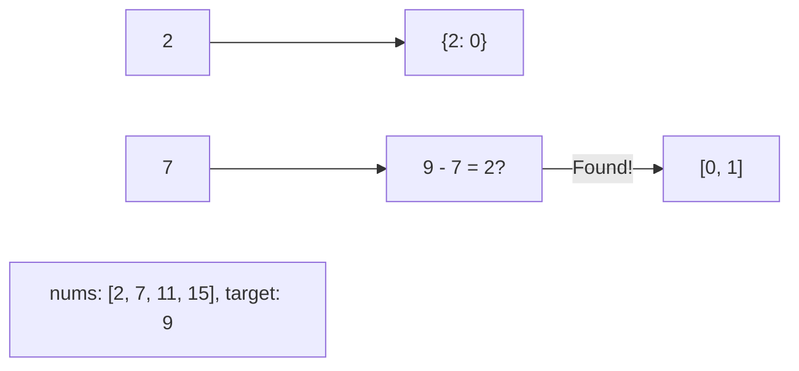

# 🎯 Arrays & Hashing: Two Sum

## 📝 Problem Description
Given an array of integers `nums` and an integer `target`, return indices of the two numbers such that they add up to `target`. You may assume that each input would have exactly one solution, and you may not use the same element twice.

!!! info "Real-World Application"
    Used in financial systems to find two transactions that sum to a specific settlement value, or in search algorithms to find pairs of items satisfying a exact budget constraint.

## 🛠️ Constraints & Edge Cases
- $2 \le nums.length \le 10^4$
- $-10^9 \le nums[i] \le 10^9$
- $-10^9 \le target \le 10^9$
- **Edge Cases to Watch:**
    - Array with exactly two elements.
    - Negative numbers in the array.
    - Large target values.

---

## 🧠 Approach & Intuition

!!! success "The Aha! Moment"
    Instead of searching for the second number, **"remember" what you've seen**. Use a hash map to store each number and its index. For the current number `n`, check if the complement `target - n` exists in the map.

### 🐢 Brute Force (Naive)
Use nested loops to check every possible pair of numbers. This takes $O(N^2)$ time, which is inefficient for large arrays.

### 🐇 Optimal Approach
1. Initialize an empty hash map `prevMap` (value -> index).
2. Iterate through the array using index `i` and value `n`.
3. Calculate the `diff = target - n`.
4. If `diff` is in `prevMap`, return `[prevMap[diff], i]`.
5. Otherwise, add `n` to `prevMap` with index `i`.

### 🧩 Visual Tracing


---

## 💻 Solution Implementation

```python
(Implementation details need to be added...)
```

### ⏱️ Complexity Analysis
- **Time Complexity:** $\mathcal{O}(N)$ — We traverse the list exactly once. Each lookup in the hash map takes $O(1)$ on average.
- **Space Complexity:** $\mathcal{O}(N)$ — In the worst case, we store all elements in the hash map.

---

## 🎤 Interview Toolkit

- **Follow-up:** If the array is sorted, can you solve it in $O(1)$ space? (Yes, using two pointers).
- **Variations:** What if there are multiple pairs? (Return all unique pairs).

## 🔗 Related Problems
- [3Sum](../../02_two_pointers/3sum/PROBLEM.md)
- [Two Sum II](../../02_two_pointers/two_sum_ii/PROBLEM.md)
