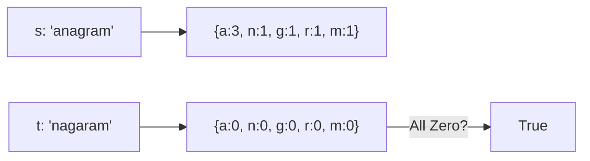

# 🔠 Arrays & Hashing: Valid Anagram

## 📝 Problem Description
Given two strings `s` and `t`, return `true` if `t` is an anagram of `s`, and `false` otherwise. An Anagram is a word or phrase formed by rearranging the letters of a different word or phrase, typically using all the original letters exactly once.

!!! info "Real-World Application"
    Used in spell checkers, text analysis, or cryptography to detect if two pieces of data contain the same components in different orders.

## 🛠️ Constraints & Edge Cases
- $1 \le s.length, t.length \le 5 \cdot 10^4$
- $s$ and $t$ consist of lowercase English letters.
- **Edge Cases to Watch:**
    - Strings of different lengths (immediate false).
    - Empty strings (though constraints say length >= 1).
    - Strings with same characters but different frequencies.

---

## 🧠 Approach & Intuition

!!! success "The Aha! Moment"
    Anagrams must have the **exact same character frequency counts**. By counting the occurrences of each letter in both strings, we can confirm if they are anagrams in linear time.

### 🐢 Brute Force (Naive)
Sort both strings and compare them. Sorting takes $O(N \log N)$ time. While simple, it's not the most efficient approach for large strings.

### 🐇 Optimal Approach
1. If lengths are different, return `false`.
2. Use a hash map (or a fixed-size array of 26 integers) to store character counts.
3. Iterate through string `s` and increment the count for each character.
4. Iterate through string `t` and decrement the count for each character.
5. If all counts in the map/array are zero, the strings are anagrams.

### 🧩 Visual Tracing


---

## 💻 Solution Implementation

```python
(Implementation details need to be added...)
```

### ⏱️ Complexity Analysis
- **Time Complexity:** $\mathcal{O}(N)$ — We iterate through both strings once ($O(N)$) and the count array once ($O(26)$).
- **Space Complexity:** $\mathcal{O}(1)$ — Since we use a fixed-size array of 26 (or a hash map capped at the size of the alphabet).

---

## 🎤 Interview Toolkit

- **Follow-up:** What if the inputs contain Unicode characters? (Use a hash map instead of a fixed-size array).
- **Harder Variant:** Find all anagrams in a list of a million strings. (Canonicalize each string by sorting it and use a hash map).

## 🔗 Related Problems
- [Group Anagrams](../group_anagrams/PROBLEM.md)
- [Contains Duplicate](../contains_duplicate/PROBLEM.md)
