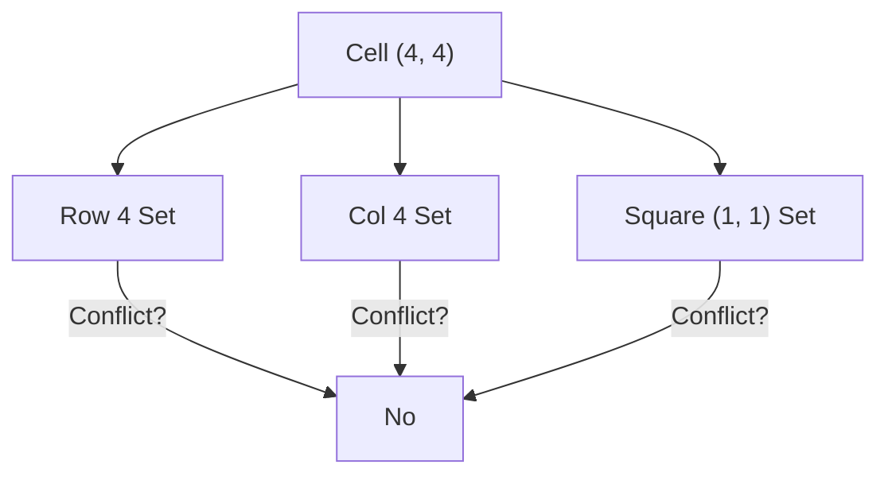

# 🔢 Arrays & Hashing: Valid Sudoku

## 📝 Problem Description
Determine if a `9 x 9` Sudoku board is valid. Only the filled cells need to be validated according to the following rules:
1. Each row must contain the digits `1-9` without repetition.
2. Each column must contain the digits `1-9` without repetition.
3. Each of the nine `3 x 3` sub-boxes must contain the digits `1-9` without repetition.

!!! info "Real-World Application"
    Validating user input in game engines, ensuring constraint satisfaction in scheduling problems, or checking for data integrity in 2D grid systems.

## 🛠️ Constraints & Edge Cases
- $board.length == 9$
- $board[i].length == 9$
- $board[i][j]$ is a digit `1-9` or `'.'`.
- **Edge Cases to Watch:**
    - Empty board (valid).
    - Board with multiple digits but no violations.
    - Violations in the $3 \times 3$ sub-boxes that are not in rows or columns.

---

## 🧠 Approach & Intuition

!!! success "The Aha! Moment"
    Use **Hash Sets** for each row, column, and $3 \times 3$ box. The key trick is mapping each `(r, c)` cell to its corresponding box index using the formula: `(r // 3, c // 3)`.

### 🐢 Brute Force (Naive)
Verify rows, then verify columns, then verify each of the nine $3 \times 3$ boxes individually. While this works, it requires multiple passes over the board.

### 🐇 Optimal Approach
1. Initialize three hash maps of sets: `cols`, `rows`, and `squares`.
2. Iterate through every cell `(r, c)` in the $9 \times 9$ board.
3. Skip empty cells (`'.'`).
4. For a digit `v`:
    - Check if `v` is in `rows[r]`, `cols[c]`, or `squares[(r // 3, c // 3)]`.
    - If it is, the board is invalid; return `false`.
    - Otherwise, add `v` to the respective sets.
5. If the entire board is processed without conflict, return `true`.

### 🧩 Visual Tracing


---

## 💻 Solution Implementation

```python
(Implementation details need to be added...)
```

### ⏱️ Complexity Analysis
- **Time Complexity:** $\mathcal{O}(1)$ — Since the board size is always $9 \times 9$, the number of operations is constant ($81$ iterations).
- **Space Complexity:** $\mathcal{O}(1)$ — The size of the sets is also bounded by the board size.

---

## 🎤 Interview Toolkit

- **Follow-up:** How would you solve a Sudoku board (fill in the blanks)? (Hint: Backtracking).
- **Scaling:** How would you handle an $N^2 \times N^2$ board? (The logic remains the same, but complexity becomes $O(N^4)$).

## 🔗 Related Problems
- [Sudoku Solver](https://leetcode.com/problems/sudoku-solver/)
- [Rotate Image](https://leetcode.com/problems/rotate-image/)
